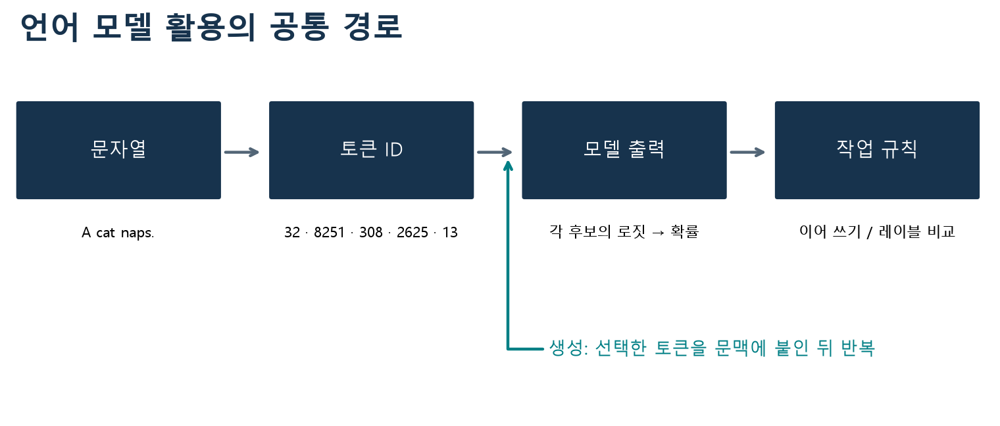
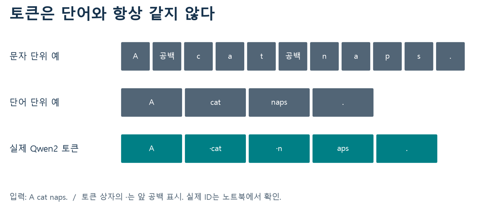
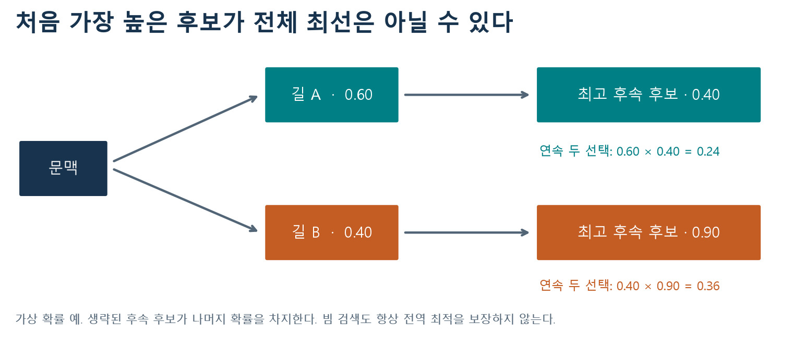
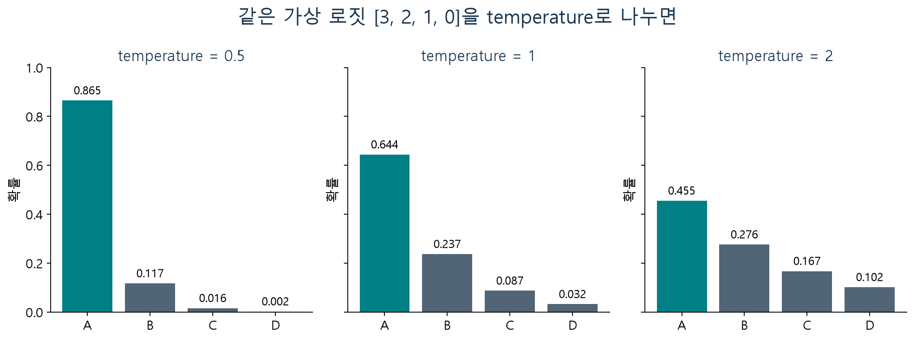
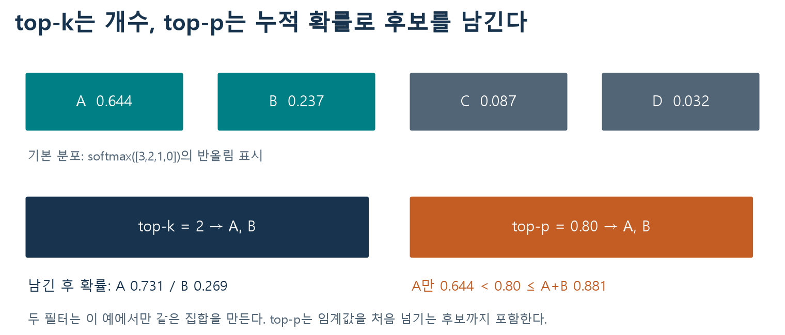
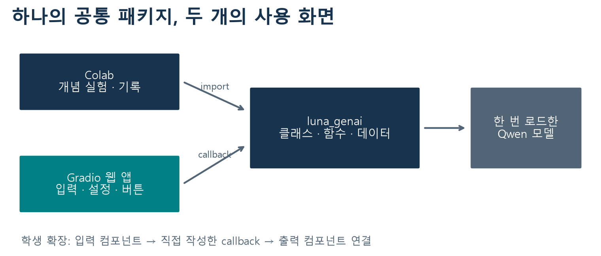
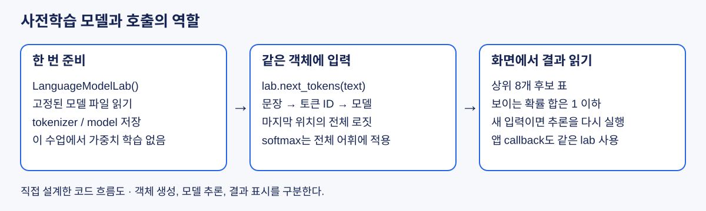

# W02B · 언어 모델의 활용 사례

교재 2.1 · 데이터 사이언스를 위한 생성형 인공지능 · 2026-09-09

[Colab 실습 열기](https://colab.research.google.com/github/lunalab-ai/genAI/blob/main/notebooks/student/w02b_language_model_applications.ipynb) · [공통 패키지](https://github.com/lunalab-ai/genAI/tree/main/src)

## 이번에 만들 것

문장을 넣으면 토큰과 다음 후보를 보여 주고, 생성 설정을 바꾸거나 영화 리뷰의 감성을 비교할 수 있는 **언어 모델 실험실**을 만든다. 앞선 실험에서 사용한 기능을 마지막에 웹 앱으로 연결한다. 구현은 과목 GitHub의 `luna_genai` 패키지에 누적하고 노트북과 앱에서 함께 import한다.

이번 수업을 마치면 문자열에서 생성 문장까지의 경로를 설명하고, 같은 모델에 서로 다른 작업을 시키는 프롬프트를 비교할 수 있다. 특히 “높은 확률”, “좋은 문장”, “정답”이 같은 뜻인지 구분한다.

교재에서 가져오는 것은 토큰화·확률 예측·생성·제로샷·퓨샷의 개념과 흐름이다. 아래 예문, 리뷰 데이터, 수치 도식과 웹 앱은 이 수업을 위해 새로 설계했다. Transformer 내부 구조와 가중치를 학습하는 과정은 후속 수업에서 다룬다.

## 1. 하나의 모델로 어떤 작업을 할 수 있을까?

언어 모델은 주어진 문맥 다음에 올 토큰의 분포를 계산한다. 다음 후보를 선택하고 다시 문맥에 붙이면 문장을 생성할 수 있다. 반대로 문맥 마지막을 `Sentiment:`처럼 만들고 두 레이블의 점수를 비교하면 간단한 분류 실험이 된다.

| 활용 | 입력을 만드는 방법 | 출력을 읽는 방법 |
|---|---|---|
| 이어 쓰기 | 이야기의 첫 문장을 제공 | 새로 생성한 문장 관찰 |
| 감성 분류 | 리뷰와 `Sentiment:` 제공 | ` positive`, ` negative`의 점수 비교 |
| 번역 | 언어 쌍의 예시와 새 문장 제공 | 대응 문장의 생성을 관찰 |
| 요약 | 원문과 요약 요청 제공 | 요약 결과를 원문과 대조 |

번역·요약도 가능한 활용 방식이지만 모든 기본 모델이 요청을 잘 수행하는 것은 아니다. 이번 필수 실험은 이어 쓰기와 감성 분류에 집중한다. 짧은 소형 모델의 출력도 사실 확인과 사람이 읽는 평가가 필요하다.



그림 1. 교재 2.1의 공통 흐름을 새 예문과 배치로 구성했다. 생성에서는 선택한 토큰을 문맥에 추가하고 다음 분포를 다시 구한다.

실습은 교재와 같은 **Qwen/Qwen2-0.5B 기본 모델**을 사용한다. instruction-tuned 대화 모델과 구분되는 모델이며, 내부 확률을 관찰하기 위한 선택이다. 제공자도 기본 모델을 완성형 텍스트 생성 서비스로 사용하는 것을 권장하지 않는다. [Qwen2-0.5B 모델 설명](https://huggingface.co/Qwen/Qwen2-0.5B)

### 준비하고 예측하기

Colab 사본을 저장하고 첫 설치 셀부터 실행한다. 공개 모델 약 1 GB를 처음 한 번 내려받고, 자체 작성 리뷰 데이터는 패키지를 설치할 때 함께 준비한다. 유료 API 키나 파일 업로드는 필요 없다. CPU가 기본이며 사용 가능한 GPU가 있으면 활용한다. 모델은 `lab = LanguageModelLab()`로 한 번 만들고 이후 셀에서 재사용한다.

모델 로딩이 실패하면 오류를 확인한 뒤 다시 실행한다. 인터넷 없이 진행할 때는 노트북과 앱의 **수치 실험 전용 모드**를 사용할 수 있다. 이 모드의 네 후보는 직접 정한 가상 로짓이며, 실제 언어 모델의 예측이 아니다. 패키지 설치까지 실패했다면 인터넷 연결부터 복구해야 한다.

실행 전 질문: `The movie was` 다음에는 어떤 단어가 높은 점수를 받을까? 문맥에 `boring`을 추가하면 같은 분포가 나올까?

## 2. 토큰화: 모델은 글자를 어떻게 받는가?

토큰화(tokenization)는 문자열을 모델이 사용하는 작은 단위로 나누고 ID로 바꾸는 과정이다. 문자 단위는 어휘가 작지만 문장이 길어질 수 있고, 단어 단위는 처음 보는 단어를 처리하기 어렵다. 하위 단어(subword)는 자주 나타나는 조각을 재사용한다. 실제 알고리즘은 모델별로 다르며 모델과 대응하는 토크나이저를 함께 사용해야 한다. [Transformers 토큰화 설명](https://huggingface.co/docs/transformers/main/en/tokenizer_summary)



그림 2. 교재 그림 2-1~2-3의 단위 비교를 새 예문 `A cat naps.`로 구성했다. 마지막 행은 고정한 Qwen2 토크나이저의 실제 결과이다. 토큰 상자의 `·`는 앞 공백을 읽기 쉽게 표시한 기호이다.

```python
from luna_genai import LanguageModelLab
lab = LanguageModelLab()
lab.token_table("A cat naps.")
```

이 예문의 ID는 해당 revision에서 `[32, 8251, 308, 2625, 13]`이다. 숫자는 뜻의 순서나 중요도를 나타내지 않는 어휘표의 식별자이다. `cat`과 ` cat`의 ID가 다른 이유는 공백도 입력의 일부이기 때문이다. 같은 영어 단어를 다른 모델에 넣으면 다른 ID가 나올 수 있다.

한국어도 직접 관찰한다. 일부 토큰은 한 글자의 바이트 일부에 대응하므로 토큰 하나씩 decode하면 대체 문자 `�`가 보일 수 있다. 개별 decode 결과를 이어 붙이는 방식과 **전체 ID를 한 번에 decode하는 방식**을 구분한다. 정상적인 전체 복원 여부는 후자로 확인한다.

### 실습 A · 예측 → 실행 → 복원

1. `cat`, ` cat`, `고양이가 잠을 잡니다.`의 토큰 수를 먼저 예상한다.
2. 표의 ID·내부 표기·개별 decode를 관찰한다.
3. 전체 ID를 복원하여 원문과 같은지 검사한다.

빈칸 문제: 노트북의 `recovered_student`에 전체 ID를 복원한 문자열을 넣는다. **목표:** encode와 decode의 관계 이해. **힌트:** 토크나이저의 decode는 ID 목록을 받는다. **자가 점검:** 복원 문자열이 원문과 같아야 한다. 문제를 아직 풀지 않아도 뒤 실험은 실행할 수 있다.

## 3. 다음 토큰의 로짓과 확률

모델 출력의 로짓(logit)은 각 후보에 부여한 정규화 전 점수이다. 음수일 수 있고 합이 1일 필요도 없다. softmax는 점수를 양수로 바꾸고 전체 합으로 나누어 확률 분포를 만든다.

$$
p(i\mid\text{context})=\frac{\exp(z_i)}{\sum_j\exp(z_j)}
$$

분모는 전체 어휘 후보를 포함한다. 실무 계산에서는 큰 수의 지수로 인한 넘침을 피하려고 모든 점수에서 최댓값을 빼고 계산한다. 분자와 분모에 같은 상수가 곱해지므로 결과 분포는 같다.

모델 출력 형태는 `[배치, 입력 위치, 어휘 후보]`이다. 문장 하나의 다음 토큰을 보려면 마지막 입력 위치를 읽는다. Python 인덱스 `-1`은 마지막 원소를 뜻한다.

```python
z = lab.last_logits("The movie was")
top = lab.next_tokens("The movie was", n=8)
```

표의 확률은 전체 어휘로 정규화한 값이다. 화면에는 8개 후보만 보이므로 **보이는 확률의 합이 1보다 작을 수 있다**. 나머지 후보의 확률을 버리고 8개끼리 다시 정규화한 표와는 의미가 다르다. 또한 모델 확률은 이 문맥 다음에 나올 토큰의 확률이며 그 내용이 사실이라는 확률이 아니다.

### 실습 B · 문맥 바꾸기와 인덱스 디버깅

`The movie was`와 `The movie was boring and`의 상위 후보를 비교한다. 같은 후보의 순위가 달라졌는지 기록한다. 결과가 예상과 달라도 관찰을 그대로 남긴다.

디버깅 문제: 가상 출력 `fake_logits`의 형태가 `(1, 3, 4)`일 때 `fake_logits[0, 0, :]`는 어느 위치를 읽는가? 마지막 위치의 후보 4개를 읽도록 `last_student`를 작성한다. **힌트:** 세 축의 의미와 `-1`. **자가 점검:** 결과 형태가 `(4,)`이고 첫 위치의 값과 다른지 확인한다.

## 4. 생성은 선택과 반복이다

자동회귀 생성(autoregressive generation)은 다음 후보 선택 → 문맥에 추가 → 새 분포 계산을 반복한다. 같은 첫 분포에서 시작해도 선택 규칙에 따라 이후 문맥이 달라지고, 뒤의 분포도 달라진다. 비교할 때 프롬프트·모델·생성 길이를 유지한다.

### 탐욕적 디코딩과 빔 검색

탐욕적 디코딩(greedy decoding)은 매 단계 가장 확률이 높은 후보 하나를 선택한다. 빠르고 결정적이지만 문장 전체의 높은 점수를 보장하지 않는다. 빔 검색(beam search)은 여러 부분 문장을 유지하며 확장한다. 탐색 폭과 점수 규칙에 따라 결과가 달라지고, 탐욕적 방법보다 계산이 늘어난다.



그림 3. 교재 그림 2-4~2-5의 탐색 개념을 새로운 두 단계 확률로 설명한다. 다른 후속 후보들은 생략했다. 실제 문장 점수는 토큰별 로그 확률의 합 등으로 계산하며 길이 보정 여부도 중요하다. 제한된 빔 폭은 전역 최적의 보장이 아니다.

```python
lab.generate("A small robot opened the door and", strategy="greedy")
```

우리 패키지의 greedy는 `do_sample=False`이고, beam은 폭 3·길이 보정 0으로 설정한다. 빔 검색은 이번에는 짧은 시연으로 관찰한다. 높은 모델 점수만으로 사람이 읽기 좋은 문장이 보장되지는 않는다. [Transformers 생성 방식](https://huggingface.co/docs/transformers/main/en/generation_strategies)

### 샘플링과 temperature

샘플링은 분포에 따라 다음 후보를 무작위로 뽑는다. temperature T는 softmax 이전에 로짓을 나누는 양이다. $p_T(i)=\frac{\exp(z_i/T)}{\sum_j\exp(z_j/T)},\quad T>0$로 계산하며 T가 작으면 높은 후보에 더 집중하고, T가 크면 더 평평해진다. 순위 자체는 양수 T로 나누기만 해서는 바뀌지 않는다.



그림 4. 교재 그림 2-6~2-7의 샘플링·temperature 관계를 직접 계산한 분포로 재구성했다. T=0.5에서 A에 더 집중하고 T=2에서는 다른 후보도 선택될 여지가 커진다.

T가 0에 가까워지는 극한과 API에 숫자 0을 넣는 것은 다르다. 이 실습의 샘플링 T는 양수만 허용한다. 가장 높은 후보만 고르려면 `strategy="greedy"`를 사용한다. 높은 T는 정확도를 높이는 장치가 아니며, 낮은 T도 사실성을 보장하지 않는다.

### top-k와 top-p

top-k는 확률이 높은 k개를 남긴다. top-p(nucleus sampling)는 확률순으로 더하여 누적 확률이 p 이상이 되는 최소 후보 집합을 남긴다. 임계값을 처음 넘기는 토큰을 포함한 뒤 다시 정규화한다. [Nucleus sampling 논문 초록](https://arxiv.org/abs/1904.09751)



그림 5. 교재 그림 2-8의 후보 제한 관계를 새 수치로 설명한다. 이 분포에서는 두 필터가 같은 집합을 만들지만 일반적으로 같지 않다. top-p의 후보 개수는 문맥에 따라 달라진다.

우리 패키지는 `top_k=0`, `top_p=1`로 각 필터를 해제한다. temperature만 비교할 때는 두 필터를 해제한다. top-k만 비교할 때는 top-p=1을, top-p만 비교할 때는 top-k=0을 유지한다. 둘을 함께 켜면 top-k 필터 다음 top-p를 적용하므로 한 가지 효과만 보려는 실험과 구분한다.

### 실습 C · 한 조건만 바꾸기

같은 시작 문장·seed 7·생성 길이에서 T=0.5와 T=1.2를 비교한다. 다음에는 T=0.8을 고정하고 top-p=1과 0.8을 비교한다. 마지막으로 같은 설정과 seed로 다시 실행한다. 서로 다른 설정이 반드시 서로 다른 문장을 만드는 것은 아니다.

**목표:** 반복 가능성과 다양성을 구분. **힌트:** seed는 무작위 추출의 시작 상태이며 모델의 지식을 바꾸지 않는다. **자가 점검:** 바꾼 설정은 한 가지인가? 같은 환경에서 같은 설정을 반복했는가? GPU·라이브러리 버전이 달라지면 동일 seed만으로 완전히 같은 결과를 보장할 수 없다.

## 5. 제로샷과 퓨샷: 문맥으로 작업을 제시하기

제로샷(zero-shot)은 작업 예시 없이 요청과 입력을 제공한다. 퓨샷(few-shot)은 소수의 입력·출력 예시를 문맥에 추가한다. 이번 2-shot에서는 고정된 리뷰·레이블 예시 2개를 넣는다. **모델의 가중치를 업데이트하지 않는다.** 프롬프트에 예시를 넣는 것과 학습 데이터로 미세조정하는 것은 다르다. [Few-shot 학습 논문 초록](https://arxiv.org/abs/2005.14165)

```text
Classify the movie review as positive or negative.
Review: Wonderful acting made this a lovely evening.
Sentiment:
```

이 뒤의 ` positive`와 ` negative` 점수를 비교한다. 앞 공백까지 포함한 문자열을 실제 토크나이저로 변환하고, 각각 한 토큰인지 검사한다. 교재에 나온 ID 숫자를 다른 모델에 그대로 쓰지 않는다. 레이블이 여러 토큰이라면 전체 레이블의 조건부 확률을 계산해야 하며, 마지막 토큰 하나만 비교해서는 안 된다.

### 두 레이블 내 비율을 정확히 읽기

전체 어휘에서 두 레이블의 확률을 각각 p_pos, p_neg라고 하면 양성의 상대 점수는 $\frac{p_{\mathrm{pos}}}{p_{\mathrm{pos}}+p_{\mathrm{neg}}}$이다. 이는 “다음 토큰을 두 레이블로 제한했을 때의 비율”이다. 다른 단어가 대부분의 확률을 차지해도 이 비율은 높을 수 있다. 따라서 앱은 전체 어휘 확률과 두 후보 내 비율을 함께 보여 준다.

예를 들어 두 확률이 0.018과 0.002라면 상대 점수는 0.9이지만, 두 후보가 차지한 전체 확률은 0.02뿐이다. 이 수치는 설명용 가상 예이며 “90% 확률로 정답”이라는 뜻이 아니다.

```python
from luna_genai import load_reviews
review = load_reviews("development")[0]["review"]
result = lab.classify(review, few_shot=True)
print(result["prompt"])
result["scores"]
```

### 실습 D · 같은 평가 문장으로 비교

데이터는 모두 직접 작성한 짧은 영어 영화 리뷰이다. `examples`의 2개는 프롬프트용, `development`의 4개는 실험·조정용, `evaluation`의 4개는 조정 후 마지막 비교용이다. 외부 IMDb 데이터나 교재의 원자료가 아니다.

개발 문장으로 프롬프트를 살펴본 뒤, 평가 4개에 제로샷과 2-shot을 같은 조건으로 적용한다. 정답 수와 함께 두 레이블의 전체 확률 질량을 살펴본다. 퓨샷이 항상 더 정확하다고 가정하지 않는다. 4개 결과가 같거나 전부 맞아도 일반 성능의 근거는 충분하지 않다.

**오류 찾기:** 부정어, 반어, 장단점을 섞은 자체 문장 하나를 추가한다. 오분류하면 문장 해석·프롬프트·레이블 방식 중 무엇을 바꿔 확인할지 제안한다. 오분류를 발견하지 못했으면 “현재 예에서는 발견하지 못함”이라고 기록한다. 결과를 맞추려고 평가 문장을 반복해서 조정하면 더 이상 미사용 평가가 아니다.

## 6. 마지막 통합 실습 · 언어 모델 실험실 만들기



그림 6. 새로 설계한 누적 앱 구조. 화면은 입력과 출력을 담당하고, 모델·데이터 처리는 공통 패키지가 담당한다.

```python
from luna_genai import build_app
app = build_app(lab)
app.launch(share=True)  # Colab에서 실행
```

앱에는 토큰·다음 후보, 생성 비교, 제로샷·퓨샷 분류, 수치 실험 탭이 있다. 같은 `lab`을 넘기므로 버튼을 누를 때마다 모델을 다시 다운로드하지 않는다. 모델이 없으면 수치 실험 전용 앱을 만들어 현재 모드를 화면에 표시한다.

Gradio Blocks에서는 컴포넌트를 만들고 이벤트에 함수를 연결한다. `button.click(fn, inputs, outputs)`의 입력 컴포넌트 순서는 함수 인수 순서에 대응하고, 함수 반환값은 출력 컴포넌트에 전달된다. 함수는 화면 객체가 아닌 실제 입력값을 받는다. [Gradio 공식 Blocks 가이드](https://github.com/gradio-app/gradio/blob/main/guides/03_building-with-blocks/01_blocks-and-event-listeners.md)

### 실습 E · 나의 비교 패널 연결

완성된 기본 앱을 먼저 확인한 뒤 노트북의 확장 문제를 푼다. 사용자가 입력한 문장의 토큰 수를 반환하는 callback을 작성하고, 새 탭에 Textbox·Button·Number를 배치해 연결한다.

**목표:** UI 입력 → 공통 API → 반환값 → UI 출력의 흐름을 직접 구성. **힌트:** `lab.token_table(text)`의 행 수와 함수 반환값의 자료형을 생각한다. **자가 점검:** 두 다른 문장을 넣었을 때 입력에 대응하는 숫자가 나타나는가? 버튼의 inputs와 outputs가 함수에 맞게 연결되었는가? 전체 모델 로드를 callback 안에서 반복하지 않는가?

확장 문제를 마치지 않아도 기본 앱의 기능을 실행할 수 있다. 앱에서 최소 두 탭을 실제 조작하고, 모바일 폭에서는 컴포넌트가 어떻게 쌓이는지 관찰한다. Colab 공유 링크는 실행 중인 런타임에 연결되므로 런타임 종료 후에는 다시 실행해야 한다.

## 7. 실험 기록과 점검 퀴즈

노트북의 기록 셀 또는 [실험 기록 양식](w02b-experiment-log.md)에 남긴다. 이번 자료에는 별도 성적 반영 과제가 없다.

| 기록할 항목 | 작성 내용 |
|---|---|
| 실행 조건 | 모델 revision·패키지 버전·CPU/GPU·seed |
| 비교 | 같은 입력에서 한 가지 바꾼 설정 |
| 관찰 | 실제 생성 문장 또는 후보·레이블 점수 |
| 해석 | 관찰로 말할 수 있는 것과 아직 확인하지 못한 것 |
| 앱 | 입력·callback·출력 연결과 확인한 동작 |

1. `cat`과 ` cat`의 토큰 ID가 다를 수 있는 이유는 무엇인가?
2. 출력 형태가 `[배치, 위치, 어휘]`일 때 다음 토큰 분포를 읽는 위치는 어디인가?
3. 상위 후보 8개의 확률 합이 1보다 작은 것이 오류인가?
4. temperature만 비교하려면 top-k와 top-p를 어떻게 설정하는가?
5. 확률이 0.60, 0.25, 0.10, 0.05일 때 top-p=0.80은 몇 개를 남기는가?
6. 퓨샷 프롬프트에 예시 2개를 추가하면 모델 가중치가 업데이트되는가?
7. 두 레이블 내 양성 비율이 0.9이면 90% 확률로 정답이라고 말할 수 있는가?
8. 웹 앱의 버튼 callback 안에서 모델을 매번 다시 로드하면 어떤 문제가 생기는가?

먼저 답을 작성한 뒤 [별도 퀴즈 해설](https://github.com/lunalab-ai/genAI/blob/main/course/handouts/w02b-quiz.md)로 확인한다.

## 참고자료와 재구성 범위

- 주교재 『핸즈온 생성형 AI』 2.1 언어 모델의 활용 사례, 인쇄 p.44–67, 그림 2-1~2-8. 원문의 토큰화·확률 예측·생성·제로샷·퓨샷 용어와 흐름을 따른다. 도식 1~5는 개념을 참고해 새 예문·수치·배치로 독립 제작했고 도식 6과 리뷰·앱은 수업용 추가 설계이다.
- [Qwen2-0.5B](https://huggingface.co/Qwen/Qwen2-0.5B), [토큰화 문서](https://huggingface.co/docs/transformers/main/en/tokenizer_summary), [생성 문서](https://huggingface.co/docs/transformers/main/en/generation_strategies): 모델 선택과 API 설명.
- [Holtzman 외, The Curious Case of Neural Text Degeneration](https://arxiv.org/abs/1904.09751), [Brown 외, Language Models are Few-Shot Learners](https://arxiv.org/abs/2005.14165): 초록의 nucleus sampling 동기와 가중치 업데이트 없는 few-shot 개념 참고. 이 논문들의 실험 결과를 이번 소형 모델의 성능 보장으로 사용하지 않는다.
- [Transformers 5.15.1 Qwen2 API](https://huggingface.co/docs/transformers/v5.15.1/en/model_doc/qwen2), [Gradio Blocks](https://github.com/gradio-app/gradio/blob/main/guides/03_building-with-blocks/01_blocks-and-event-listeners.md): 설치 버전·이벤트 연결 확인. 외부 자료 확인일 2026-09-08.

## 코드 정의에서 보충 학습하기

[API: arguments, results and examples](https://github.com/lunalab-ai/genAI/blob/2026-fall-explained/src/API.md)

- [build_app](https://github.com/lunalab-ai/genAI/blob/2026-fall-explained/src/luna_genai/__init__.py#L8): 이미 준비한 lab을 연결한 Gradio Blocks 객체를 반환한다.
- [load_reviews](https://github.com/lunalab-ai/genAI/blob/2026-fall-explained/src/luna_genai/data.py#L5): 패키지에 포함된 수업용 리뷰 목록을 새 객체로 읽어 반환한다.
- [LanguageModelLab](https://github.com/lunalab-ai/genAI/blob/2026-fall-explained/src/luna_genai/model.py#L13): 고정 Qwen2 기본 언어 모델을 한 번 준비해 여러 실험에서 재사용하는 클래스.
- [LanguageModelLab.generate](https://github.com/lunalab-ai/genAI/blob/2026-fall-explained/src/luna_genai/model.py#L106): text 뒤의 새 문자열만 반환한다. 원래 프롬프트는 반환 문자열에서 제외한다.
- [LanguageModelLab.classify](https://github.com/lunalab-ai/genAI/blob/2026-fall-explained/src/luna_genai/model.py#L158): review의 다음 토큰으로 positive/negative를 비교한 dict를 반환한다.
- [PretrainedTextDemo](https://github.com/lunalab-ai/genAI/blob/2026-fall-explained/src/luna_genai/pretrained_demo.py#L12): 고정 DistilGPT2를 CPU에서 한 번 로드하는 선택 시연 객체.



직접 설계한 코드 흐름도 · 객체 생성, 모델 추론, 결과 표시를 구분한다.
