# W03A · 트랜스포머 블록과 사전학습

2026년 9월 14일 월요일 · 3주차 1차시 · 생성형 인공지능

주교재 『핸즈온 생성형 AI』 2.2–2.7. 2주차에서 남은 블록·어텐션·모델 계보를 연결하고, 마지막에는 실제 언어 모델의 다음 토큰 계산을 웹앱으로 만든다. 행렬 계산 보충은 복습용이며, 모든 수식을 외우는 것이 목표는 아니다.

## 1. 오늘 따라갈 한 줄

문장을 토큰 ID로 바꾸고, 벡터로 읽고, 주변 정보와 섞고, 다음 토큰 후보를 채점한다. 선택한 토큰을 입력 뒤에 붙이면 문장이 한 조각 길어진다. 이것을 반복하는 것이 자기회귀 생성이다.

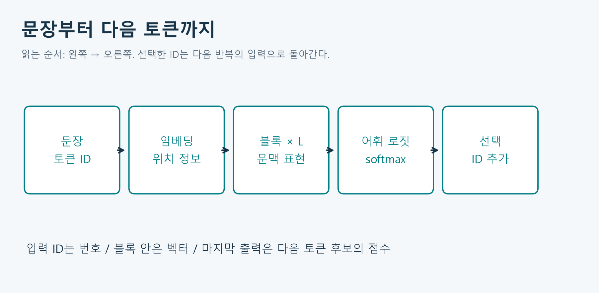

그림 1. 각 단계의 출력이 다음 단계의 입력이다. 교재 그림 2-9의 개념을 자체 배치로 재구성했다. 토큰 선택 후에는 처음부터 재입력하는 경로 또는 캐시를 재사용하는 경로가 있다.

학습 목표는 다음과 같다.

- Q/K/V, 마스크, softmax, 가중합을 작은 행렬로 읽는다.
- 멀티헤드·잔차·정규화·FFN이 한 블록에서 하는 일을 구분한다.
- BERT, GPT/Qwen, T5/BART의 구조와 학습목표를 연결한다.
- 사전학습·미세조정·프롬프트 추론의 차이를 설명한다.
- 모델의 forward 출력을 이용해 생성 과정을 관찰하고 자동 반복을 웹앱에 연결한다.

## 2. 블록에 들어가는 것은 단어가 아니라 행렬

### 2.1 ID, 임베딩, 문맥 표현

토큰 ID는 어휘표의 행 번호다. ID가 더 크다고 더 중요한 토큰이거나 의미가 더 크다는 뜻이 아니다. 임베딩은 그 행에 저장된 학습 가능한 실수 벡터다. 같은 모델 안에서 같은 ID는 같은 시작 임베딩을 조회하지만, 블록을 통과한 표현은 문맥에 따라 달라진다.

$$
E\in\mathbb{R}^{V\times d},\qquad x_i=E[t_i],\qquad X\in\mathbb{R}^{n\times d}.
$$

여기서 $V$는 어휘 크기, $d$는 특징 수, $n$은 입력 토큰 수, $t_i$는 위치 $i$의 토큰 ID다. $E[t_i]$는 곱셈이 아니라 행 조회다. $X$의 한 행은 한 위치, 한 열은 한 특징 좌표다. 실제 구현에는 배치 축이 앞에 추가된다.

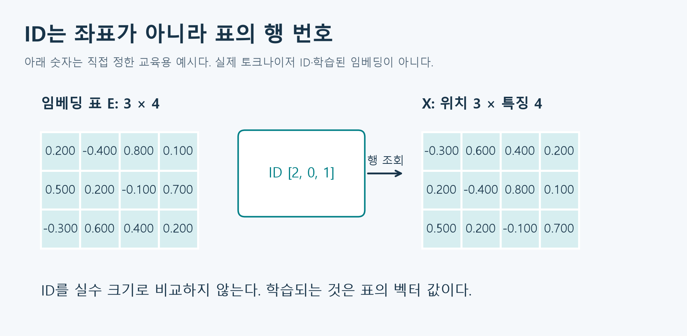

그림 2. 자체 설계한 가상 수치다. 실제 Qwen 임베딩을 측정한 그림은 아니다. ID 순서가 바뀌면 조회된 행의 순서가 바뀐다.

### 2.2 왜 위치 정보가 필요한가

‘개가 사람을 쫓는다’와 ‘사람이 개를 쫓는다’는 순서 관계가 다르다. 단어 벡터 집합만으로는 누가 누구를 쫓는지 충분히 표현할 수 없다. 원래 Transformer는 토큰 임베딩에 위치 벡터를 더했다. 위치별 정보와 내용별 정보가 같은 폭을 가져야 더할 수 있다.

$$
X_i=E[t_i]+P_i.
$$

원논문의 사인·코사인 위치 표현은 다음과 같다. $i$는 위치, $r$은 특징 쌍의 번호이며 $2r$과 $2r+1$은 짝을 이루는 좌표다. 서로 다른 주기의 파동을 써서 위치를 구별한다.

$$
P_{i,2r}=\sin\left(\frac{i}{10000^{2r/d}}\right),\quad
P_{i,2r+1}=\cos\left(\frac{i}{10000^{2r/d}}\right).
$$

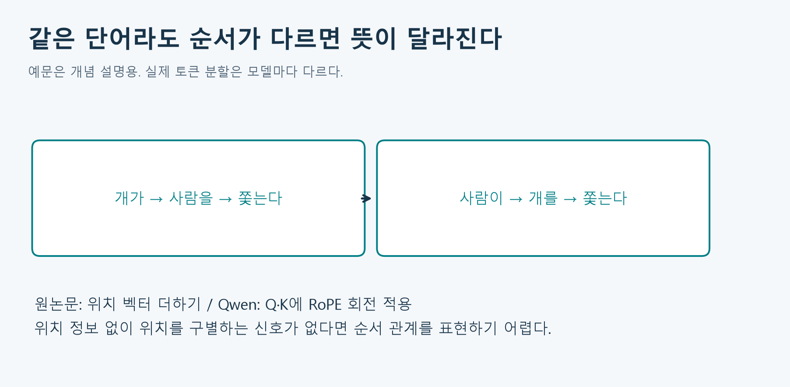

그림 3. 예문은 자체 작성했다. 모든 모델이 위 수식을 사용하는 것은 아니다. BERT의 학습형 위치 임베딩, Qwen의 RoPE 등은 구분해야 한다.

Qwen의 RoPE는 Q와 K의 특징 쌍을 위치에 맞게 회전시키는 방식이다. ‘임베딩에 사인·코사인을 더한다’는 원논문 설명을 Qwen 전체 구현 설명으로 사용하지 않는다. 위치 처리법이 있어도 임의로 긴 입력의 정확도·메모리 사용을 보장하지 않는다.

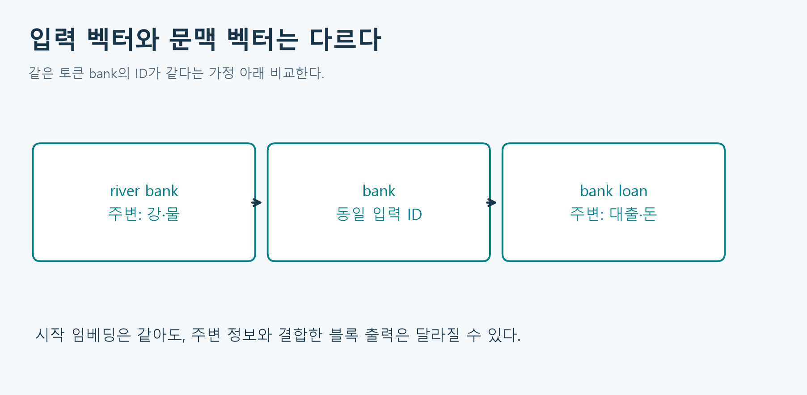

그림 4. 같은 ID의 시작 벡터가 같더라도, 주변 단어를 참고한 뒤의 벡터는 달라질 수 있다. bank가 실제로 하나의 같은 토큰인 경우를 가정한 개념도다.

## 3. 어텐션의 기본 아이디어: 누구의 정보를 얼마나 가져올까

어떤 위치를 업데이트할 때 모든 다른 위치를 똑같이 평균하지 않고, 현재 문맥에서 관련성 점수를 계산하여 정보를 섞는다. ‘철수가 가방을 내려놓았다. 그것은 무거웠다’에서 ‘그것’의 표현을 갱신할 때 ‘가방’이 유용할 수 있다. 다만 실제 헤드가 반드시 그 연결만 학습한다는 뜻은 아니다. 어텐션 가중치를 곧바로 모델 결정의 인과적 설명으로 단정하지 않는다.

### 3.1 Q, K, V를 분리하는 이유

- Query(Q): 현재 위치가 참고할 정보를 찾는 기준.
- Key(K): 각 위치가 비교를 위해 내놓는 특징.
- Value(V): 비중이 정해진 뒤 실제로 섞을 정보.

도서관 비유로는 Q가 찾는 조건, K가 검색용 표지, V가 가져올 내용이다. 실제로는 모두 실수 벡터이며, 사람이 질문 문장을 넣어 주는 것이 아니다. 이 투영을 만드는 가중치는 학습된다.

$$
Q=XW_Q,\qquad K=XW_K,\qquad V_m=XW_V.
$$

어휘 크기 $V$와 Value 행렬을 혼동하지 않도록 이 절에서는 Value 행렬을 $V_m$으로 쓴다. 기본 한 헤드에서 $W_Q,W_K\in\mathbb{R}^{d\times d_k}$, $W_V\in\mathbb{R}^{d\times d_v}$이다. 따라서 $Q,K$는 $n\times d_k$, $V_m$은 $n\times d_v$이다. Q와 K의 마지막 차원은 같아야 내적할 수 있지만, Value의 마지막 차원은 꼭 같을 필요는 없다.

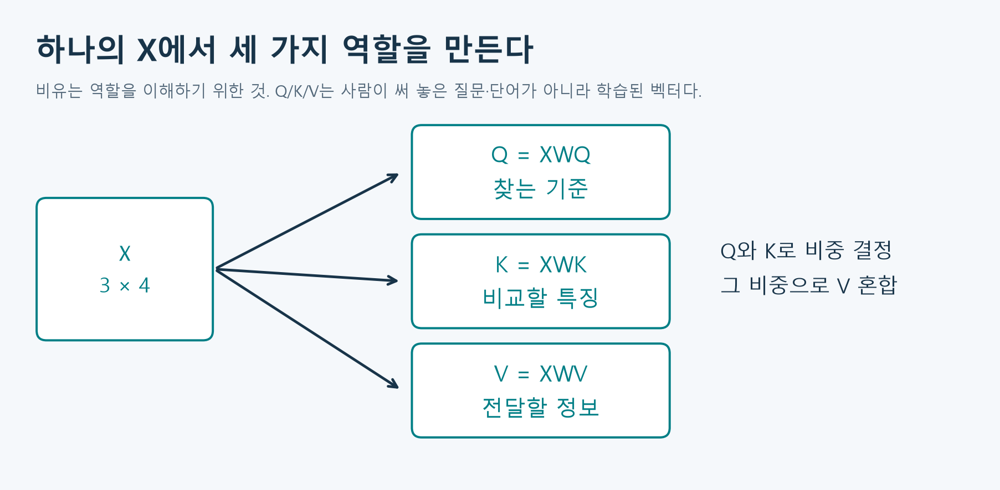

그림 5. Q/K/V의 역할을 독립 배치로 표현했다. 수학적 정의 보충: [Transformer 원논문 3.2](https://arxiv.org/html/1706.03762v7).

### 3.2 첫 계산: 위치 간 점수

$$
S=\frac{QK^\top}{\sqrt{d_k}},\qquad
S_{ij}=\frac{q_i\cdot k_j}{\sqrt{d_k}}.
$$

$i$행은 ‘정보를 받는 위치’, $j$열은 ‘정보를 제공하는 위치’다. $QK^\top$의 형태는 $(n\times d_k)(d_k\times n)=n\times n$이다. 대각선은 자기 자신과의 점수다. self-attention의 self는 ‘자기 위치만 본다’가 아니라 ‘Q/K/V가 같은 시퀀스에서 나온다’는 뜻이다.

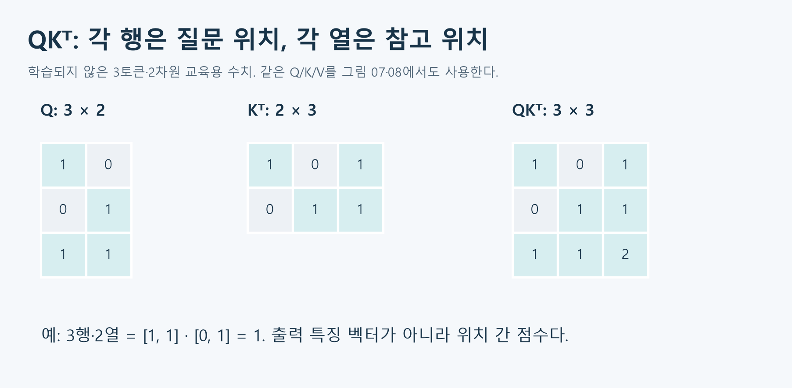

그림 6. 이후 그림에서도 유지하는 가상 Q/K다. 실제 모델에서 추출한 어텐션은 아니다.

차원이 커지면 내적의 크기도 커지기 쉽다. 각 성분이 독립이고 평균 0·분산 1이라는 단순한 가정에서는 내적의 분산이 $d_k$이고 표준편차는 $\sqrt{d_k}$이다. 그 크기로 나누면 softmax가 지나치게 뾰족해지는 것을 완화한다. ‘정확도를 항상 높이는 마법의 나눗셈’이 아니라 점수 규모를 조절하는 설계다.

### 3.3 마스크: 미래를 본 뒤 맞히면 안 된다

문장을 이어 쓸 때 위치 $i$의 표현은 자기 자신과 이전 입력 위치만 참고해야 한다. 학습 때 전체 문장을 한꺼번에 주더라도 미래의 정답을 엿보지 못하도록 causal mask를 쓴다.

$$
M_{ij}=\begin{cases}0,&j\le i,\\-\infty,&j>i.\end{cases}
$$

마스크는 softmax **이전**의 점수에 더한다. 차단할 점수를 0으로 바꾸면 $e^0=1$이므로 여전히 양의 확률이 생긴다. 차단 위치를 매우 작은 수 또는 음의 무한대로 처리해야 한다. 패딩 마스크는 ‘실제 토큰이 아닌 빈자리’를 차단하는 것으로, 미래를 차단하는 causal mask와 목적이 다르다. 두 제약을 함께 적용할 수도 있다.

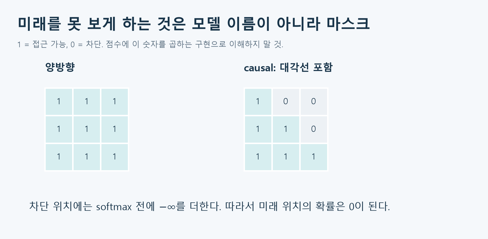

그림 7. 양방향은 왼쪽과 오른쪽을 함께 볼 수 있다. causal도 현재 위치는 볼 수 있다. 그림의 0/1은 접근 가능 여부이지 점수에 곱하는 구현이 아니다.

### 3.4 행별 softmax와 Value 가중합

$$
A_{ij}=\frac{\exp(S_{ij}+M_{ij})}{\sum_{r=1}^{n}\exp(S_{ir}+M_{ir})},\qquad
Z=AV_m,\qquad z_i=\sum_{j=1}^{n}A_{ij}v_j.
$$

한 질문 위치 $i$를 고정하고 참고할 위치들에 확률을 배분하므로 **각 행**의 합이 1이다. 어휘 전체에 적용하는 softmax가 아니다. 실제 안정적인 구현은 각 행의 최댓값을 빼고 지수화한다. 분자·분모에 같은 배율이 곱해지므로 확률은 바뀌지 않는다. 모든 위치를 차단한 행은 정상 확률분포를 만들 수 없으므로 마스크도 검증해야 한다.

전체 식은 다음처럼 모인다.

$$
\operatorname{Attention}(Q,K,V_m)
=\operatorname{softmax}_{\mathrm{row}}\left(\frac{QK^\top}{\sqrt{d_k}}+M\right)V_m.
$$

말로 읽으면 ‘Q와 K를 비교하고, 규모를 조절하고, 금지 위치를 가리고, 참고 비중을 정하고, 그 비중으로 V를 섞는다’이다. softmax 결과 자체가 최종 문맥 벡터는 아니다. 마지막의 Value 가중합이 필요하다.

### 3.5 손으로 끝까지 계산하는 예

$$
Q=K=\begin{bmatrix}1&0\\0&1\\1&1\end{bmatrix},\quad
V_m=\begin{bmatrix}1&0\\0&2\\3&1\end{bmatrix}.
$$

세 번째 위치의 내적 점수는 $[1,1,2]$이고 $d_k=2$다. 스케일링 후 약 $[0.707,0.707,1.414]$, softmax 후 약 $[0.2483,0.2483,0.5035]$다. 각 Value의 비중을 곱해 더한다.

$$
z_3\approx0.2483[1,0]+0.2483[0,2]+0.5035[3,1]
=[1.7587,1.0000].
$$

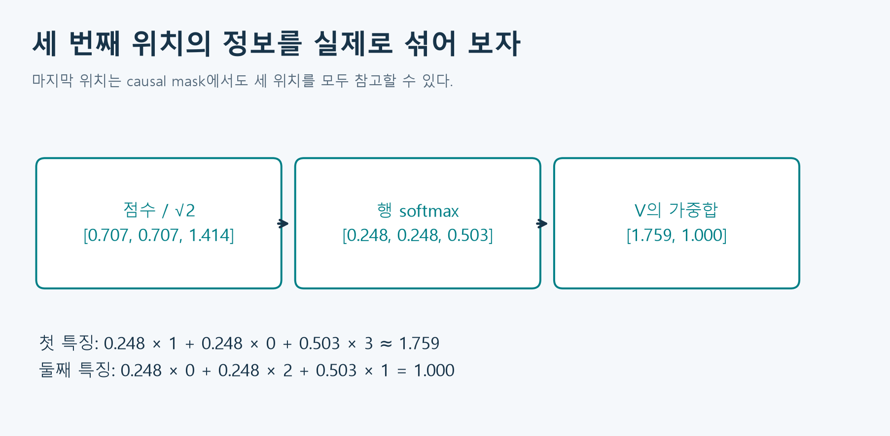

그림 8. 합은 반올림 전 값으로 계산한다. 입력의 한 Value를 그대로 고르는 것이 아니라 여러 Value를 섞을 수 있다.

causal mask를 적용한 전체 가중치와 출력은 다음과 같다. 첫 행은 자기 자신만 볼 수 있고, 둘째 행은 앞의 두 위치를 본다. 마지막 행은 모두 볼 수 있으므로 여기서는 양방향 계산과 같다.

$$
A\approx\begin{bmatrix}1&0&0\\0.3302&0.6698&0\\0.2483&0.2483&0.5035\end{bmatrix},\quad
Z\approx\begin{bmatrix}1&0\\0.3302&1.3395\\1.7587&1.0000\end{bmatrix}.
$$

이 예에서 점수 행렬은 $3\times3$, 출력은 $3\times2$다. 참고 위치 축은 가중합에서 합쳐지고, Value의 특징 축이 남는다. 어텐션은 학습 과정이 아니라 고정된 가중치로도 수행되는 계산이다. 학습은 이런 계산을 여러 번 수행하며 투영행렬 등을 손실에 맞게 갱신하는 별도 절차다.

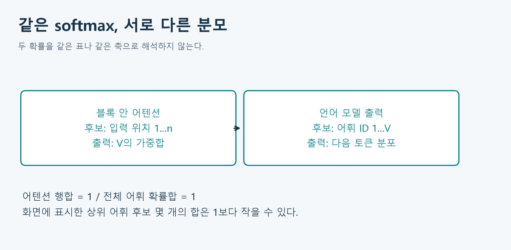

그림 9. 블록 안의 ‘어느 입력 위치를 볼까’와 출력부의 ‘어느 토큰을 낼까’를 구분한다.

## 4. 어텐션 하나만으로는 트랜스포머 블록이 아니다

### 4.1 멀티헤드와 출력 투영

하나의 관련성 기준만 사용하지 않고, 서로 다른 투영행렬로 만든 여러 헤드가 병렬로 계산한다. 같은 문장에서 다른 관계를 포착할 여지가 생긴다. 헤드 수가 곧 문법 규칙 개수인 것은 아니다.

$$
H_r=\operatorname{Attention}(XW_Q^{(r)},XW_K^{(r)},XW_V^{(r)}),
$$

$$
\operatorname{MHA}(X)=\operatorname{Concat}(H_1,\ldots,H_h)W_O.
$$

기본 설계에서 헤드당 Value 폭을 $d/h$로 두면 concat의 폭은 다시 $d$다. concat은 특징을 옆으로 잇는 것이지 토큰 위치를 뒤에 이어 붙이는 것이 아니다. $W_O$는 여러 헤드의 정보를 섞어 잔차 연결에 맞는 출력 폭을 만든다.

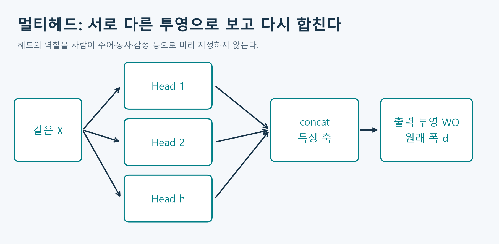

그림 10. 여러 헤드는 동시에 계산할 수 있지만, 다음 토큰을 선택한 뒤 그 다음 토큰을 만드는 생성 과정의 의존성은 별개다.

예를 들어 $n=3,d=8,h=2$라면 헤드별 출력은 $3\times4$, 이어 붙인 결과는 $3\times8$, 출력 투영 후도 $3\times8$이다. 이 차원이 유지되어야 원래 입력과 더할 수 있다.

### 4.2 잔차 연결: 입력을 버리지 않고 보완

$$
R=X+F(X).
$$

$F$는 어텐션 또는 FFN 같은 하위 계산이다. 입력 정보가 우회 경로로 남고, 여러 층을 학습할 때 변화량과 gradient가 전달되는 경로를 제공한다. 결과가 반드시 더 정확해진다거나 입력이 그대로 보존되어 복원 가능하다는 뜻은 아니다. 더하기 이후의 정규화·다음 층도 고려해야 한다.

### 4.3 LayerNorm: 토큰마다 특징 축을 조절

한 위치의 특징 벡터 $x\in\mathbb{R}^{d}$에 대해 다음을 계산한다.

$$
\mu=\frac1d\sum_{r=1}^{d}x_r,\qquad
\sigma^2=\frac1d\sum_{r=1}^{d}(x_r-\mu)^2,
$$

$$
\operatorname{LN}(x)_r=\gamma_r\frac{x_r-\mu}{\sqrt{\sigma^2+\epsilon}}+\beta_r.
$$

$\epsilon$은 0으로 나누는 일을 막는 작은 양수이고, $\gamma,\beta$는 학습되는 특징별 크기·이동 모수다. 여러 문장 전체의 평균이나 토큰 사이 평균을 사용하는 것이 아니다. 초기 기본 형태에서 중심과 규모를 조절하지만, 학습된 $\gamma,\beta$까지 적용한 최종 결과가 언제나 평균 0·분산 1이라고 말하면 틀린다.

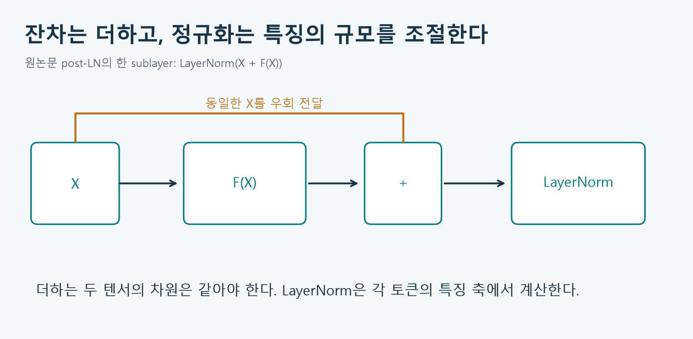

그림 11. 원논문의 post-LN 하위 구조를 독립 재구성했다. 표준 LayerNorm과 Qwen의 RMSNorm은 동일한 연산이 아니다.

### 4.4 FFN: 각 위치 안에서 특징을 변환

어텐션이 토큰 사이에서 정보를 섞었다면, FFN은 각 토큰의 특징을 비선형적으로 가공한다. 같은 블록에서는 모든 위치가 같은 FFN 가중치를 공유한다. 일반적으로 서로 다른 블록의 FFN까지 같은 가중치를 공유하는 것은 아니다.

$$
\operatorname{FFN}(x)=\max(0,xW_1+b_1)W_2+b_2.
$$

원논문에서는 $W_1\in\mathbb{R}^{d\times d_{\mathrm{ff}}}$로 폭을 늘리고 ReLU를 적용한 뒤, $W_2\in\mathbb{R}^{d_{\mathrm{ff}}\times d}$로 폭을 되돌린다. 비선형성이 없으면 연속한 선형 변환을 하나의 선형 변환으로 합칠 수 있다. 비선형 활성화는 표현 가능한 변환을 풍부하게 한다.

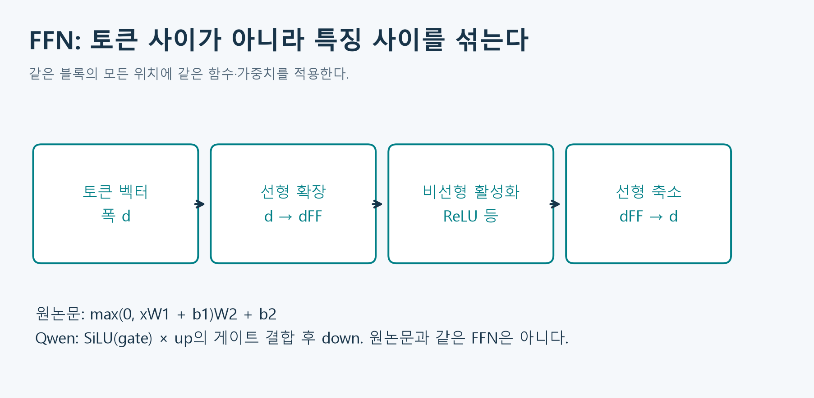

그림 12. FFN에는 토큰 위치끼리 곱하는 $n\times n$ 행렬이 없다. 모든 위치를 병렬 처리할 수 있지만 각 위치는 독립적으로 같은 함수를 거친다.

수계산 보충: $x=[1,-1]$에서 첫 선형 변환 결과가 $[1,-2,0,1]$이면 ReLU 후는 $[1,0,0,1]$이다. 두 번째 변환이 이를 $[0,2]$로 바꾼다면 FFN 출력은 $[0,2]$, 잔차 합은 $[1,1]$이다. FFN 결과와 잔차 합을 구분한다.

이 계산을 직접 확인할 가중치를 아래처럼 정하고 bias는 0으로 둔다. 학습된 Qwen 가중치가 아닌 교육용 수치다. 첫 행렬의 행 수 2는 입력 폭, 열 수 4는 확장 폭이다. 두 번째 행렬은 폭을 2로 되돌린다.

$$
W_1=\begin{bmatrix}1&-1&1&0\\0&1&1&-1\end{bmatrix},\qquad
W_2=\begin{bmatrix}1&0\\0&1\\1&1\\-1&2\end{bmatrix}.
$$

예를 들어 확장 결과의 둘째 성분은 $1(-1)+(-1)(1)=-2$이며 ReLU에서 0이 된다. FFN 출력의 첫 성분은 $1(1)+1(-1)=0$, 둘째 성분은 $1(0)+1(2)=2$다. 실습에서 같은 수치를 코드로 검산한다.

### 4.5 한 블록의 정확한 순서

원논문의 인코더 블록을 dropout 생략, post-LN 형태로 적으면 다음과 같다.

$$
U=\operatorname{LN}\bigl(X+\operatorname{MHA}(X)\bigr),\qquad
Y=\operatorname{LN}\bigl(U+\operatorname{FFN}(U)\bigr).
$$

원논문 디코더에는 masked self-attention 다음에 인코더 출력에 대한 cross-attention이 추가된다. 반면 GPT/Qwen 같은 decoder-only 모델은 일반적으로 이 인코더·cross-attention 부분 없이 causal self-attention과 FFN을 반복한다. ‘디코더’라는 말만 보고 원논문 디코더의 모든 부품이 그대로 있다고 생각하지 않는다.

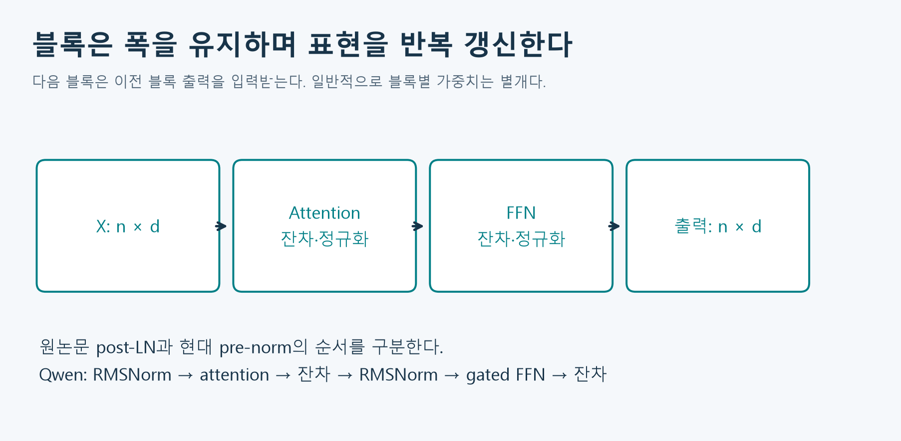

그림 13. 교재 그림 2-9·2-10의 블록 개념을 재구성했다. 잔차를 더하는 자리와 정규화 순서를 본문 수식과 함께 읽는다.

### 4.6 실제 Qwen 블록은 어떻게 다른가

이번 고정 모델은 `Qwen/Qwen2-0.5B`, revision `91d2aff3f957f99e4c74c962f2f408dcc88a18d8`이다. 설정 파일과 설치된 Transformers 5.15.1의 Qwen2 구현을 확인했다. 모델 이름이 비슷해도 다른 크기·버전의 설정을 가져오지 않는다.

| 항목 | 원논문 기본 설명 | 이번 Qwen2-0.5B |
|---|---|---|
| 구조 | 인코더와 디코더 | decoder-only, 24개 블록 |
| 블록 폭 | 기본 실험 512 | 896 |
| 위치 | 사인·코사인 위치 벡터 더하기 | RoPE로 Q/K 회전 |
| 정규화 | 잔차 합 뒤 LayerNorm | 하위 계산 전 RMSNorm, 끝에 최종 RMSNorm |
| 헤드 | 기본 멀티헤드 | Query 14개, KV 2개인 GQA |
| FFN | ReLU, 두 선형 변환 | SiLU 게이트 결합, 중간 폭 4864 |
| 출력 | 작업별 출력층 | 어휘 크기 151936의 로짓 |

Qwen의 pre-norm 블록은 대략 아래 순서다. RMSNorm은 평균을 빼는 LayerNorm과 달리 제곱평균의 제곱근으로 규모를 조절한다.

$$
U=X+\operatorname{Attention}(\operatorname{RMSNorm}(X)),\qquad
Y=U+\operatorname{SwiGLU}(\operatorname{RMSNorm}(U)).
$$

$$
\operatorname{RMSNorm}(x)_r=\gamma_r\frac{x_r}{\sqrt{\frac1d\sum_s x_s^2+\epsilon}},\qquad
\operatorname{SwiGLU}(x)=\bigl(\operatorname{SiLU}(xW_g)\odot(xW_u)\bigr)W_d.
$$

$\odot$는 같은 위치 성분끼리 곱하는 연산이다. $\operatorname{SiLU}(a)=a/(1+e^{-a})$다. 게이트 경로가 다른 확장 특징을 조절한다. GQA에서는 14개 Query 헤드가 2개의 K/V 헤드 그룹을 공유한다. 헤드 폭은 $896/14=64$이며 한 KV 그룹을 Query 헤드 7개가 공유한다. ‘14개 모든 헤드의 결과가 같다’거나 ‘Query도 2개’라는 뜻은 아니다.

참고: [고정 모델의 설정](https://huggingface.co/Qwen/Qwen2-0.5B/blob/91d2aff3f957f99e4c74c962f2f408dcc88a18d8/config.json), [Qwen2 공식 구현 설명](https://huggingface.co/docs/transformers/v5.15.1/en/model_doc/qwen2). 설정의 최대 위치 수가 곧 모든 길이에서 검증된 품질이나 학생 PC에서 가능한 길이를 보장하지 않는다. 실습은 입력 384토큰 이하, 새 토큰 32개 이하로 제한한다.

## 5. 모델 계보: 이름보다 구조·목표를 먼저 본다

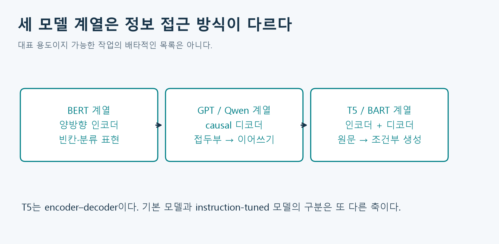

그림 14. 교재 그림 2-10·2-11의 구조 개념을 재구성했다. 모델 선택은 정보 접근, 학습목표, 출력 형태를 함께 보고 한다.

| 계열 | 볼 수 있는 정보 | 대표 사전학습 목표 | 자연스러운 활용과 주의점 |
|---|---|---|---|
| BERT·RoBERTa | 입력의 좌우 문맥 | 선택한 토큰 복원, masked LM | 문장·토큰 분류, 검색 표현. 기본 BERT는 자유로운 다음 토큰 생성기로 학습된 것이 아님 |
| DistilBERT | 양방향 입력 | 큰 모델의 지식을 작은 모델에 전달하는 증류 및 관련 목표 | 더 작은 인코더. ‘증류’는 새 구조 계열 이름이 아님 |
| GPT·Llama·Qwen | 현재까지의 접두부 | 다음 토큰 예측, causal LM | 이어쓰기·대화·코드. 기본 모델과 지시 튜닝 모델 구분 |
| T5 | 인코더 입력 전체와 디코더 접두부 | 손상된 구간을 text-to-text로 복원 | 번역·요약·조건부 생성. encoder–decoder |
| BART | 인코더의 손상된 입력, 디코더 접두부 | 손상된 문장을 원문으로 복원 | 조건부 생성·요약. encoder–decoder |

BERT 원형은 masked LM 외에 NSP 목표도 사용했다. BERT 계열의 모든 후속 모델이 같은 목표 조합을 유지하는 것은 아니다. T5와 BART는 둘 다 인코더–디코더지만 입력 손상 방법, 복원할 대상의 형식, 세부 학습 설정이 다르다. ‘생성한다’는 이유만으로 둘을 decoder-only로 분류하지 않는다.

### 5.1 Self-attention과 cross-attention

번역에서 인코더는 원문을 읽고, 디코더는 지금까지 만든 번역 접두부를 읽는다. cross-attention에서는 디코더 쪽 표현이 Q, 인코더 쪽 표현이 K/V의 출처다.

$$
Q=H_{\mathrm{dec}}W_Q,\qquad
K=H_{\mathrm{enc}}W_K,\qquad V_m=H_{\mathrm{enc}}W_V.
$$

원문 길이를 $n_s$, 번역 접두부 길이를 $n_t$라 하면 cross-attention 점수는 $n_t\times n_s$다. 반드시 정사각 행렬일 필요가 없다. 디코더가 미래의 번역 정답을 보는 것은 금지하지만, 이미 주어진 원문 전체를 참고하는 것은 허용된다.

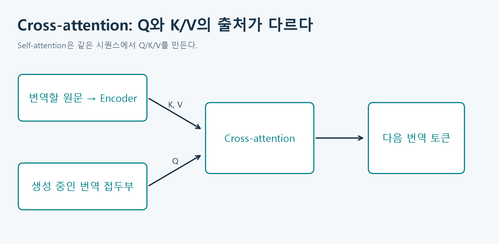

그림 15. 두 시퀀스의 출처가 핵심이다. 원논문 그림의 표현을 복사하지 않고 새 흐름으로 구성했다.

### 5.2 같은 내용을 세 방식으로 제시하면

| 모델 | 입력 예시 | 기대하는 출력의 성격 |
|---|---|---|
| BERT | `The cat drank [MASK].` | 가려진 위치의 토큰 후보 |
| Qwen 기본 모델 | `The cat drank` | 뒤에 이어질 토큰 시퀀스 |
| T5/BART 조건부 생성 | 원문과 학습된 작업 형식 | 입력을 조건으로 하는 새로운 문장 |

이는 인터페이스 설명 예시이며, 이 문장을 모든 기본 체크포인트에 그대로 넣으면 좋은 결과가 나온다는 보장은 아니다. 분류 헤드를 붙인 모델, embedding 전용으로 조정한 모델, 지시 튜닝한 모델을 목적에 맞게 선택해야 한다.

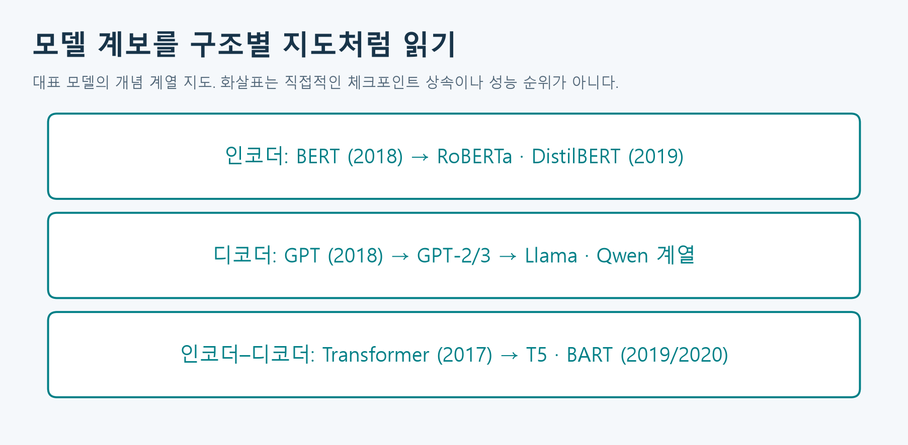

그림 16. 교재 그림 2-12의 세 갈래 분류를 참고한 대표 모델 지도다. T5/BART의 연구 공개 시점과 논문 출판 연도가 다를 수 있다. 2026년 전체 모델 목록·성능 순위가 아니며, 화살표는 직접적인 가중치 상속을 보증하지 않는다.

참고: [BERT 논문](https://aclanthology.org/N19-1423/), [T5 논문](https://jmlr.org/papers/v21/20-074.html), [Hugging Face 모델 구조 비교](https://huggingface.co/learn/llm-course/chapter1/6).

## 6. 사전학습: 정답을 문장 안에서 만들기

### 6.1 다음 토큰 정답은 한 칸 옆에 있다

일반적인 causal LM은 토큰 시퀀스의 다음 토큰을 맞히도록 학습한다. 개념 예로 `I / like / tea / EOS`에서 입력의 `I` 위치는 `like`, `like` 위치는 `tea`, `tea` 위치는 `EOS`를 예측한다. 특수 토큰의 실제 삽입 정책은 학습 데이터·모델마다 다르다.

$$
p_\theta(t_1,\ldots,t_T)=\prod_{i=1}^{T}p_\theta(t_i\mid t_{<i}).
$$

조건부 확률을 곱하면 시퀀스의 확률이 된다. $\theta$는 임베딩, 투영, FFN, 정규화 등 학습되는 모든 모수를 묶어 쓴 기호다. 시작 토큰 처리에 따라 첫 항의 조건 표기는 달라질 수 있다.

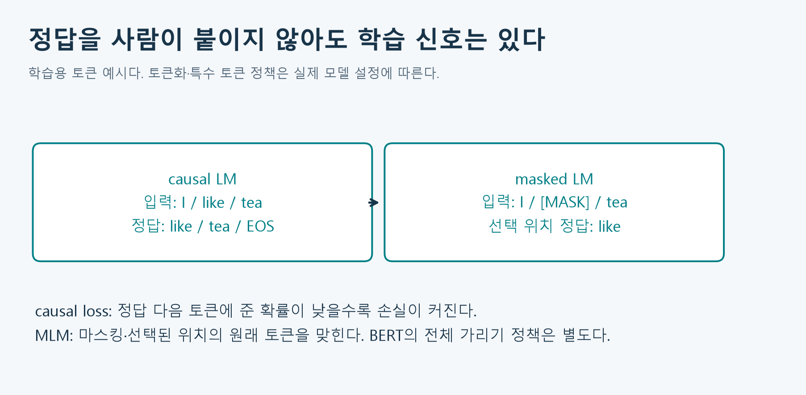

그림 17. 자체 문장으로 만든 정답 시프트와 마스크 비교다. 교재 2.4의 자기지도 사전학습 개념을 보충한다.

학습은 정답 다음 토큰에 높은 확률을 주도록 평균 음의 로그확률을 줄인다. 아래에서는 첫 토큰을 문맥으로 두고 나머지 위치의 손실을 평균한다.

$$
\mathcal{L}(\theta)=-\frac{1}{T-1}\sum_{i=1}^{T-1}
\log p_\theta(t_{i+1}\mid t_1,\ldots,t_i).
$$

정답에 확률 0.8을 주면 손실은 약 0.223, 0.2를 주면 약 1.609다. 자연로그 기준이며 작을수록 정답에 더 높은 확률을 준 것이다. 정답과 가장 확률 높은 후보가 같은지만 확인하는 정확도와 달리 확률 크기도 반영한다. 패딩이나 손실 대상이 아닌 위치는 분모·합에서 제외해야 한다.

$$
\theta\leftarrow\theta-\eta\nabla_\theta\mathcal{L}.
$$

이 식은 단순 경사하강의 개념식이다. $\eta$는 학습률이다. 실제 대규모 학습은 Adam류 옵티마이저 등 더 구체적인 설정을 쓸 수 있다. 모델이 정답을 틀릴 때 사람이 그때마다 올바른 문장을 입력하는 방식만 있는 것은 아니다. 문장에서 만든 정답으로 loss와 gradient를 계산한다.

### 6.2 학습은 병렬인데 생성은 왜 한 토큰씩인가

학습 때는 정답 문장 전체가 있으므로 모든 위치의 예측과 손실을 한 번에 계산할 수 있다. causal mask가 각 위치의 미래 접근을 막아 준다. 이때 정답 접두부를 사용하는 방식을 teacher forcing으로 이해할 수 있다. 추론에서는 다음 토큰이 아직 정해지지 않았으므로 하나를 선택해 입력에 추가해야 그 다음 조건을 알 수 있다. 행렬 계산의 병렬성과 출력 생성의 순차적 의존성은 모순되지 않는다.

### 6.3 사전학습, 미세조정, 프롬프트

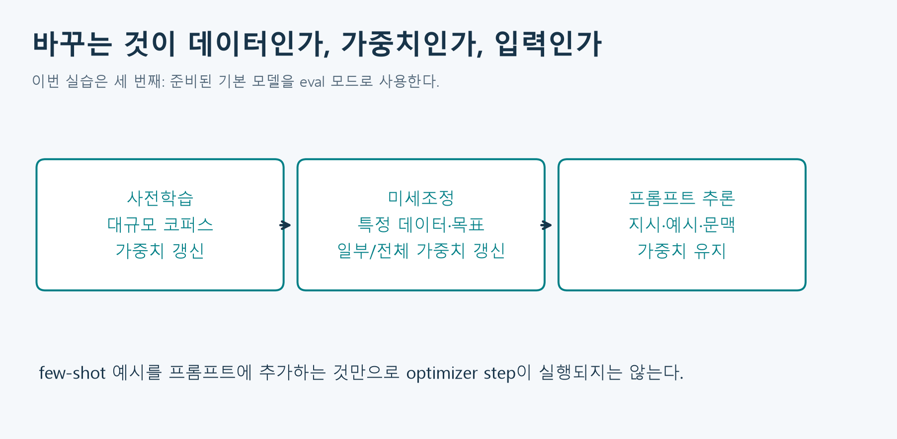

그림 18. 교재 그림 2-13의 이전 학습을 활용하는 개념을 세 작업으로 나누어 재구성했다.

사전학습은 넓은 데이터에서 표현과 언어 패턴을 학습하는 단계다. 미세조정은 목적에 맞춘 데이터로 가중치 일부 또는 전체를 추가 학습한다. instruction tuning은 지시–응답 예시를 활용하는 미세조정의 한 방식이다. 프롬프트에 지시나 few-shot 예시를 넣고 추론만 하는 경우는 입력이 바뀔 뿐 모델 가중치가 갱신되지 않는다. 대화 중 문맥을 활용하는 능력과 가중치가 실제로 학습되는 일을 혼동하지 않는다.

이번 실습은 사전학습을 직접 수행하지 않는다. 공개된 기본 모델을 `eval()`로 로드하고 `inference_mode()`에서 계산한다. `eval()`은 dropout 등 학습·평가 모드를 바꾸고, `inference_mode()`는 gradient 추적 비용을 줄인다. 어느 것도 모델을 새 데이터에 미세조정하는 명령이 아니다.

## 7. 한계와 확장: 잘 이어 쓴다고 사실을 보증하지 않는다

다음 토큰 예측은 자연스러운 문장을 만들 수 있지만, 사실성 검증이나 출처 확인과 동일하지 않다. 훈련 데이터의 편향, 누락, 잘못된 패턴이 출력에 나타날 수 있다. 기본 모델은 요청에 충실하게 답하는 챗봇으로 추가 조정되지 않았을 수 있다. 이 수업에서는 짧은 이어쓰기 관찰을 하며 출력의 사실성을 검증된 정보로 간주하지 않는다.

일반적인 dense self-attention의 점수 행렬은 길이에 대해 $n\times n$이다. 길이를 두 배로 늘리면 이 행렬 원소 수는 네 배가 된다. 메모리 효율 구현은 실제 저장량을 줄일 수 있지만, 긴 문맥의 비용이나 학습 범위·품질 문제 자체가 사라지는 것은 아니다.

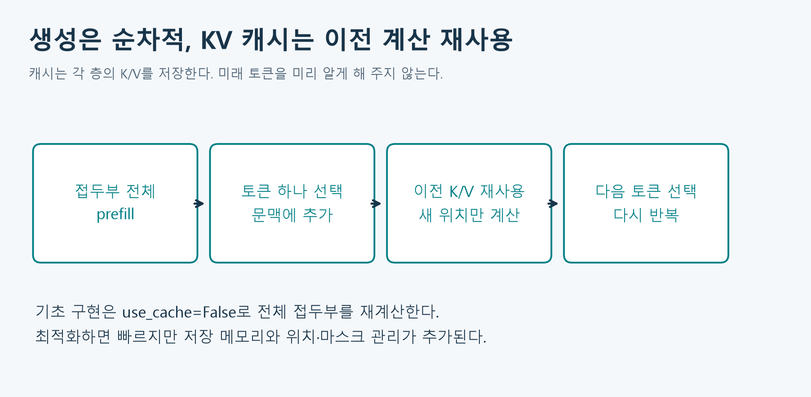

그림 19. KV 캐시는 이전 위치의 K/V 계산을 재사용한다. 각 층에서 별도로 관리하며 모델 가중치와는 다른 임시 추론 상태다.

기초 생성 루프에서는 이해하기 쉽게 캐시를 끄고 전체 접두부를 다시 계산한다. 최적화에서는 이미 계산한 K/V를 저장하고 새 토큰 부분을 추가한다. 같은 접두부에서 과거 causal 표현은 미래를 보지 않으므로 재사용할 수 있다. 캐시를 쓰더라도 새 Query가 이전 위치들을 참고하는 계산과 토큰 간 순차성은 남는다. 참고: [KV 캐시 공식 설명](https://huggingface.co/docs/transformers/main/en/cache_explanation).

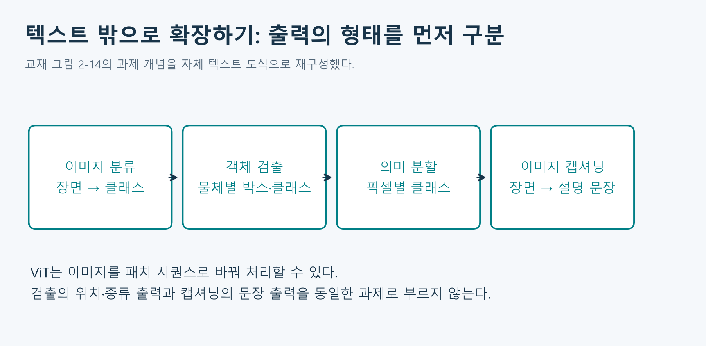

그림 20. 교재 그림 2-14의 과제 개념을 독립 재구성했다. 검출의 ‘위치·종류’와 캡셔닝의 ‘문장’을 구분한다. 이미지도 패치 시퀀스로 바꾸어 Transformer에 넣을 수 있으며 텍스트·이미지 정보를 연결하는 멀티모달 모델로 확장할 수 있다. 이 차시의 필수 모델 다운로드와 구현은 텍스트에 한정한다.

## 8. 프로젝트: 생성 과정을 보여 주는 웹앱

### 8.1 목표와 환경

사용자가 시작 문장과 생성 규칙을 입력하고, 실제 모델이 생성한 문장·선택 토큰·확률·종료 이유를 보게 한다. 새 데이터 파일 업로드나 유료 API 키는 필요 없다. Qwen2-0.5B 공개 가중치 약 1 GB를 최초 다운로드하고 이후 캐시를 재사용한다. CPU 기본이며 충분한 메모리가 필요하다. 다운로드 실패는 실제 오류로 표시하고 가상 문장으로 대체하지 않는다.

교재 2.6의 핵심은 `model.generate()`만 호출하는 것이 아니라 **forward → 마지막 로짓 → 선택 → 추가 → 종료**를 직접 연결하는 데 있다. 2주차 앱은 그대로 남기고, 이번 앱에서는 한 단계 관찰 후 자동 반복을 조립한다.

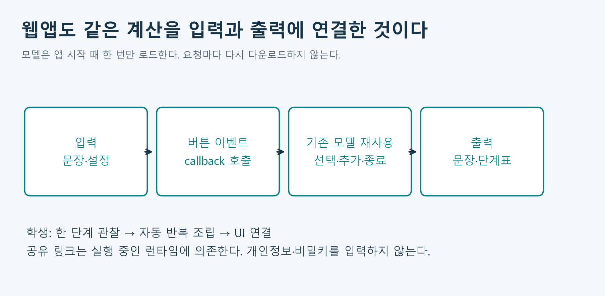

그림 21. 학생이 수정할 곳은 모델 로더가 아니라 반복·종료 조건과 UI 이벤트 연결이다. 한 번 준비한 모델 객체를 여러 요청에서 재사용한다.

### 8.2 출력 형태에서 마지막 위치 찾기

입력 ID가 `[1, n]`일 때 모델 로짓은 `[1, n, V]` 형태다. `outputs.logits[0, -1, :]`는 마지막 입력 위치가 예측하는 **다음** 토큰의 모든 어휘 점수다. 마지막 축의 한 원소만 선택하거나 첫 위치를 선택하면 목표가 달라진다.

$$
\ell\in\mathbb{R}^{V},\qquad
p(v)=\frac{e^{\ell_v}}{\sum_{u=1}^{V}e^{\ell_u}}.
$$

greedy는 가장 높은 로짓의 ID를 선택한다. softmax는 순서를 보존하므로 argmax만 필요한 경우 softmax 계산 없이 고를 수 있다. 확률을 출력할 때는 전체 어휘에서 계산한다.

$$
\hat t=\operatorname*{arg\,max}_{v}\ell_v.
$$

sampling은 점수를 temperature로 나누고, top-k로 후보를 제한하고, 남은 후보의 확률을 다시 정규화하여 뽑는다. 이번 앱의 `top_k=0`은 제한 해제다. `temperature`는 양수여야 하며 greedy에서는 사용하지 않는다. 표에는 기본 모델의 전체 어휘 확률과 필터 후 선택분포 확률을 따로 기록한다. 둘 다 문장의 사실성이 맞을 확률은 아니다.

### 8.3 반복 구현 계약

1. 문장 하나를 토큰화한다. 기본 입력은 1–1500자·384토큰 이하다.
2. `model(input_ids=..., use_cache=False)`로 전체 접두부를 계산한다.
3. 마지막 위치의 로짓에서 다음 ID를 하나 고른다.
4. 선택 ID를 기록하고 입력 ID 뒤에 붙인다. 매번 문자열로 decode한 뒤 다시 tokenize하지 않는다.
5. EOS이면 종료하고, 아니면 새 토큰 제한까지 반복한다.
6. 마지막에 생성 ID 전체를 한 번에 decode한다. 개별 토큰 조각의 문자열을 이어 붙이는 것과 다를 수 있다.

`max_new_tokens`는 새 토큰 수의 한도이며 입력 길이는 제외한다. 총 길이를 제한하는 `max_length`와 다르다. EOS가 나오면 최대 길이에 도달하기 전에 끝날 수 있고, EOS 자체는 표에 기록해도 최종 decode에서 숨길 수 있다. 빈 출력이 언제나 오류라는 뜻은 아니지만 검증 예문에서는 실제 일반 토큰이 생성되는지 확인한다.

### 8.4 실습과 앱 조립

학생 노트북에는 다음 활동이 순서대로 있다. 각 문제는 미완성 상태여도 기본 관찰과 다음 독립 활동을 막지 않도록 분리했다. 자동 반복 완성 전의 기본 웹앱은 한 번에 한 토큰을 생성한다. 자동 반복을 연결한 뒤에는 지정 개수까지 생성하고 단계표를 반환한다.

| 활동 | 해야 할 일 | 자가 점검 |
|---|---|---|
| A · 축 오류 | 어텐션 softmax 축과 차단 위치 수정 | 행합 1, 미래 가중치 0 |
| B · 생성 반복 | 제공된 한 단계 API를 반복하고 EOS 처리 | 새 토큰 수 제한, 순서대로 연결 |
| C · 통제 비교 | 같은 프롬프트에서 greedy와 sampling 비교 | 바꾼 설정과 고정 설정 기록 |
| D · UI 연결 | callback 입력·출력 순서 연결 | 문장·표·종료 이유가 같은 실행 결과 |
| E · 해석 | 모델 선택과 사전학습 설명 | 구조·학습목표·가중치 변경을 근거로 판단 |

설치 버전과 API의 자세한 입력·출력·정의 위치는 노트북의 첫 호출 전에 설명한다. [학생 Colab](https://colab.research.google.com/github/lunalab-ai/genAI/blob/2026-fall-w03a/notebooks/student/w03a_transformers.ipynb)을 열어 Drive에 사본을 저장하고 첫 셀부터 실행한다. 수업 패키지 0.1.3은 `2026-fall-w03a`에 고정하며, [함수별 API 계약](https://github.com/lunalab-ai/genAI/blob/2026-fall-w03a/src/W03A-API.md)에서 입력·출력과 구현을 확인한다.

웹 공유 링크는 실행 중인 Colab 런타임에 의존한다. 런타임을 종료하면 링크도 작동하지 않을 수 있다. 원하지 않는 외부 공유를 피하려면 로컬 모드로 실행한다. 개인정보·비밀키를 입력하거나 공유하지 않는다. 생성 결과에 편향·부정확한 내용이 있으면 그대로 신뢰하지 말고 기록·검토한다.

## 9. 점검 퀴즈

Q1. 토큰 ID와 임베딩 벡터는 어떻게 다른가?

Q2. QK 전치의 3행 2열은 무엇을 뜻하는가?

Q3. 미래 위치의 점수를 0으로 바꾸는 것이 올바른 causal mask인가?

Q4. 어텐션 가중치의 softmax 축과 언어 모델 출력 softmax 축은 어떻게 다른가?

Q5. FFN은 서로 다른 토큰 위치의 정보를 직접 섞는가?

Q6. BERT, Qwen, T5를 각각 어떤 구조 계열로 분류하는가?

Q7. 정답 다음 토큰에 확률 0.2를 준 경우와 0.8을 준 경우 중 손실이 더 큰 것은 어느 쪽인가?

Q8. few-shot 예시를 입력에 추가하면 모델 가중치가 자동으로 업데이트되는가?

Q9. 생성 루프에서 매번 전체 출력 문자열을 다시 토큰화하지 않고 ID를 이어 붙이는 이유는 무엇인가?

Q10. KV 캐시를 사용하면 다음 토큰들을 모두 동시에 결정할 수 있는가?

별도 점검 퀴즈 해설은 문제를 풀어 본 뒤 확인한다. 실습 비교 결과는 [실험 기록 양식](w03a-experiment-log.md)에 남긴다. 성적 반영 과제나 제출 기한은 별도로 정하지 않았다.

## 10. 핵심 정리와 참고

블록은 관련 위치의 Value를 모으는 어텐션, 위치별 특징을 바꾸는 FFN, 잔차·정규화가 결합한 계산이다. 구조의 차이는 무엇을 볼 수 있고 무엇을 출력하도록 학습했는지와 연결된다. 자기지도 사전학습에도 정답과 손실이 있으며, 이번 앱은 그 학습 결과를 바꾸지 않고 사용한다. 생성 루프는 마지막 위치의 점수를 읽어 하나씩 선택·추가하는 과정이다.

- 주교재 『핸즈온 생성형 AI』 2.2–2.7, 인쇄 67–90쪽의 해당 절. 그림 2-9–2-14는 개념 관계를 검토하고 새 배치·예문·수치로 독립 재구성했다. 원본 스캔·출판사 편집 파일은 포함하지 않았다.
- [Attention Is All You Need](https://arxiv.org/html/1706.03762v7): 3.1–3.5의 구조와 수학적 정의 보충.
- [BERT](https://aclanthology.org/N19-1423/)와 [T5](https://jmlr.org/papers/v21/20-074.html): 구조·사전학습 목표의 원 논문.
- [모델 구조별 공식 교육 자료](https://huggingface.co/learn/llm-course/chapter1/6), [Qwen2 모델 카드](https://huggingface.co/Qwen/Qwen2-0.5B), [Gradio Blocks와 이벤트](https://www.gradio.app/guides/blocks-and-event-listeners).

도식 21종은 학습용 자체 제작물이며, 별도 표시가 없는 수치 예는 실제 모델 내부 관측값이 아니다. 본문은 2026-09-14 수업을 위해 확인한 범위의 설명이며 모델 성능 순위나 최신 제품 목록을 제공하는 자료가 아니다.
