# W03B · 트랜스포머 구조 다시 보기

2026년 9월 16일 수요일 · 생성형 인공지능 · 3주차 2차시 보강

교재 2장 2.2–2.7 / W03A를 마쳤다고 가정하지 않습니다. 오늘의 목표는 **블록 안에서 무엇이 바뀌는지 설명하고, 그 블록을 가진 실제 모델로 한 토큰씩 누적하는 웹앱을 만드는 것**입니다.

[단계별 Colab](https://colab.research.google.com/github/lunalab-ai/genAI/blob/2026-fall-w03b/notebooks/student/w03b_transformer_walkthrough.ipynb) · [실험 기록](w03b-workbook.md) · [지난 강의](https://github.com/lunalab-ai/genAI/blob/main/course/notion/w03a/w03a-transformers.md)

## 1. 먼저 세 가지를 구별합니다

“나는 오늘 학교에”라는 문장이 토큰화되었다고 합시다. 실제 토크나이저는 한 단어를 여러 조각으로 나눌 수 있으므로, 아래 단어 단위 예시는 원리 설명용입니다.

|대상|무엇인가|변하는 때|
|---|---|---|
|토큰 ID|어휘표의 번호. 크고 작은 숫자가 의미의 크기를 뜻하지 않음|새 토큰을 추가하면 ID열이 길어짐|
|임베딩|ID로 조회한 실수 벡터|학습 때 임베딩 표의 값이 바뀜|
|문맥 표현|블록을 지나 주변 정보를 반영한 벡터|입력 문맥과 블록에 따라 달라짐|

블록 입력 $X\in\mathbb{R}^{n\times d}$의 **행은 토큰 위치**, **열은 특징**입니다. 오늘 손계산은 $n=3,d=4$입니다. 블록은 대체로 이 모양을 보존하면서 각 행의 내용을 더 유용하게 바꿉니다. 배치 축은 그림에서 생략합니다.

## 2. 큰 구조도: 선을 따라 읽기

그림 출처: Vaswani et al., *Attention Is All You Need*, Figure 1. [원논문](https://arxiv.org/html/1706.03762v7) / [원본 이미지](https://arxiv.org/html/1706.03762v7/Figures/ModalNet-21.png). 원논문에 명시된 출처 표시 조건부 학술적 재사용 허용에 따라 원본 그대로 사용했습니다. 교재 그림 2-10의 원출처이며, 출판사의 번역·편집 이미지를 복제한 것은 아닙니다.

그림은 **아래에서 위로** 읽습니다. 영어 상자 이름보다 다음 경로를 먼저 짚으세요.

1. 왼쪽 **Inputs → Input Embedding**: 원문 토큰 ID를 벡터로 바꿉니다. Positional Encoding을 더해 순서 정보를 줍니다. 어텐션 자체만으로는 위치 순서를 알 수 없기 때문입니다.
2. 왼쪽 회색 테두리 **$N\times$**: self-attention과 FFN을 가진 인코더 블록을 여러 층 쌓습니다. 같은 모양의 층이지, 모든 층이 동일한 가중치를 공유한다는 뜻은 아닙니다.
3. 오른쪽 **Outputs (shifted right)**: 학습에서는 정답 출력의 이전 토큰들을 넣습니다. 추론에서는 시작 토큰과 지금까지 생성한 토큰을 넣습니다.
4. 오른쪽 첫 어텐션은 **Masked Multi-Head Attention**입니다. 현재 위치에서 미래 출력은 보지 않습니다. 두 번째 어텐션은 왼쪽 인코더 출력도 받아 원문을 참고하는 **cross-attention**입니다.
5. 오른쪽 맨 위 **Linear → Softmax**: 출력 벡터를 전체 어휘 후보의 점수로 바꾸고 다음 토큰 분포를 만듭니다. 어텐션 안의 softmax와는 대상 축이 다릅니다.

그림의 가느다란 우회선은 장식이 아닙니다. 각 하위층에 들어가기 전 값을 보관했다가 계산 결과에 더하는 **잔차 연결**입니다. GPT/Qwen은 이 전체 번역 구조를 그대로 쓰지 않습니다. 별도 인코더와 그 출력에 대한 cross-attention이 없는 decoder-only 계열입니다.

## 3. 한 블록을 끝까지: 섞기 → 보존하기 → 특징 바꾸기

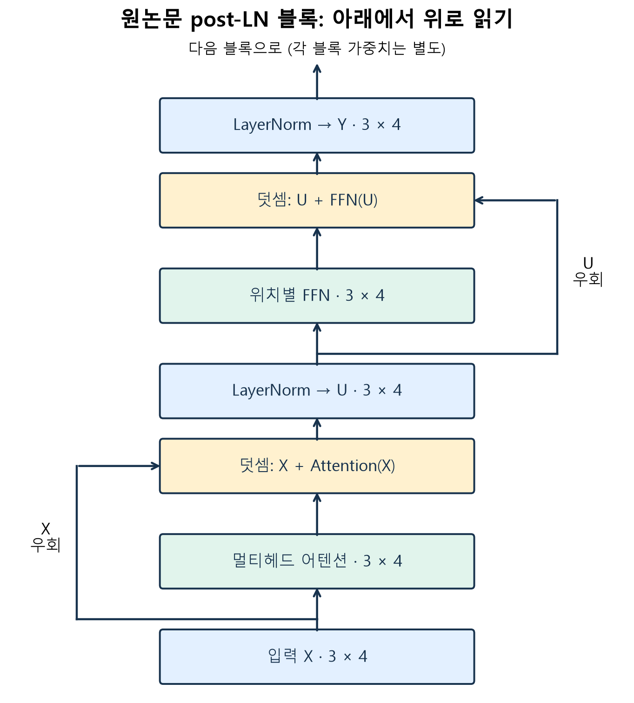

자체 제작. 원논문 post-LN 기준입니다. 입력과 각 결과의 모양은 모두 $3\times4$여서 더할 수 있습니다.

### 3.1 어텐션: 다른 위치의 정보를 받아옵니다

각 위치가 다른 위치를 얼마나 참고할지 계산하고, 그 비중으로 정보를 섞습니다. “그것”이 어느 대상을 가리키는지 판단할 때 주변 단어 표현을 참고하는 상황을 떠올려 보세요. 다만 어텐션 비중을 사람처럼 이해했다는 증거나 유일한 설명으로 해석해서는 안 됩니다.

### 3.2 잔차: 원래 표현에 수정량을 더합니다

$$R_1=X+\operatorname{MHA}(X),\qquad U=\operatorname{LN}(R_1)$$

$X$는 지우지 않고 우회선에 남겨 둡니다. 어텐션 결과는 원래 표현에 보탤 정보입니다. **이어 붙이기(concat)가 아니라 같은 위치·같은 특징끼리 덧셈**합니다. 잔차 경로는 깊은 모델의 정보·기울기 전달을 돕습니다.

### 3.3 LayerNorm: 한 위치 안의 특징 스케일을 조정합니다

한 행 $r=(r_1,\ldots,r_d)$에 대해

$$\mu={1\over d}\sum_j r_j,\quad \sigma^2={1\over d}\sum_j(r_j-\mu)^2,$$
$$\operatorname{LN}(r)_j=\gamma_j{r_j-\mu\over\sqrt{\sigma^2+\epsilon}}+\beta_j.$$

평균을 빼고 표준편차로 나눈 뒤 학습 가능한 크기 $\gamma$와 이동 $\beta$를 적용합니다. $\epsilon$은 0으로 나누는 것을 막는 작은 양수입니다. **여러 토큰의 평균을 내어 같은 값으로 만드는 연산도, 확률의 합을 1로 만드는 softmax도 아닙니다.** 손계산에서는 $\gamma=1,\beta=0$으로 둡니다.

### 3.4 FFN: 같은 위치의 특징을 가공합니다

$$F=\max(0,UW_1+b_1)W_2+b_2,\qquad Y=\operatorname{LN}(U+F).$$

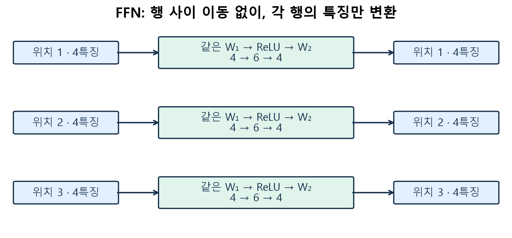

자체 제작. 예시에서 $W_1:4\times6$, $W_2:6\times4$입니다. $3\times4\to3\times6\to3\times4$로 폭을 늘렸다 되돌립니다. ReLU는 음수를 0으로 만드는 비선형 함수입니다. 비선형성이 없다면 두 선형 변환을 하나로 합칠 수 있습니다.

모든 위치에 **동일한 FFN 가중치**를 적용하지만 행 사이 값을 직접 섞지는 않습니다. 어텐션은 위치 간 정보 교환, FFN은 위치별 특징 변환이라는 역할을 구별하세요. 마지막 $Y$가 다음 블록의 입력이 됩니다.

## 4. 어텐션을 한 행씩 계산하기

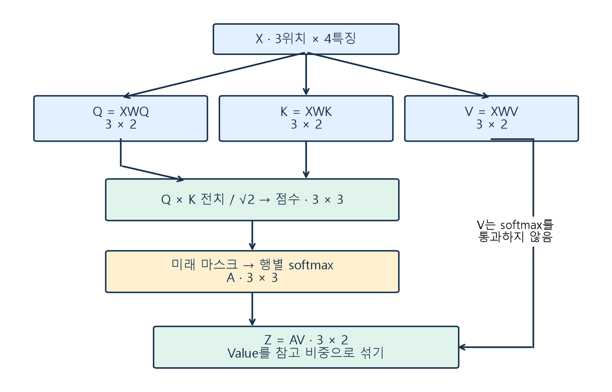

자체 제작. Q/K/V는 세 종류의 단어가 아니라 **같은 입력을 서로 다른 용도로 투영한 벡터**입니다.

$$Q=XW_Q,\quad K=XW_K,\quad V=XW_V.$$

Query는 “지금 위치가 찾는 단서”, Key는 “각 위치가 비교에 내놓는 단서”, Value는 “실제로 가져올 정보”라는 비유로 읽습니다. $W_Q,W_K,W_V$는 학습됩니다. 사람이 검색어를 직접 써 넣거나 단어 뜻을 수작업으로 분류하는 것이 아닙니다.

### 4.1 손계산 예제: 세 위치, head 폭 2

아래는 **학습된 모델에서 추출하지 않은 교육용 숫자**입니다. 노트북의 `block_walkthrough()`와 같습니다.

$$Q=K=\begin{bmatrix}1&0\\0&1\\1&1\end{bmatrix},\qquad V=\begin{bmatrix}1&0\\0&2\\3&1\end{bmatrix}.$$

$$S={QK^\top\over\sqrt{d_k}}={1\over\sqrt2}\begin{bmatrix}1&0&1\\0&1&1\\1&1&2\end{bmatrix}.$$

$S_{ij}$는 **정보를 받는 위치 $i$의 Query**와 **참고하는 위치 $j$의 Key**의 내적입니다. $\sqrt{d_k}$로 나누는 이유는 head 폭이 커질 때 내적 크기가 커져 softmax가 지나치게 뾰족해지는 경향을 줄이기 위해서입니다.

### 4.2 두 번째 위치만 확대합니다

마스크 전 두 번째 행은 $[0,0.7071,0.7071]$입니다. causal 조건에서는 위치 2가 위치 3을 보면 안 되므로

$$[0,0.7071,-\infty]\xrightarrow{\text{softmax}}[0.3302,0.6698,0].$$

$$A_{ij}={\exp(S_{ij}+M_{ij})\over\sum_k\exp(S_{ik}+M_{ik})},\qquad M_{ij}=\begin{cases}0&j\le i\\-\infty&j>i.\end{cases}$$

분모는 **같은 행의 참고 위치들**을 더합니다. 위치 2 자신은 볼 수 있습니다. 미래 점수를 0으로 바꾸면 $\exp(0)=1$이므로 차단되지 않습니다.

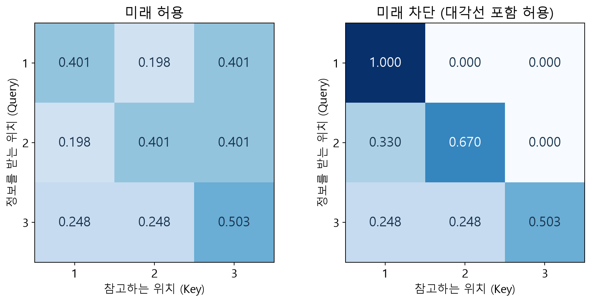

자체 제작. 각 행의 합은 1입니다. 세 번째 위치는 이미 마지막이어서 마스크 전후가 같습니다. 첫 번째 위치는 자기 자신만 참고하여 $[1,0,0]$이 됩니다.

마지막으로 Value를 가중합합니다.

$$z_2=0.3302[1,0]+0.6698[0,2]+0[3,1]=[0.3302,1.3395].$$

이 값은 토큰 번호도 다음 단어 확률도 아닙니다. **두 번째 위치에 전달할 새 특징 벡터**입니다. 모든 행을 한꺼번에 계산하면

$$Z=AV,\qquad (3\times3)(3\times2)=3\times2.$$

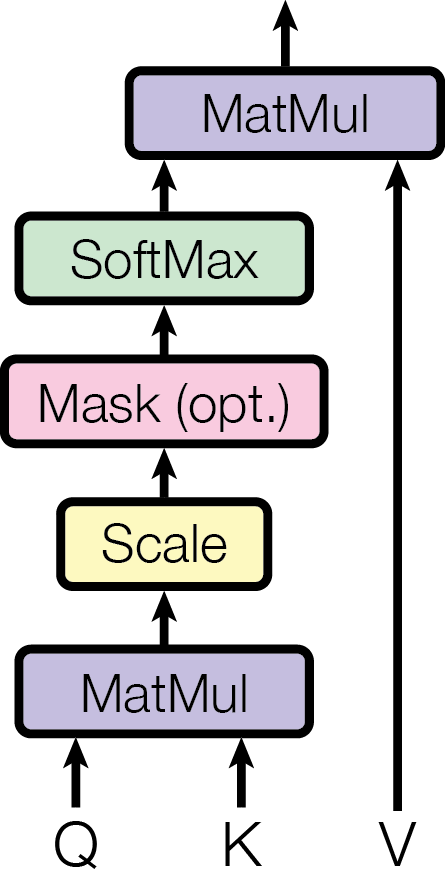

출처: Vaswani et al., Figure 2 왼쪽, [원본](https://arxiv.org/html/1706.03762v7/Figures/ModalNet-19.png), 원본 그대로 학술적 재사용. 아래 Q/K에서 시작해 MatMul → Scale → Mask → SoftMax → V와 MatMul 순서를 위쪽으로 짚으세요.

## 5. 여러 head는 병렬로 계산하고 열 방향으로 합칩니다

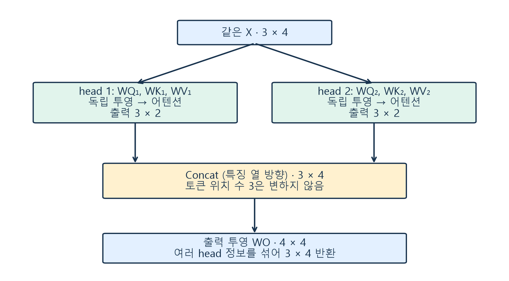

자체 제작. head 1이 계산된 뒤 head 2를 실행하는 직렬 관계가 아닙니다. 각 head는 서로 다른 투영 가중치를 가집니다. 특정 head가 언제나 특정 문법만 맡는다고 정해져 있지는 않습니다.

$$\operatorname{MHA}(X)=\operatorname{Concat}(Z_1,\ldots,Z_h)W_O.$$

예시에서는 두 $3\times2$를 특징 열 방향으로 합쳐 $3\times4$로 만들고, $W_O\in\mathbb{R}^{4\times4}$로 head들의 정보를 섞습니다. 원래 $X$와 폭이 같아져 잔차 합이 가능합니다. **concat 때 위치 수 3을 6으로 늘리지 않습니다.**

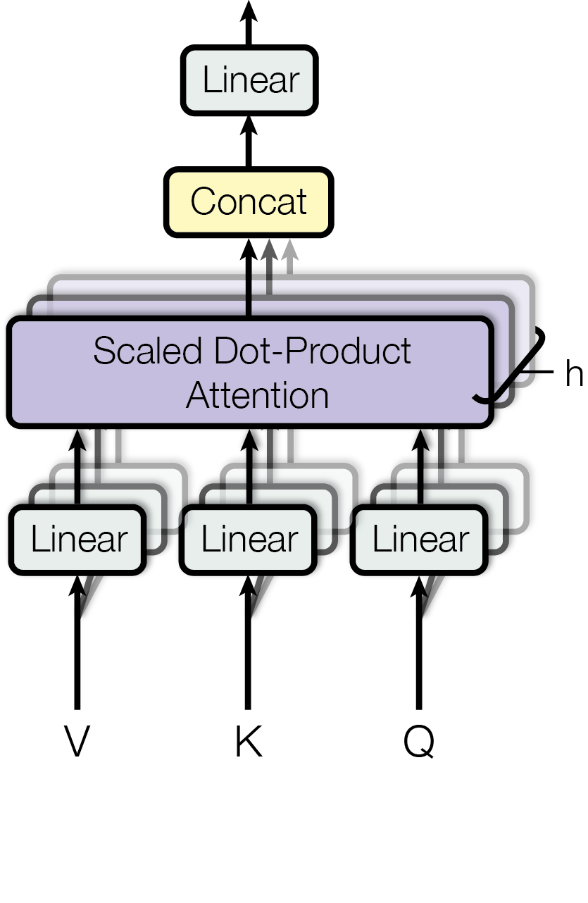

출처: Vaswani et al., Figure 2 오른쪽, [원본](https://arxiv.org/html/1706.03762v7/Figures/ModalNet-20.png), 원본 그대로 학술적 재사용. 아래 세 Linear는 Q/K/V 투영, 위 Linear는 결합 후 출력 투영입니다.

### 원논문 그림과 실제 Qwen을 구별하기

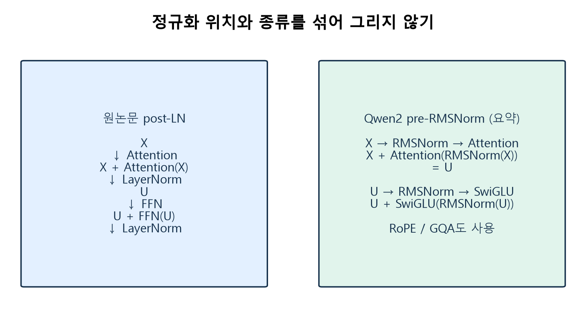

자체 제작. 실제 실습 모델 Qwen2는 하위층 **앞**의 RMSNorm, 위치 정보를 주는 RoPE, K/V head를 공유하는 GQA, SwiGLU FFN을 사용합니다. RMSNorm은 LayerNorm처럼 평균을 빼는 방식이 아닙니다. 이번 손계산은 원리를 보기 위한 post-LN/ReLU 블록이며 Qwen의 가중치·어텐션을 재현한 것이 아닙니다. 기본 역할은 같지만 세부식을 섞어 그리면 안 됩니다.

## 6. 모델 계보: 세 갈래를 비교합니다

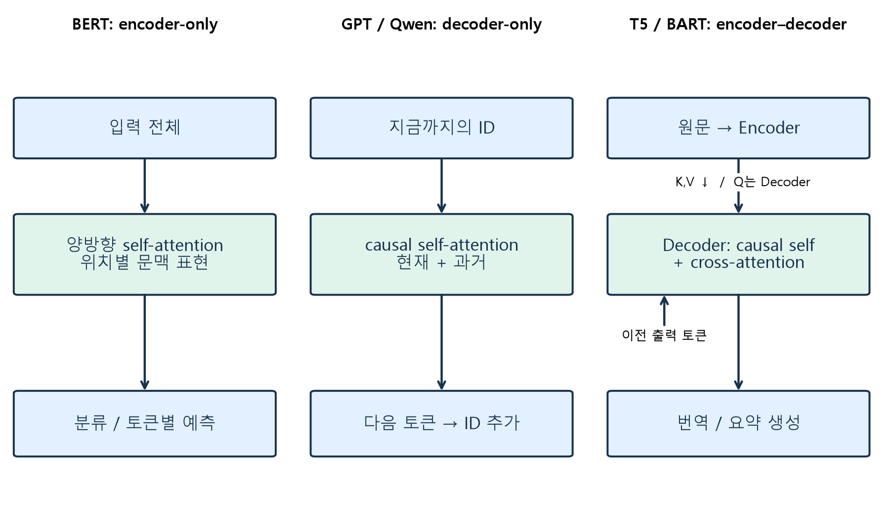

자체 제작. 세 패널 사이에 처리 순서가 있는 것이 아닙니다. 출발점은 2017 Transformer이며 BERT/GPT(2018), BART/T5(2019 연구 공개), 이후 Qwen 등으로 구조와 학습 방식이 다양해졌습니다. 단순한 한 줄의 후계 관계는 아닙니다.

|비교 축|BERT|GPT / Qwen 기본 모델|T5 / BART|
|---|---|---|---|
|구조|encoder-only|decoder-only|encoder–decoder|
|self-attention 접근|입력의 앞뒤|현재까지의 토큰|인코더는 전체, 디코더는 현재까지|
|cross-attention|기본 구조에 없음|기본 텍스트 구조에 없음|디코더 Q가 인코더 K/V 참고|
|대표 사전학습 정답|가린 토큰, 원 BERT는 NSP도 사용|다음 토큰|T5: 가린 구간 / BART: 손상 전 문장 복원|
|잘 맞는 출발 과제|분류·토큰 라벨링·표현|이어쓰기·텍스트 생성|조건부 번역·요약·변환|

생성을 한다고 모두 decoder-only는 아닙니다. T5도 생성합니다. 또 GPT/Qwen으로 분류를 수행할 수 있으므로 표는 “유일한 가능한 용도”가 아닙니다. **base와 instruct 구분은 encoder/decoder 구분과 별개**입니다. 이번 기본 Qwen은 대화 지시를 잘 따르도록 만든 챗봇이 아니라 이어쓰기 모델입니다.

구조 비교 근거: [Hugging Face LLM Course](https://huggingface.co/learn/llm-course/chapter1/6), [원논문](https://arxiv.org/html/1706.03762v7). 실제 모델은 [고정 Qwen2-0.5B revision](https://huggingface.co/Qwen/Qwen2-0.5B/tree/91d2aff3f957f99e4c74c962f2f408dcc88a18d8)을 사용합니다.

## 7. 사전학습과 생성: 정답이 있는가, 가중치를 바꾸는가?

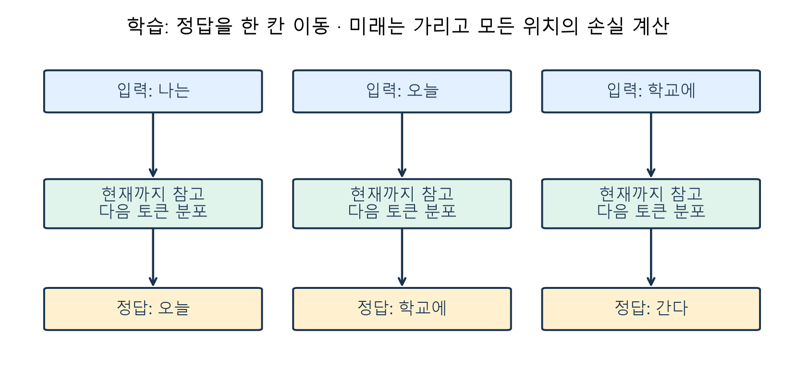

자체 제작. 단어 단위 개념 예시이며 실제 토크나이저 분할이 아닙니다. 입력 “나는 오늘 학교에”에 대해 위치별 정답은 “오늘 학교에 간다”입니다. 한 문장을 여러 위치의 학습 예제로 사용할 수 있습니다.

$$\mathcal L=-{1\over T}\sum_{t=1}^{T}\log p_\theta(x_{t+1}\mid x_1,\ldots,x_t).$$

$\theta$는 모델 가중치, $T$는 정답이 있는 예측 위치 수입니다. 정답 확률 0.8이면 한 위치 손실은 약 0.223, 0.2이면 약 1.609입니다. 학습은 이 손실을 줄이는 방향으로 가중치를 바꿉니다. 정답이 원문에서 만들어지므로 사람이 모든 다음 단어를 별도로 표시할 필요가 없습니다.

|단계|데이터/입력|가중치 갱신|이번 실습|
|---|---|---|---|
|사전학습|많은 텍스트와 자체 구성 정답|있음|이미 학습된 가중치를 다운로드|
|미세조정|목적에 맞는 추가 데이터|있음|수행하지 않음|
|추론|사용자 프롬프트|없음|실제 forward로 다음 토큰 선택|

학습에서는 정답 토큰이 이미 있어 마스크를 쓰면서 여러 위치의 손실을 병렬 계산할 수 있습니다. 추론에서는 다음 입력에 넣을 토큰 자체를 아직 모르므로 한 번 선택한 결과를 다음 단계로 넘깁니다. 프롬프트에 예시를 추가하는 것만으로 가중치가 학습되지는 않습니다.

## 8. 실습: 한 단계에서 웹앱까지

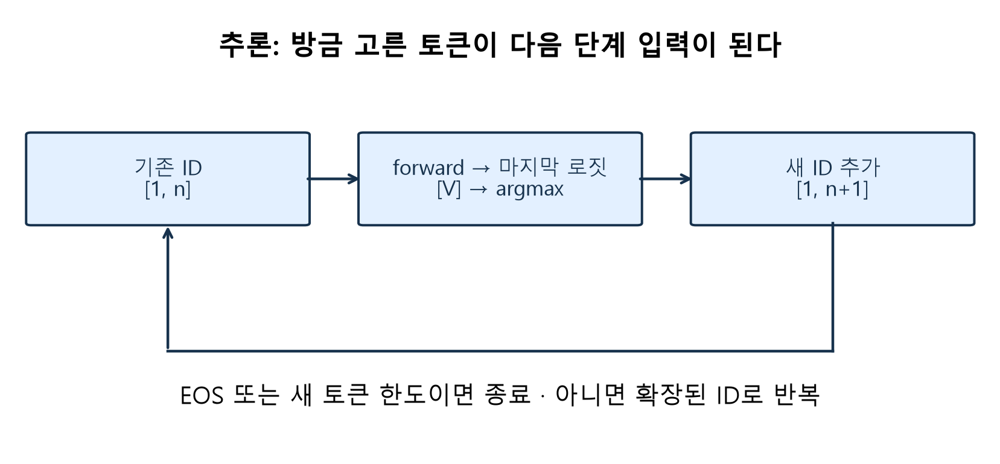

자체 제작. `model.generate()`를 한 번 호출하는 대신 다음 과정을 직접 연결합니다.

1. 토큰화: 문자열 → ID tensor `[1,n]`.
2. 실제 forward: 전체 위치 로짓 `[1,n,V]` 중 마지막 위치 `[V]` 사용.
3. greedy 선택: 가장 큰 로짓의 ID 하나 선택.
4. ID 추가: `[1,n]` → `[1,n+1]`. 문자열을 다시 토큰화하지 않음.
5. EOS 또는 새 토큰 한도이면 멈추고, 아니면 반복. 전체 ID열을 decode해 문장 표시.

여기서 $V$는 어휘 크기 기호로서, 어텐션의 Value 행렬 $V$와 문맥이 다릅니다. 후보 확률이 높다고 문장이 사실이라는 뜻도 아닙니다. greedy의 선택 확률 1은 선택 규칙의 결과일 뿐입니다.

### Colab 실행 순서

새 W03B 사본을 Drive에 저장합니다. 패키지는 **0.1.4**, 고정 태그는 **2026-fall-w03b**입니다. W03A 사본과 기존 태그는 유지됩니다. CPU 기본, 유료 API 키·원자료 업로드는 필요 없습니다. 최초 공개 모델 약 1 GB 다운로드 뒤 캐시를 재사용합니다. 다운로드 오류를 가짜 결과로 대신하지 않습니다.

먼저 작은 NumPy 블록을 확인합니다. 그다음 모델을 한 번 준비하고 `s0 → s1 → s2`를 직접 연결합니다. 마지막 짧은 반복문의 빈칸과 버튼 연결을 완성합니다. 문제를 못 풀어도 기본 관찰 앱은 독립적으로 실행됩니다.

웹 화면의 **초기화**는 프롬프트를 ID로 바꾸고 기록을 비웁니다. **다음 토큰 1개 추가**는 저장된 ID에 한 토큰만 붙입니다. 문장이나 한도를 바꾸면 다시 초기화해야 합니다. 사용자별 `gr.State`를 사용하므로 다른 세션의 생성 기록과 섞지 않습니다.

|버튼|입력 → 함수|반환 → 화면|
|---|---|---|
|초기화|문장, 한도 → reset|새 상태, 원문, 빈 표, ready|
|다음 토큰|문장, 한도, 상태 → advance|새 상태, 누적 문장, 기록 표, 종료 상태|
|자동 생성(조립 활동)|문장, 한도 → 학생 callback|완성 문장, 표, 종료 이유|

기본 앱은 `share=False`입니다. Colab 외부 공유는 노트북의 별도 선택 안내를 따릅니다. 공유 주소는 런타임이 종료되면 사용할 수 없고 영구 서비스가 아닙니다. 개인정보·비밀 정보를 입력하지 마세요. 모델 출력은 오류·편향을 포함할 수 있습니다.

## 9. 출구 질문

Q1. 잔차 덧셈에서 두 배열은 어떤 조건을 만족해야 하는가?

Q2. causal mask는 자기 자신도 가리는가? 미래 점수를 0으로 만들면 되는가?

Q3. 한 토큰을 고른 다음 forward에는 무엇을 넣는가?

추가 복습 질문:

- FFN과 어텐션은 어떻게 역할이 다른가?
- 두 개의 3×2 head를 concat하면 6×2인가?
- T5가 문장을 생성하므로 decoder-only라고 할 수 있는가?
- 어텐션 표의 확률과 다음 토큰 확률의 정규화 축은 같은가?
- 추론 중 프롬프트 변경은 미세조정인가?

[퀴즈 해설](https://github.com/lunalab-ai/genAI/blob/main/course/handouts/w03b-quiz.md)은 먼저 답을 말해 본 뒤 확인하세요. 별도 성적 반영 과제나 제출 기한은 없습니다.

## 부록: 차원을 한 번에 점검하기

|연산|입력|출력|확인할 축|
|---|---|---|---|
|Q/K/V 투영|$X:3\times4$, 각 $W:4\times2$|각 $3\times2$|마지막 특징 축|
|점수|$Q:3\times2$, $K^\top:2\times3$|$3\times3$|받는 위치 × 참고 위치|
|마스크·softmax|$3\times3$|$3\times3$|각 행 합 1|
|가중합|$A:3\times3$, $V:3\times2$|$3\times2$|참고 위치를 합산|
|2 head concat|각 $3\times2$|$3\times4$|열 방향 결합|
|출력 투영·잔차·LN|$3\times4$|$3\times4$|덧셈 모양 일치|
|FFN|$3\times4$|$3\times6\to3\times4$|행은 독립, 가중치는 공유|

예시 $X=[e_1;e_2;e_3]\in\mathbb R^{3\times4}$, $W_Q=W_K=[(1,0);(0,1);(1,1);(0,0)]$, $W_V=[(1,0);(0,2);(3,1);(0,0)]$로 두면 본문의 Q/K/V가 정확히 나옵니다. 모든 중간 배열과 두 head의 독립 가중치는 공개 `walkthrough.py`에서 확인합니다. 숫자를 임의로 부여한 교육용 블록이며 학습 결과로 해석하지 않습니다.
