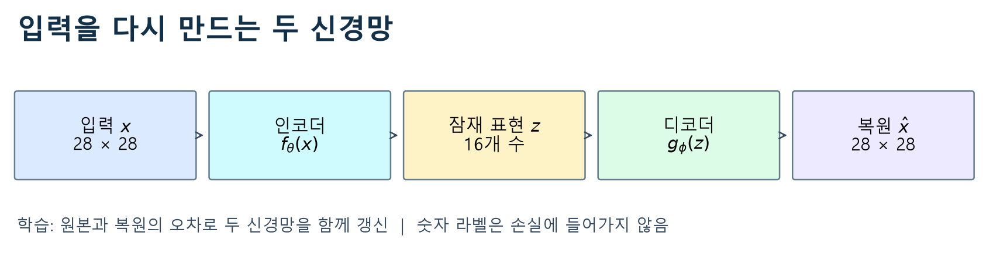
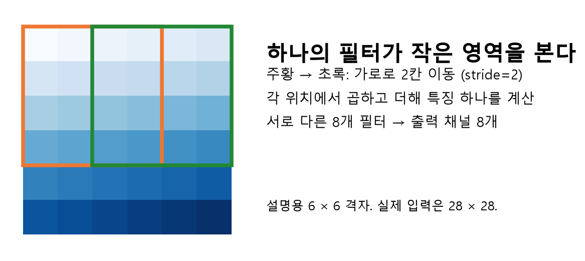
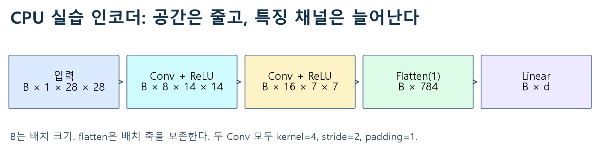
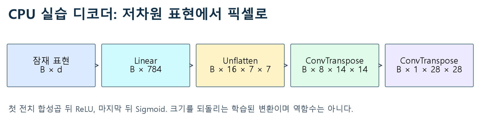
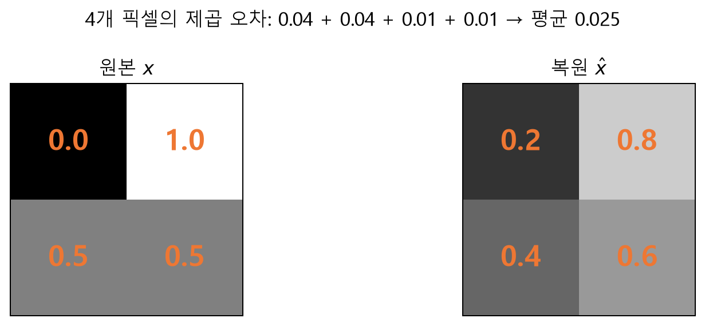
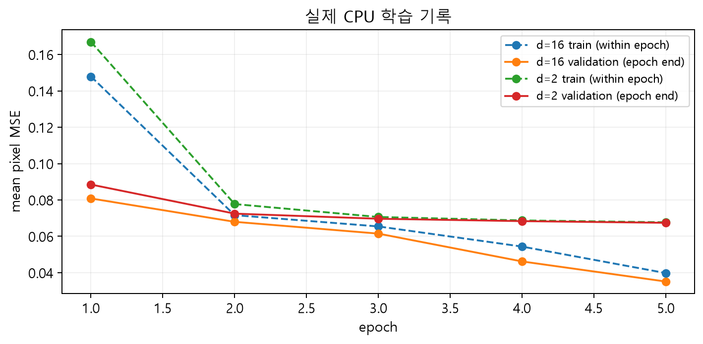
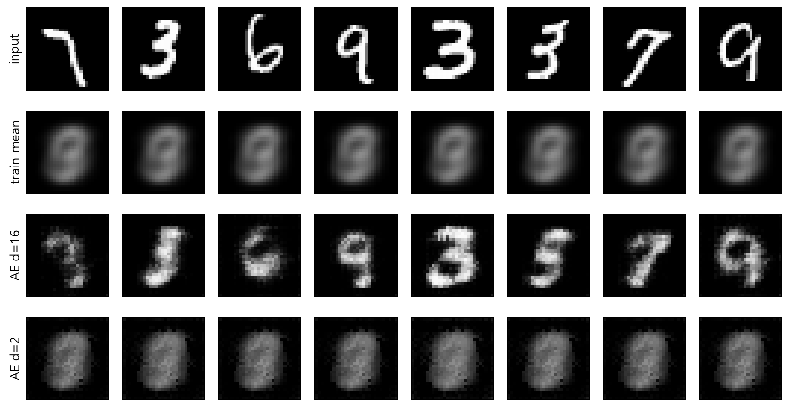
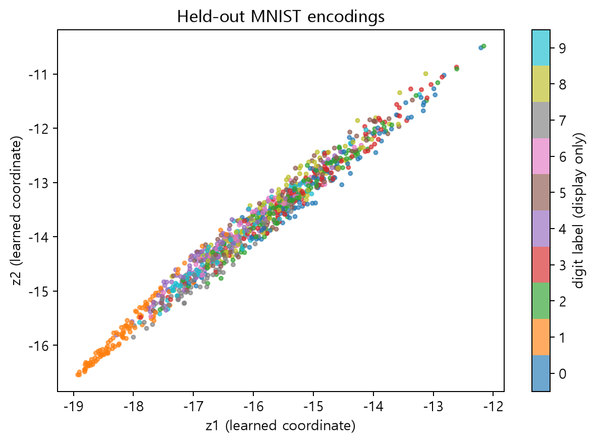
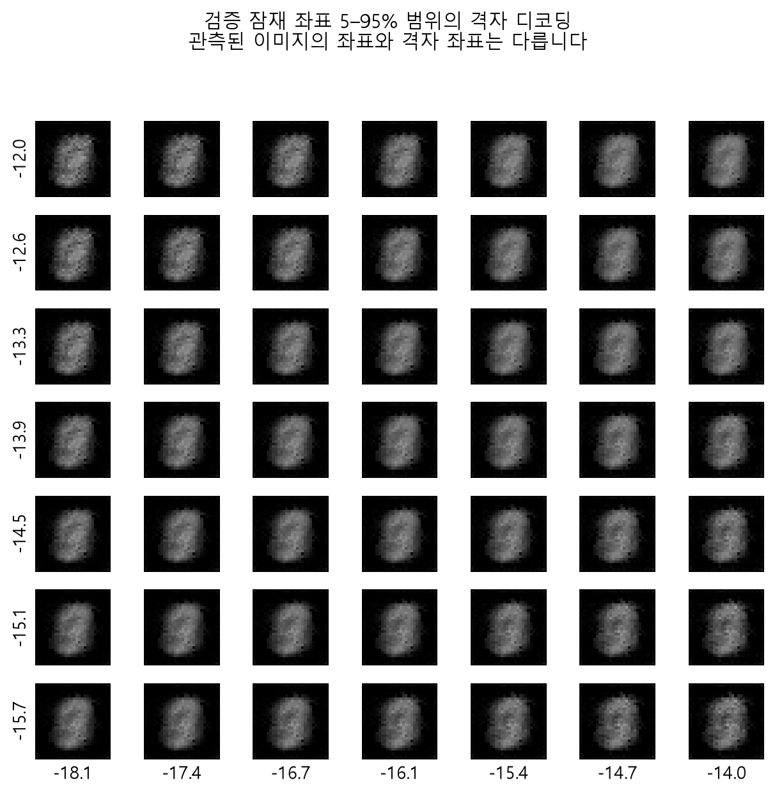

# W04A · 오토인코더: 압축과 복원으로 배우는 잠재 표현

데이터 사이언스를 위한 생성형 인공지능 · 2026년 9월 21일 월요일 · 4주차 1차시

주교재 『핸즈온 생성형 AI』 3.1 오토인코더, 3.1.1–3.1.6(97–119쪽).

[Colab 실습 열기](https://colab.research.google.com/github/lunalab-ai/genAI/blob/2026-fall-w04a/notebooks/student/w04a_autoencoders.ipynb) · [실험 기록지](w04a-workbook.md) · [공통 코드/API](https://github.com/lunalab-ai/genAI/blob/2026-fall-w04a/src/W04A-API.md)

## 1. 오늘의 질문: 작은 표현으로 원본을 다시 만들 수 있을까?

손 글씨 숫자 한 장은 28×28개의 밝기 값으로 표현된다. 이 784개 숫자를 16개 숫자로 바꾸고, 그 16개만 보고 원래 이미지를 다시 만들도록 두 신경망을 함께 학습할 수 있다. 첫 신경망은 인코더, 두 번째는 디코더다. 둘을 연결한 모델을 **오토인코더(autoencoder, AE)**라고 한다.

이 수업의 목표는 이미지를 통째로 외워 출력하는 프로그램을 만드는 것이 아니다. 제한된 표현을 통과하면서 복원에 유용한 특징이 어떻게 남는지 관찰한다. 다만 낮은 차원이라고 해서 언제나 의미 있는 표현을 학습하는 것은 아니다. 모델의 용량, 학습 데이터, 손실, 최적화와 평가를 함께 살펴야 한다.

오늘 수업 뒤에는 다음을 할 수 있어야 한다.

- 입력·잠재 표현·복원을 구별하고 자기 지도 학습의 target을 설명한다.
- 배치·채널·공간 차원을 추적하고 인코더와 디코더의 역할을 읽는다.
- MSE를 작은 예에서 계산하고 학습 코드의 각 단계를 설명한다.
- 같은 미사용 이미지로 복원 성능과 한계를 비교한다.
- 잠재 좌표를 직접 바꾸는 웹 화면을 조립하고, 복원과 임의 생성을 구별한다.



그림1. 주교재 그림3-1·3-2의 인코더/디코더 관계를 참고한 독립 제작 도식. 원본 교재 그림을 복제한 것이 아니다.

### 앞선 트랜스포머 수업과 연결하기

인코더·디코더는 역할을 나타내는 이름이다. 같은 이름을 쓴다고 같은 층이나 같은 학습목표인 것은 아니다. 앞선 언어 모델은 문맥에서 다음 토큰을 예측했다. 오늘의 AE는 이미지의 잠재 표현에서 **입력 이미지 자체를 복원**한다. 오늘 구현에는 어텐션도 자동회귀 토큰 생성도 없다.

| 구분 | 오늘의 오토인코더 | 앞선 다음 토큰 언어 모델 |
| --- | --- | --- |
| 입력 | 숫자 이미지 | 토큰 ID열 |
| 학습 target | 입력과 같은 이미지의 픽셀 | 다음 위치의 토큰 |
| 주요 관찰 | 병목·복원·잠재 좌표 | 문맥·확률·생성 반복 |
| 손실 | 전체 픽셀 평균 MSE | 다음 토큰의 예측 손실 |

## 2. 교재 3.1을 어떻게 따라갈 것인가?

| 교재 범위 | 이 자료의 대응 | 수업용 보충 |
| --- | --- | --- |
| 3.1.1 데이터 준비하기 | MNIST·정규화·배치 | 학습/검증/테스트 분리, 캐시 검증 |
| 3.1.2 인코더 모델링 | 합성곱·채널·flatten·잠재 벡터 | 작은 CPU 모델과 shape 추적 |
| 3.1.3 디코더 모델링 | 확장·전치 합성곱·출력 활성화 | 역함수라는 오해 바로잡기 |
| 3.1.4 훈련 | 복원 MSE·역전파·갱신 | 평균 이미지 기준선, 학습 전후 비교 |
| 3.1.5 잠재 공간 탐색 | 16차원과2차원 표현 | 동일 조건 비교의 해석 범위 |
| 3.1.6 잠재 공간 시각화 | 색을 입힌 산점도·좌표 디코딩 | 학생이 조립하는 Gradio 좌표 탐색기 |

교재의 용어와 개념 전개를 따른다. 검증 분리·평균 이미지 기준선·작은 모델·웹앱은 이 수업에서 추가한 예시다. 아래 수치와 그림은 작은 모델의 실제 실행이며 교재 대형 모델의 재현 결과가 아니다. 3.2의 변이형 오토인코더(VAE)는 필요성만 예고한다.

## 3. 데이터 준비: 라벨 없이도 정답이 있다

MNIST는 숫자0–9의 28×28 흑백 이미지 데이터다. 원래 학습 집합은60,000장, 테스트 집합은10,000장이다. 숫자 라벨도 있지만 이번 AE 손실은 라벨을 사용하지 않는다. 입력 이미지에서 target을 얻으므로 교재의 표현대로 **자기 지도 학습(self-supervised learning)**으로 설명할 수 있다.

입력 이미지가 숫자7이라면 target은 정수7이 아니다. 선이 놓인 위치의 밝기까지 포함한 원본 이미지 전체가 target이다. 라벨은 학습을 마친 뒤 잠재 산점도의 점 색을 구별하는 데만 쓴다.

### 범위를 맞춰야 복원할 수 있다

원본 파일은 픽셀을0–255 정수로 저장한다. 입력을 float32로 바꾸고255로 나눈다.

$$
x_{hw}=\frac{u_{hw}}{255},\qquad 0\leq x_{hw}\leq1.
$$

디코더 출력에도 Sigmoid를 사용해 같은 범위를 맞춘다. 정규화한 입력과 원본 정수 라벨을 혼동하지 않는다. Sigmoid는 연속적인 밝기를 출력하며 자동으로0과1만 남기는 연산이 아니다.

| 데이터 역할 | 수업 표본 수 | 쓰임 |
| --- | --- | --- |
| train | 원 train에서6,000장 | 모수 갱신·평균 이미지 계산 |
| validation | 원 train의 별도1,000장 | epoch별 학습 상태 관찰·좌표 탐색 범위 |
| test | 원 test에서1,000장 | 고정한 모델의 최종 비교·시각화 |

seed1337로 고정 선택한다. train과 validation은 원 train 인덱스가 겹치지 않는다. test는 원래 다른 파일에서 온다. 두 모델이 같은 split을 사용한다. test 점수를 보고 학습 횟수나 좌표 범위를 고르지 않는다.

### 텐서 shape 읽기

PyTorch 이미지 배치는 보통 $(B,C,H,W)$다. `(128,1,28,28)`은128장, 흑백 채널1개, 높이28, 너비28이다. 배치는 여러 이미지를 한 번에 계산하기 위한 축이다. 채널은 한 이미지 안의 특징 종류를 나타내는 축이다. 두 축을 섞으면 서로 다른 이미지의 정보가 한 표본으로 합쳐질 수 있다.

실습 로더는 공개 HTTPS 미러에서 약11.6MB를 자동 다운로드하고 파일별 체크섬을 확인한다. 다운로드 실패는 명확한 오류로 알리며 가짜 이미지로 대신하지 않는다. 이후에는 캐시를 재사용한다. 데이터가 준비되었다는 출력과 shape·범위를 먼저 확인한다.

## 4. 인코더: 정보를 어떤 모양으로 줄이는가?

인코더는 픽셀을 잠재 벡터로 변환하는 학습 가능한 함수다.

$$
z=f_\theta(x),\qquad x\in\mathbb{R}^{1\times28\times28},\quad z\in\mathbb{R}^{d}.
$$

여기서 $\theta$는 학습할 모수, $d$는 잠재 차원이다. 같은 인코더를 모든 이미지에 적용한다. 잠재 벡터의 각 좌표는 보통 사람이 미리 지정한 획 두께·기울기 같은 속성과 일대일 대응하지 않는다.

### 합성곱은 작은 영역의 패턴을 반복해서 살핀다

필터는 작은 창 안의 입력값에 학습한 가중치를 곱하고 더한다. 같은 필터를 여러 위치에서 사용하면 비슷한 획이 어느 위치에 있는지 탐지할 수 있다. 필터가 여러 개면 서로 다른 특징 채널을 만든다. stride는 창을 몇 칸씩 옮기는지, padding은 경계 밖에 얼마나 여백을 더하는지 정한다.



그림2. 자체 제작한 설명용 격자. 색은 서로 다른 이미지가 아니라 같은 필터의 이동 위치를 구별한다. 실제 모델의 입력 크기는28×28이다.

커널 크기 $k$, stride $s$, padding $p$이고 dilation이1이면 한 공간 축의 출력 크기는 다음과 같다.

$$
H_{\mathrm{out}}=\left\lfloor\frac{H_{\mathrm{in}}+2p-k}{s}\right\rfloor+1.
$$

실습의 첫 층에서 $H_{\mathrm{in}}=28$, $k=4$, $s=2$, $p=1$을 넣으면14가 된다. 두 번째 층은14를7로 바꾼다. 채널은1→8→16으로 늘어나므로 공간 크기가 줄어도 특징 종류는 늘어난다.



그림3. 작은 CPU 모델의 shape. 모두 독립 제작한 도식이며 실제 코드의 층과 일치한다.

### flatten은 배치 축을 남긴다

두 합성곱 뒤 shape은 $(B,16,7,7)$이다. `Flatten(start_dim=1)`은 표본 하나의 특징만 펴서 $(B,784)$로 만든다. 이어서 `Linear(784,d)`가 잠재 차원으로 투영한다. 여기서784개는 중간 특징 값이며, 원본784픽셀을 그대로 복사한 배열이라는 뜻은 아니다.

`flatten(start_dim=0)`은 배치까지 합쳐 버린다. 이미지4장이면 길이3,136의 한 벡터가 되어 표본별 대응이 사라진다. 실습 B에서는 이 축을 직접 채운다.

### 교재 모델과 실습 모델의 차이

| 항목 | 교재의16차원 예 | 오늘의 CPU 예 |
| --- | --- | --- |
| 인코더 채널 | 1→128→256→512→1024 | 1→8→16 |
| 공간 크기 | 28→14→7→3→1 | 28→14→7 |
| 잠재 직전 벡터 | 1024 | 784 |
| 잠재 차원 | 16, 이후2로 탐색 | 16과2 |
| 디코더 시작 특징 | 1024×4×4 | 16×7×7 |
| 모수 수 | 교재 표기17,215,635 | d=16:30,273 / d=2:8,307 |
| 학습 설정 | 교재의 큰 모델·훈련 예 | 6,000장·5 epoch·CPU |

교재 모델은 더 넓은 채널과 BatchNorm을 사용한다. 실습 모델은 빠른 직접 학습을 위해 줄였고 BatchNorm을 쓰지 않는다. 같은 개념을 관찰하는 실습이며 성능 수치를 서로 동등하게 비교하지 않는다.

## 5. 디코더: 학습한 특징에서 픽셀로

디코더는 잠재 벡터를 이미지 모양으로 바꾸는 별도의 학습 가능한 함수다.

$$
\hat{x}=g_\phi(z)=g_\phi(f_\theta(x)).
$$

먼저 Linear가 $d$개 값을784개 특징으로 바꾸고 `Unflatten(1,(16,7,7))`이 공간 모양을 만든다. 전치 합성곱 두 층이7→14→28로 공간을 넓힌다. 이 reshape 자체가 학습하는 것은 아니며, 그 앞뒤 Linear·합성곱의 모수가 학습된다.



그림4. 작은 디코더의 shape. 마지막 층 뒤 Sigmoid를 적용해 연속 밝기를 얻는다.

dilation이1일 때 전치 합성곱의 공간 크기는 다음과 같다.

$$
H_{\mathrm{out}}=(H_{\mathrm{in}}-1)s-2p+k+o,
$$

$o$는 `output_padding`이다. 오늘의 작은 모델은 $k=4,s=2,p=1,o=0$이므로 입력7이14가 된다. 교재는 디코더에서3×3 커널과 일부 층의 output_padding을 사용하므로 숫자를 그대로 섞지 않는다.

전치 합성곱은 **인코더의 진짜 역함수라는 뜻이 아니다**. 축소 과정에서 이미 정보를 잃을 수 있고, 디코더의 가중치도 별도로 학습한다. 출력 크기가 원본과 같다는 사실과 내용까지 완벽히 복구했다는 주장은 다르다. PyTorch 공식 문서도 이 연산을 일반적인 의미의 역합성곱으로 보지 않는다.

### 출력층에 Sigmoid를 쓰는 이유

ReLU는 음수를0으로 만들지만 양수의 상한은 없다. 정규화한 이미지의 밝기를 출력하려면 범위를 맞춰야 한다.

$$
\operatorname{ReLU}(a)=\max(0,a),\qquad \sigma(a)=\frac{1}{1+e^{-a}}.
$$

Sigmoid 결과는0과1 사이의 연속값이다.0.3을 검은색0으로,0.7을 흰색1로 자동 변환하지 않는다. 이 수업은 교재의 잠재 공간 탐색에서 다루는 출력 범위 문제를 처음부터 통일해 두 모델을 비교한다.

## 6. MSE: 얼마나 다르게 복원했는가?

복원값과 원본값의 차이를 제곱하고 전체 픽셀에 대해 평균한다.

$$
L(\theta,\phi)=\frac{1}{BCHW}\sum_{b=1}^{B}\sum_{c=1}^{C}\sum_{h=1}^{H}\sum_{w=1}^{W}\left(x_{bchw}-\hat{x}_{bchw}\right)^2.
$$

한 배치가128장이라면 분모는128×1×28×28이다. 이미지 수로만 나누거나 픽셀 합을 그대로 반환하면 다른 크기의 숫자를 얻는다. 비교 대상들이 같은 정규화와 같은 평균 방식을 사용해야 한다.



그림5. 자체 작성한4픽셀 수계산 예. 차이의 제곱은0.04,0.04,0.01,0.01이고 합은0.1, 평균은0.025다.

```python
prediction = model(x_batch)
loss = torch.nn.functional.mse_loss(prediction, x_batch)
```

두 번째 인자는 숫자 라벨이 아니라 같은 배치의 원본 이미지다. `prediction`과 `x_batch`의 shape을 같게 유지한다. 손실이 작다는 것은 픽셀 평균 오차가 작다는 뜻이며, 모든 숫자가 사람에게 선명하게 읽힌다는 뜻까지 포함하지 않는다. 배경 픽셀이 많은 이미지에서는 단순한 예측도 꽤 작은 MSE를 낼 수 있다.

## 7. 학습: 계산과 모수 갱신을 구별한다

한 배치에 대한 흐름은 다음과 같다.

1. 이전 배치의 gradient를 비운다.
2. 현재 모수로 입력을 복원한다.
3. 복원과 원본 사이의 손실을 계산한다.
4. `backward()`로 각 모수가 손실에 미치는 미분을 계산한다.
5. optimizer가 그 정보를 사용해 모수를 갱신한다.

```python
optimizer.zero_grad(set_to_none=True)
prediction = model(x_batch)
loss = torch.nn.functional.mse_loss(prediction, x_batch)
loss.backward()
optimizer.step()
```

`backward()`만 실행하면 gradient는 생기지만 모수 값은 아직 바뀌지 않는다. `step()`은 모수를 바꾼다. 실습에서는 갱신 전후 모수 차이를 직접 확인한다. 매 배치 손실의 단조 감소를 보장하지는 않는다.

학습에는 `model.train()`을, 평가에는 `model.eval()`을 쓴다. `eval()`은 Dropout·BatchNorm 같은 층의 동작 모드를 바꾼다. 미분 기록을 생략하는 것은 `torch.inference_mode()`의 역할이다. 작은 실습 모델에는 Dropout·BatchNorm이 없지만, 이 두 개념을 구분하는 습관을 유지한다.



그림6. Python3.12.10·PyTorch2.8 CPU 실측. train선은 epoch 중 갱신되는 모델들의 배치 손실 평균이고 validation선은 epoch 마지막 모델의 평가다. 그래서 두 선의 차이를 전부 일반화 차이라고 단정하지 않는다. 다섯 epoch을 사전에 고정했고 test를 보며 학습 횟수를 선택하지 않았다.

## 8. 복원을 비교하려면 기준선이 필요하다

**평균 이미지 기준선**은 train 이미지의 픽셀별 평균을 계산한 뒤, 어떤 test 입력을 받든 그 평균 이미지를 출력한다. 입력별 정보를 사용하지 않는 간단한 예측이다. 모델이 이 기준선보다도 나아지지 않았다면 작은 MSE만 보고 유용한 입력별 표현을 학습했다고 주장하기 어렵다.

아래는 고정된test1,000장에서 측정한 한 실행의 결과다. 모두 정규화된 픽셀 전체 평균 MSE이며, 환경이 바뀌면 끝자리와 학습시간은 달라질 수 있다.

| 조건 | 학습 전 test MSE | 5 epoch 뒤 test MSE |
| --- | --- | --- |
| train 평균 이미지 | 해당 없음 | 0.068221 |
| AE 잠재16차원 | 0.195672 | 0.035132 |
| AE 잠재2차원 | 0.265124 | 0.068296 |

16차원 모델은 초기 상태와 평균 기준선보다 오차가 작아졌다.2차원 모델은 초기 상태에서는 크게 개선됐지만 **이 짧은 학습에서는 평균 기준선보다 약간 나빴다**. 이를 “잠재 공간 학습이 충분히 성공했다”고 포장하지 않는다. 병목 크기만으로 결과가 결정되는 것도 아니다.2차원이라는 제약과 짧은 학습, 모델 구조·최적화 조건이 함께 작용한 결과다.



그림7. test의 첫8장을 고정 순서로 표시했다. 잘된 사례만 고른 그림이 아니다. 모든 행은 동일한0–1 밝기 범위다. MSE와 함께 획이 흐려지거나 서로 붙은 위치를 확인한다.

### 잠재 차원의 의미와 압축률의 함정

16개 값은2개 값보다 더 많은 정보를 담을 가능성이 있다. 그러나 실제 최적화가 그 가능성을 충분히 사용한다는 보장은 없다. 손실 함수가 다른 성질을 선호할 수도 있다. 이 실험 한 번으로 “16차원은 언제나 더 좋다”는 법칙을 만들지 않는다.

또한784/16=49는 **저장하는 스칼라 개수의 비**다. 원본uint8 픽셀과float32 잠재 값을 바이트로 비교하면 dtype부터 다르다. 모델 모수·메타데이터·실제 파일 압축 형식까지 고려하지 않고49배 바이트 압축이라고 말하면 안 된다.

## 9. 잠재 공간을 그리면 무엇을 볼 수 있을까?

2차원 벡터는 가로축과 세로축의 좌표로 바로 그릴 수 있다. 각 입력 이미지를 인코더에 통과시켜 얻은 좌표를 찍고, 숫자 라벨로 색을 구별한다. 라벨이 그림에 등장한다고 라벨을 이용해 학습한 것은 아니다.



그림8. 실제 작은2차원 모델의 잠재 표현. 색은 관찰을 위한 보조 정보다. 축에는 미리 지정된 의미가 없고, 다른 숫자의 색이 겹칠 수 있다. 분류 손실을 최소화한 모델이 아니므로 이를 분류기의 정확도로 읽지 않는다.

교재의 큰 모델에서 관찰한 모양과 이번 산점도가 같을 필요는 없다. seed·가중치·병목·학습 조건이 달라지면 회전·확대·왜곡된 좌표가 나올 수 있다. 좌표의 숫자 자체보다 어떤 입력이 어디에 놓이고, 그 근처를 디코딩하면 무엇이 나오는지 연결해서 본다.

## 10. 임의 좌표를 넣으면 새 숫자가 만들어지는가?

복원 때의 디코더 입력은 실제 이미지에서 얻은 $z=f_\theta(x)$다. 임의 생성 때는 별도 규칙으로 뽑은 $z$를 넣는다. 두 경우의 좌표 분포가 같다는 보장은 없다.



그림9. validation 좌표의각 축5–95% 분위수 범위에 만든7×7 격자를 디코딩했다. test를 보고 탐색 범위를 조절하지 않았다. 격자 좌표가 실제 인코딩 근처라는 보장은 없고, 흐리거나 비슷한 이미지가 반복될 수 있다.

직사각형 안에 좌표를 고르게 뽑아도 데이터가 놓인 영역을 고르게 뽑은 것은 아니다. 산점도에서 비어 있는 틈에 해당하는 좌표를 줄 수 있다. AE는 학습 입력의 인코딩에서 복원 손실을 줄였을 뿐, 모든 잠재 좌표에서 그럴듯한 숫자를 내놓도록 학습한 것은 아니다.

이번2차원 모델은 실제 입력의 복원부터 충분하지 않으므로, 흐린 임의 출력의 원인을 전부 잠재 공간의 빈 영역 탓으로 돌리면 안 된다. 짧은 학습의 한계와 분포 제약 부재를 구별한다.

이 차이가3.2의 VAE로 이어지는 출발점이다. VAE는 잠재 분포와 샘플링의 연결을 다루는 추가 구조와 학습목표를 갖는다. 오늘은 그 필요성까지 이해하고, VAE의 손실 유도나 훈련은 하지 않는다.

## 11. 코드에서 화면으로: 마지막 웹 앱

제공되는 기본 앱은 이미지 번호와 잠재 차원을 받아 원본·복원·MSE를 표시한다. 이후 학생이2차원 좌표 슬라이더 두 개, 디코딩 함수, 버튼 이벤트를 연결한다. 화면의 컴포넌트 순서와 함수의 인자·반환 순서가 맞아야 한다.

| 연결 | 입력 | 출력 |
| --- | --- | --- |
| 제공된 복원 기능 | test번호, 잠재 차원 | 원본 이미지, 복원 이미지, MSE문자열 |
| 직접 조립할 좌표 탐색 | 좌표1, 좌표2 | 디코더 이미지 |

앱 객체를 만드는 것, callback을 직접 호출하는 것, 서버를 시작하는 것, 브라우저에서 버튼을 누르는 것은 서로 다른 단계다. 화면이 떠도 callback 연결이 빠지면 결과가 바뀌지 않는다. 실습 G에서는 그 연결을 직접 작성한다.

공통 모듈은 `luna_genai.autoencoder`에 누적한다. 모델·로더·학습·평가를 노트북마다 복사하지 않고 같은 고정 태그에서 import한다. 노트북은 설명·관찰·수정 활동에 집중한다. 제공된 복원 함수는 `build_autoencoder_app`에 연결되어 있으며, 새 좌표 탐색은 직접 조립한다.

`share=False`가 기본이다. Colab에서 외부 링크가 필요하면 실행 셀의 SHARE를True로 바꿀 수 있다. 이 링크는 실행 중인 런타임에 의존한다. 영구 게시된 웹사이트가 아니며, 런타임이 종료되면 모델과 서버를 다시 준비해야 한다.

## 12. 점검 질문

해설을 보기 전에 자신의 문장으로 답하고, 실습의 관찰값을 근거로 연결한다.

1. Q1. 오토인코더의 학습 target은 숫자 라벨인가, 입력 이미지인가?
2. Q2. `(B,16,7,7)`을 배치를 유지하며 펼치면 어떤 shape인가?
3. Q3. 네 픽셀의 제곱 오차 합이0.1이면 평균 MSE는 얼마인가?
4. Q4. 전치 합성곱이 인코더의 진짜 역함수라고 할 수 있는가?
5. Q5. `eval()`과 `inference_mode()`는 같은 역할인가?
6. Q6. 학습 전보다 MSE가 작아졌다는 사실만으로 평균 이미지 기준선보다 낫다고 할 수 있는가?
7. Q7. 잠재 산점도에 숫자 라벨 색을 표시하면 라벨을 이용해 학습했다는 뜻인가?
8. Q8. 좋은 복원 성능이 임의 잠재 좌표의 생성 품질까지 보장하는가?

## 참고와 재현 범위

주교재의3.1 설명·용어·구조를 읽고 독립 작성했다. 교재 스캔이나 출판사 코드를 공개 자료에 포함하지 않았다. 수업 그림은 새 도식 및 실제 수업 구현의 계산 결과다. 실행 설정은seed1337, train6,000/validation1,000/test1,000, Adam학습률0.001, batch128,5epoch, CPU2threads다. 처음 관측한 데이터 다운로드와 두 모델 학습·평가 전체는 해당 PC에서약15.6초였으며 학생 환경의 시간 보장이 아니다.

- [TensorFlow: Intro to Autoencoders](https://www.tensorflow.org/tutorials/generative/autoencoder) — 기본 구조·정규화·복원의 개념 참고.
- [PyTorch: MSELoss](https://docs.pytorch.org/docs/2.14/generated/torch.nn.modules.loss.MSELoss.html) — 전체 원소 평균 정의. 온라인 문서는2.14, 실제 수업 검증 런타임은2.8이며 사용한 핵심 API를 실제 실행으로 확인한다.
- [PyTorch: ConvTranspose2d](https://docs.pytorch.org/docs/2.14/generated/torch.nn.modules.conv.ConvTranspose2d.html) — 출력 shape와 역함수에 대한 주의.
- [torchvision MNIST 구현](https://github.com/pytorch/vision/blob/main/torchvision/datasets/mnist.py) — 공개 미러와 파일별 체크섬. 실습은 torchvision을 import하지 않는 독립 로더다.
- [MNIST 데이터 카드](https://huggingface.co/datasets/ylecun/mnist) — 이미지 크기·원래 split·데이터 설명.
- [Gradio: Blocks and Event Listeners](https://www.gradio.app/guides/blocks-and-event-listeners) — 화면 구성과 이벤트의 입력·출력 연결.

자료 확인일:2026-09-20. 별도 성적 반영 과제나 제출 기한은 없다. 실험 기록과 점검 질문을 복습에 활용한다.
