# W05A · 이미지를 복원하고, 생성하고, 문장으로 찾기

**데이터 사이언스를 위한 생성형 인공지능 · 2026년 9월 28일 월요일 · 5주차 1차시**

주교재 『핸즈온 생성형 AI』 3장. 3.1 오토인코더를 보강하고, 3.2 변이형 오토인코더, 3.3 CLIP, 3.5 의미 기반 이미지 검색으로 연결한다. W04A에서는 AE의 개념과 기본 구조까지 배웠다. 이번 자료는 그 지점에서 다시 출발하므로 지난 실습을 끝내지 않아도 읽고 실행할 수 있다.

[Colab A · AE/VAE 관찰실](https://colab.research.google.com/github/lunalab-ai/genAI/blob/2026-fall-w05a-v2/notebooks/student/w05a_ae_vae.ipynb) · [Colab B · CLIP 검색과 웹 앱](https://colab.research.google.com/github/lunalab-ai/genAI/blob/2026-fall-w05a-v2/notebooks/student/w05a_clip_search.ipynb) · [실험 기록지](w05a-workbook.md) · [함수·클래스·메소드 설명과 소스](https://github.com/lunalab-ai/genAI/blob/2026-fall-w05a-v2/src/W05A-API.md)

## 1. 같은 이미지, 서로 다른 세 가지 질문

고양이 사진을 컴퓨터에 주었을 때 “이 사진을 작은 표현으로 바꾸었다가 복원해 줘”, “배운 분포에서 새로운 이미지를 만들어 줘”, “눈 위에 있는 고양이라는 문장에 맞는 사진을 찾아 줘”는 서로 다른 요구다. 모두 벡터를 사용하지만, 무엇을 잘하도록 학습했는지가 다르다.

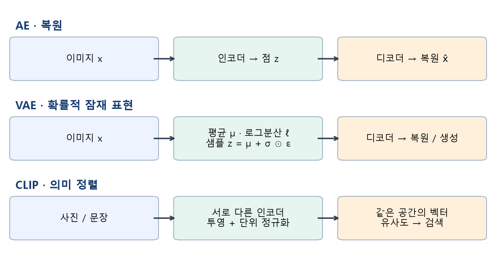

그림 1. 수업용 자체 도식. 가로로 각 모델의 입력·표현·출력을 읽는다. **AE → VAE → CLIP이 직렬로 연결된 하나의 처리 과정은 아니다.** CLIP은 이미지와 문장을 정렬하는 별도의 모델이다.

| 모델 | 학습에서 맞추려는 것 | 얻는 표현 | 이번 수업에서 확인할 결과 |
|---|---|---|---|
| AE | 원본 이미지와 복원 이미지 | 입력별 잠재 벡터 한 점 | 복원·잔차·잠재 좌표 |
| VAE | 복원과 사전분포에 대한 제약 | 입력별 잠재 확률분포 | 평균·분산·샘플·생성 |
| CLIP | 함께 주어진 이미지와 설명 문장 | 비교 가능한 이미지·텍스트 벡터 | 짝맞추기·코사인 순위·검색 |

수업 뒤에는 입력·손실·학습 모수·출력을 연결해서 설명하고, VAE의 평균과 로그분산을 구별하며, CLIP의 검색 점수를 직접 계산할 수 있어야 한다. 마지막에는 같은 기능을 웹 화면의 입력과 버튼에 연결한다.

### 교재와 실습의 대응

| 교재 범위 | 본문에서 다룰 내용 | 실습에서 더하는 관찰 |
|---|---|---|
| 3.1, 97–119쪽 | 인코더·디코더·복원 손실·잠재 공간 | 한 단계 학습, 평균 이미지 기준선, 잔차 |
| 3.2, 120–134쪽 | 평균·로그분산·재매개변수화·KL | 같은 조건의 β 비교, 보간과 사전분포 샘플 |
| 3.3, 134–148쪽 | 이미지/문장 인코더·대조 손실 | 실제 3×3 유사도 행렬과 벡터 차원 |
| 3.4–3.6, 148–152쪽 | 다른 선택지·의미 검색·정리 | 40장 사진 검색, 실패 사례, 누적 웹 앱 |

교재 그림은 출처를 표시해 원본의 필요한 부분을 사용한다. 수계산, 작은 CPU 모델, 검증 분리, 웹 앱과 사진 검색 실험은 수업에서 추가한 설명이다. 교재의 대형 모델을 그대로 재현한 성능으로 읽지 않는다.

## 2. AE 복습: 입력이 자신의 정답이 된다

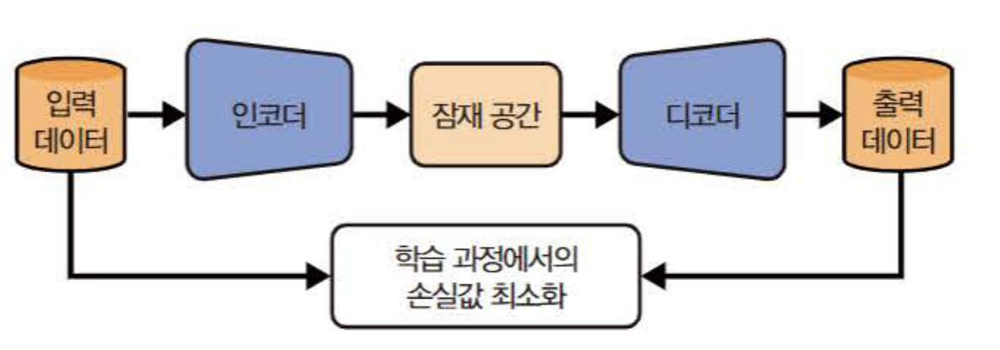

그림 2. 『핸즈온 생성형 AI』 97쪽 그림 3-2 원본 발췌. 위쪽 화살표는 **순전파**, 아래쪽 연결은 **입력과 출력의 비교**로 읽는다. 아래 화살표가 이미지를 다시 인코더에 넣는 별도 생성 과정이라는 뜻은 아니다.

인코더는 입력 이미지 $x$를 잠재 벡터 $z$로 바꾸고, 디코더는 $z$에서 복원 이미지 $\hat{x}$를 만든다.

$$
z=f_\theta(x),\qquad \hat{x}=g_\phi(z)=g_\phi(f_\theta(x)).
$$

$\theta$와 $\phi$는 학습으로 바뀌는 가중치와 편향이다. 숫자 7의 이미지를 넣었다면 target은 정수 7이 아니라 **그 이미지의 픽셀 전체**다. 별도로 붙인 숫자 라벨 없이 입력에서 학습 신호를 얻는다. 숫자 라벨은 나중에 산점도를 색칠할 때만 쓴다.

단순히 입력을 복사하는 함수도 복원 오차는 작다. 그래서 병목, 구조, 잡음, 정규화 등으로 유용한 표현을 학습하도록 설계한다. 작은 잠재 차원만으로 사람이 원하는 의미가 자동으로 분리되지는 않는다. “압축했으니 의미를 이해했다”는 결론은 별도의 근거가 필요하다.

### 픽셀과 배치의 모양부터 읽기

MNIST는 28×28 흑백 손 글씨다. 한 장은 784개 밝기 값이고, 실습에서는 0–255 정수를 255로 나누어 0–1의 float32로 바꾼다. 출력 Sigmoid도 같은 범위를 만든다.

| 위치 | 이번 실습의 shape | 의미 |
|---|---|---|
| 입력 | `(B,1,28,28)` | B장, 채널 1개, 높이·너비 28 |
| 펼치기 | `(B,784)` | 이미지별 픽셀을 한 줄로, 배치 축은 유지 |
| 은닉층 | `(B,256)` → `(B,128)` | 학습한 중간 특징 |
| AE 잠재층 | `(B,d)` | d=2 또는 d=16 |
| 디코더 | `(B,d)` → `(B,128)` → `(B,256)` → `(B,784)` | 픽셀 평균 예측 |
| 복원 모양 | `(B,1,28,28)` | reshape로 원래 모양 복구 |

이번에는 차원을 명확히 추적할 수 있는 완전연결 모델을 사용한다. 교재와 W04A의 합성곱 모델과 구조가 다르며, AE의 학습 목적은 같다. W04A보다 학습 표본과 epoch도 늘렸으므로 개선을 어느 한 요인만의 효과로 해석하면 안 된다.

[`DenseAE`](https://github.com/lunalab-ai/genAI/blob/2026-fall-w05a-v2/src/luna_genai/representation.py#L21)의 `latent_dim` 기본값은 2이고, 초기화만으로 학습되지 않는다. [`DenseAE.encode`](https://github.com/lunalab-ai/genAI/blob/2026-fall-w05a-v2/src/luna_genai/representation.py#L42)는 이미지 배치를 잠재 벡터로, [`DenseAE.decode`](https://github.com/lunalab-ai/genAI/blob/2026-fall-w05a-v2/src/luna_genai/representation.py#L46)는 잠재 벡터를 이미지로 바꾼다. 디코더는 인코더의 정확한 역함수로 보장되지 않는다.

## 3. MSE를 손으로 계산하고 코드와 연결하기

복원 MSE는 같은 위치의 픽셀 차이를 제곱한 뒤 평균한 값이다. $P$가 이미지당 픽셀 수라면 다음과 같다.

$$
L_{\mathrm{MSE}}=\frac{1}{BP}\sum_{b=1}^{B}\sum_{p=1}^{P}(x_{bp}-\hat{x}_{bp})^2.
$$

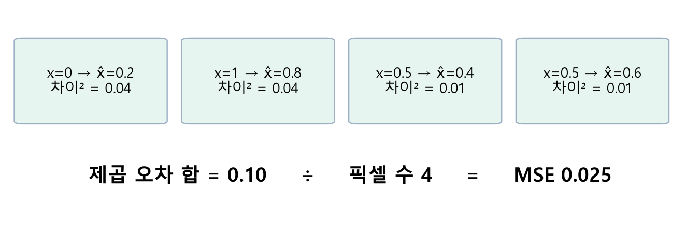

그림 3. 설명용 4픽셀 예. 원본 $(0,1,0.5,0.5)$, 복원 $(0.2,0.8,0.4,0.6)$의 제곱 오차 합은 0.1, **평균은 0.025**다. 실제 MNIST 측정값과 구별한다.

```python
prediction = model(x_batch)
loss = torch.nn.functional.mse_loss(prediction, x_batch)
```

기본 `mse_loss`는 모든 원소를 평균한다. 두 텐서의 shape과 픽셀 범위를 맞춘다. `labels`를 target으로 넣거나 한쪽만 0–255로 두면 다른 문제를 계산하게 된다. 배경이 많은 이미지에서는 흐린 평균 모양도 비교적 작은 MSE를 낼 수 있으므로 숫자와 그림을 함께 본다.

### 한 배치에서 무엇이 바뀌는가?

```python
optimizer.zero_grad(set_to_none=True)
prediction = model(x_batch)
loss = torch.nn.functional.mse_loss(prediction, x_batch)
loss.backward()
optimizer.step()
```

첫 줄은 이전 gradient를 비운다. 순전파로 현재 모수의 예측을 만들고 손실을 계산한다. `backward()`는 모수별 미분을 계산하며, **실제 모수 값을 바꾸는 줄은 `optimizer.step()`**이다. 한 배치의 개선이 모든 이미지의 개선을 보장하거나 매번 손실이 단조 감소한다는 뜻은 아니다.

학습은 `model.train()`, 관찰은 `model.eval()`로 모드를 구별한다. gradient 기록을 끄는 것은 `torch.inference_mode()`다. `eval()`과 같은 기능이 아니다. 이번 완전연결 모델에는 Dropout·BatchNorm이 없지만, 개념을 구별하는 습관은 다른 모델에서도 필요하다.

Colab A는 실제 한 번의 갱신 전후를 비교한다. 전체 재학습은 선택 경로로 남겨 두며, 기본 관찰에는 아래의 학습 완료 체크포인트를 사용한다.

## 4. 복원 그림을 읽는 방법: 기준선, 잔차, 미사용 데이터

모든 체크포인트는 같은 seed 1337과 같은 분할을 사용한다. 원 MNIST train 60,000장에서 20,000장을 학습에, 겹치지 않는 2,000장을 검증에 사용한다. 별도 공식 test 파일에서 고른 1,000장은 최종 비교용이다. 라벨은 학습 손실에 들어가지 않는다.

학습은 Adam, 학습률 0.001, batch 256, **사전에 정한 50 epoch**다. 모델을 고정한 뒤 test를 평가했다. [`load_checkpoints`](https://github.com/lunalab-ai/genAI/blob/2026-fall-w05a-v2/src/luna_genai/representation.py#L190)는 패키지에 포함된 수업용 가중치의 SHA-256을 검사하고 불러온다. 파일이 손상되면 무작위 모델로 대체하지 않고 오류를 낸다.

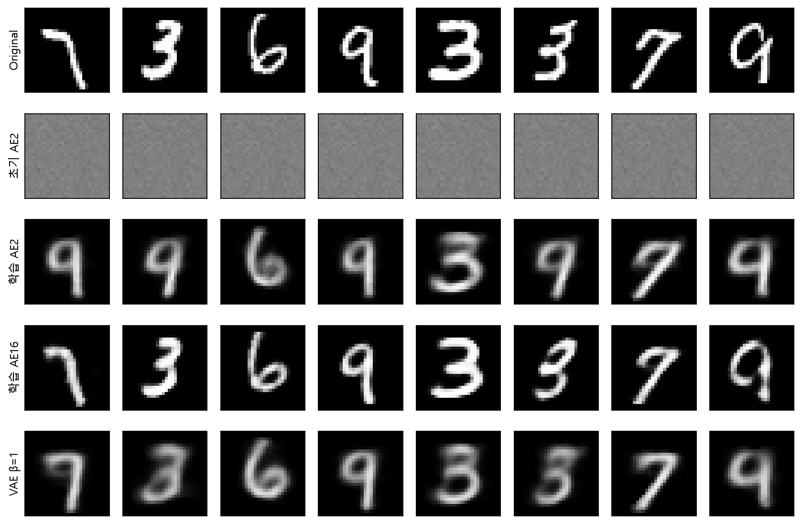

그림 4. 수업 코드의 실제 실행. 테스트의 첫 8장을 고정 순서로 사용했다. 잘 복원된 그림만 고른 결과가 아니다. 모든 행의 밝기 범위는 0–1이다. 획의 위치·두께·끊어짐을 세로로 비교한다.

| 모델 | 같은 test의 픽셀 MSE | 읽는 방법 |
|---|---:|---|
| train 평균 이미지 기준선 | 0.068203 | 입력마다 동일한 평균 그림 출력 |
| AE, d=2 | 0.039852 | 두 숫자로 복원하므로 큰 정보 병목 |
| AE, d=16 | 0.011919 | 이 실행에서는 더 세밀한 복원 |
| VAE, d=2, β=0.1 | 0.039482 | 약한 KL 가중치 |
| VAE, d=2, β=1 | 0.039818 | 기준 KL 가중치 |
| VAE, d=2, β=4 | 0.045476 | 더 강한 KL 가중치 |

VAE 평가는 **평균 $\mu$를 디코딩한 결정적 복원**이다. 샘플 $z$를 뽑아 학습할 때의 확률적 손실과 같지 않다. 모든 표의 지표는 같은 픽셀 MSE이며, AE의 MSE와 VAE의 총손실을 직접 비교하지 않았다. 끝자리와 시간은 환경에 따라 달라질 수 있다.

평균 이미지 기준선은 test를 보지 않고 train의 픽셀별 평균으로 만든다. 학습 전보다 좋아졌다는 것만 확인하는 것보다, 입력별 정보를 사용하지 않는 기준선을 넘어서는지 확인하는 편이 더 유용하다.

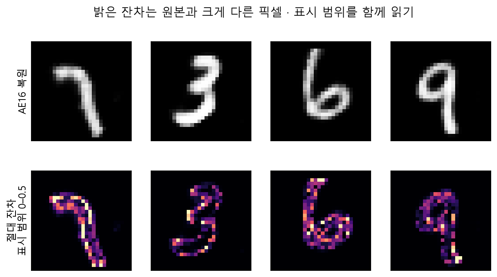

그림 5. 잔차는 $|x-\hat{x}|$다. 그림에서는 위치를 보기 쉽게 표시 범위를 0–0.5로 고정했고, 웹 앱은 0–1로 고정한다. 밝은 부분은 차이가 큰 픽셀이다. 이미지마다 자동으로 밝기를 늘리면 서로 다른 오차 크기를 잘못 비교할 수 있다.

### “49배 압축”을 말하기 전에

784개 값이 16개 값이 되면 스칼라 개수의 비는 49다. 그러나 원본 uint8과 잠재 float32는 값 하나의 바이트 수가 다르다. 디코더 가중치, 메타데이터, 실제 파일 형식까지 포함하지 않고 49배 파일 압축이라고 말하지 않는다. 이 수업에서는 **표현의 병목**을 관찰한다.

## 5. 잠재 공간: 복원과 임의 생성은 다른 실험이다

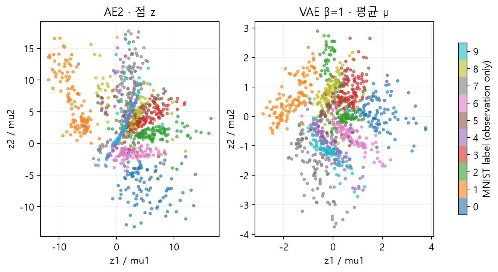

그림 6. 왼쪽은 AE의 $z$, 오른쪽은 VAE의 $\mu$다. 점 하나가 입력 이미지 하나다. 색은 학습 후 숫자 라벨로 붙인 관찰 정보이며, 축에 “획 두께” 같은 의미를 미리 지정하지 않았다. 축 범위도 서로 같지 않다.

AE의 복원에서는 인코더가 실제 이미지에서 만든 좌표 $f_\theta(x)$를 디코더에 넣는다. 임의 생성에서는 별도 규칙으로 정한 좌표를 넣는다. AE는 실제 입력의 인코딩 주변에서 복원하도록 학습했을 뿐, 표준정규분포에서 뽑은 모든 좌표를 그럴듯하게 디코딩하도록 학습한 것이 아니다.

**표현이 놓인 영역**과 **내가 샘플을 뽑는 영역**이 다르면 임의 생성이 나쁠 수 있다. 다만 생성 실패를 언제나 잠재 공간의 빈 영역 하나로 설명하지 않는다. 복원 자체의 한계와 모델 용량, 학습 상태도 함께 확인한다.

## 6. VAE: 한 점 대신 입력별 분포를 예측한다

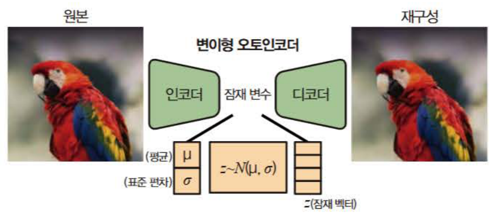

그림 7. 『핸즈온 생성형 AI』 121쪽 그림 3-4 원본 발췌. 그림의 평균·표준편차와 실제 코드의 평균·로그분산을 연결해서 읽는다. 기호 관례에 따라 정규분포의 두 번째 인자가 분산인지 표준편차인지 달라질 수 있으므로 아래 식에서는 공분산을 명시한다.

VAE 인코더는 입력마다 $\mu(x)$와 $\ell(x)=\log\sigma^2(x)$를 출력한다. 두 벡터의 shape은 각각 `(B,d)`다. 학습되는 것은 각 이미지의 분포를 예측하는 신경망의 모수다.

$$
q_\theta(z\mid x)=\mathcal{N}\!\left(\mu_\theta(x),\operatorname{diag}(\sigma_\theta^2(x))\right),
\qquad \sigma=\exp\!\left(\frac{\ell}{2}\right).
$$

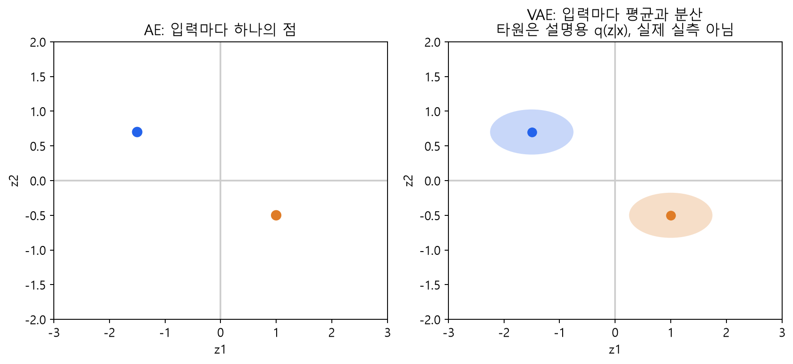

그림 8. 분포의 필요성을 설명하는 자체 도식이며 실측 산점도가 아니다. 타원의 중심은 평균, 축 방향의 폭은 표준편차와 연결된다. 대각 공분산은 좌표 사이 공분산을 0으로 두는 가정이며, 모든 좌표의 분산이 같다는 가정이 아니다.

[`DenseVAE.encode`](https://github.com/lunalab-ai/genAI/blob/2026-fall-w05a-v2/src/luna_genai/representation.py#L77)는 `(mu, logvar)`를 반환한다. 로그분산을 쓰면 분산이 음수가 되지 않도록 양수 변환을 명확하게 적용할 수 있다. `exp(logvar)`는 **분산**, `exp(0.5*logvar)`는 **표준편차**다.

### 세 분포를 구별하기

| 표기 | 의미 | 이번 실습 |
|---|---|---|
| $q_\theta(z\mid x)$ | 이미지를 본 뒤의 근사 잠재 분포 | 평균·대각 분산을 인코더가 예측 |
| $p(z)$ | 새 샘플을 뽑을 사전분포 | $\mathcal{N}(0,I)$ |
| $p_\phi(x\mid z)$ | 잠재값에서 이미지를 설명하는 관측 모델 | 디코더가 픽셀 평균을 예측 |

표준정규 prior는 **등방성**이지만 입력별 $q(z\mid x)$는 서로 다른 대각 분산을 가질 수 있다. 여러 이미지의 평균 $\mu$를 찍은 산점도 자체가 정확한 표준정규분포가 되어야 한다고 요구하지 않는다.

## 7. 재매개변수화: 무작위성을 따로 꺼내기

단순히 분포에서 샘플을 뽑는다고 쓰면, 평균과 분산을 예측하는 네트워크까지 어떻게 gradient를 전달할지 불분명하다. VAE는 표준정규 잡음 $\epsilon$을 따로 뽑고, 평균과 표준편차의 미분 가능한 연산으로 $z$를 만든다.

$$
\epsilon\sim\mathcal{N}(0,I),\qquad z=\mu+\sigma\odot\epsilon.
$$

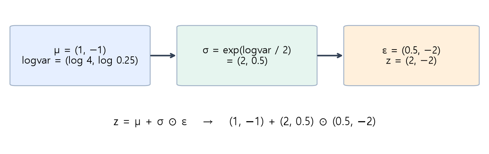

그림 9. 설명용 수계산. $\mu=(1,-1)$, 분산 $(4,0.25)$, $\epsilon=(0.5,-2)$이면 표준편차는 $(2,0.5)$이고 $z=(2,-2)$다. $\odot$는 같은 위치끼리의 원소별 곱이다.

```python
std = torch.exp(0.5 * logvar)
epsilon = torch.randn_like(mu)
z = mu + std * epsilon
```

[`reparameterize`](https://github.com/lunalab-ai/genAI/blob/2026-fall-w05a-v2/src/luna_genai/representation.py#L97)는 `epsilon`을 직접 주면 같은 수계산을 재현하고, 생략하면 새 잡음을 뽑는다. $\epsilon$은 이번 계산에서 외부 잡음으로 두고, $\mu$와 $\ell$을 거쳐 모수에 미분을 전달한다. “샘플링을 제거했다”거나 “항상 같은 $z$를 사용한다”는 뜻이 아니다.

## 8. VAE 손실: 잘 복원하면서 샘플을 뽑기 쉬운 공간으로

복원항만 줄이면 디코더에 유리한 좌표가 아무 곳으로나 퍼질 수 있다. KL 항은 입력별 근사 분포가 prior에서 지나치게 멀어지는 것을 비용으로 부과한다. 이 두 요구가 서로 절충한다.

$$
L=\frac{1}{B}\sum_{b=1}^{B}\left[\sum_{p=1}^{P}(x_{bp}-\hat{x}_{bp})^2+\beta D_{\mathrm{KL}}\big(q_\theta(z\mid x_b)\,\Vert\,\mathcal{N}(0,I)\big)\right].
$$

대각 정규분포와 표준정규 prior 사이의 KL은 다음 식으로 계산한다.

$$
D_{\mathrm{KL}}=\frac{1}{2}\sum_{j=1}^{d}\left(\mu_j^2+\exp(\ell_j)-1-\ell_j\right).
$$

[`vae_loss`](https://github.com/lunalab-ai/genAI/blob/2026-fall-w05a-v2/src/luna_genai/representation.py#L115)는 `(총손실, 복원 SSE, KL)`의 스칼라 세 개를 반환한다. 픽셀과 잠재 좌표는 **이미지 안에서 합**, 이미지는 **배치에서 평균**한다. MNIST에서 이 복원항은 앞의 픽셀 MSE의 784배다. reduction을 바꾸면 같은 β라도 상대적인 영향이 달라진다.

| 계산 | 4픽셀 수계산 예 |
|---|---:|
| 복원 제곱 오차 합 SSE | 0.100 |
| 픽셀 평균 MSE | 0.025 |
| $\mu=(1,-1)$, 분산 $(4,0.25)$의 KL | 2.125 |
| β=1일 때 SSE+βKL | 2.225 |

첫 좌표의 KL은 $(1+4-1-\log4)/2$, 둘째는 $(1+0.25-1-\log0.25)/2$다. 로그항이 상쇄되어 합이 2.125가 된다. $\mu=0$, 분산이 모두 1이면 KL은 0이다. KL이 작다는 사실만으로 복원이 좋다는 뜻은 아니다.

### 교재의 손실 그림을 해석하기

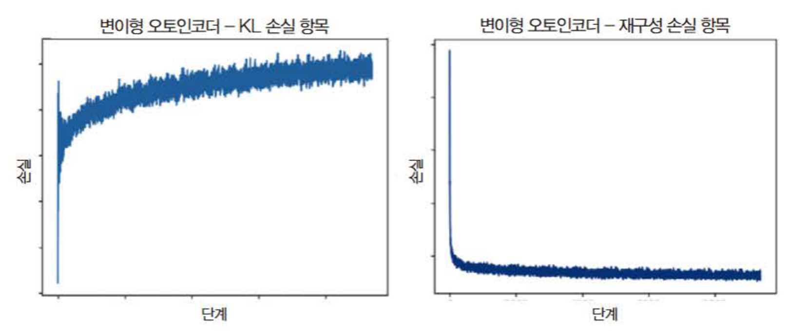

그림 10. 『핸즈온 생성형 AI』 129쪽 그림 3-5 원본 발췌. 교재에서 관찰한 학습 곡선이다. **KL이 모든 단계에서 감소해야 정상인 것은 아니다.** 복원에 유용한 정보를 더 담으며 KL이 증가할 수도 있다. 이 그림을 아래 수업 실행의 측정 결과와 섞지 않는다.

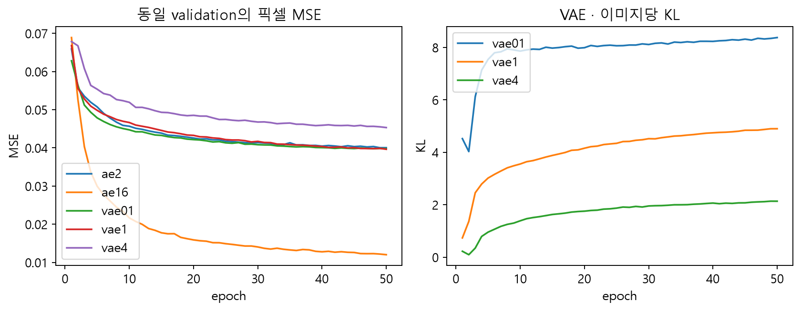

그림 11. 수업용 작은 모델의 실측. 왼쪽은 epoch 끝 모델의 validation MSE, 오른쪽은 해당 epoch의 학습 배치 KL 평균이다. 오른쪽은 갱신 중인 여러 상태의 평균이므로 왼쪽과 측정 방식도 다르다.

### β를 바꾸면 무엇이 달라지는가?

β는 KL 항의 상대 가중치다. 큰 β는 prior와의 차이를 더 비싸게 만들지만, 입력별 세부 정보를 담는 데 불리할 수 있다. 작은 β는 복원에 유리한 자유도를 주지만, prior 샘플과의 연결이 약해질 수 있다. 특정 실행에서 복원 점수가 β에 따라 엄격히 단조 변화해야 하는 것은 아니다.

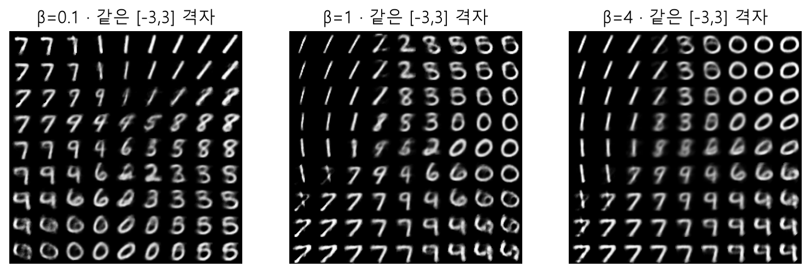

그림 12. 같은 2차원 격자 $[-3,3]\times[-3,3]$를 세 모델에서 디코딩했다. **모델을 세 번 따로 학습한 비교**다. 화면의 모델 선택은 체크포인트 전환이며, 슬라이더가 즉시 재학습하는 것처럼 해석하지 않는다. 격자는 균일한 좌표 배치이고 정규분포 샘플이 아니다.

### 보충 읽기: 왜 ELBO라고 하는가?

아래는 이론을 더 확인하고 싶을 때 읽는다. 학습에서 크게 만들려는 변분 하한은 다음과 같다.

$$
\mathcal{L}_{\mathrm{ELBO}}(x)=\mathbb{E}_{q_\theta(z\mid x)}[\log p_\phi(x\mid z)]-D_{\mathrm{KL}}(q_\theta(z\mid x)\Vert p(z)).
$$

$$
\log p_\phi(x)=\mathcal{L}_{\mathrm{ELBO}}(x)+D_{\mathrm{KL}}(q_\theta(z\mid x)\Vert p_\phi(z\mid x))\geq\mathcal{L}_{\mathrm{ELBO}}(x).
$$

마지막 KL이 음수가 아니므로 하한이 된다. 학습 코드에서는 최대화 대신 **음의 하한을 최소화**한다. 고정 분산의 Gaussian 관측 모델을 가정하면 음의 로그우도는 픽셀 제곱 오차 합에 비례한다. 계수와 상수를 어떻게 두느냐에 따라 수치 스케일이 달라지며, 임의의 MSE+KL 구현을 모두 동일한 확률 모형의 정확한 ELBO라고 부르지 않는다. β를 1에서 바꾸는 실험은 KL 가중치를 조정한 목적함수다.

## 9. 보간과 새 샘플을 나란히 보기

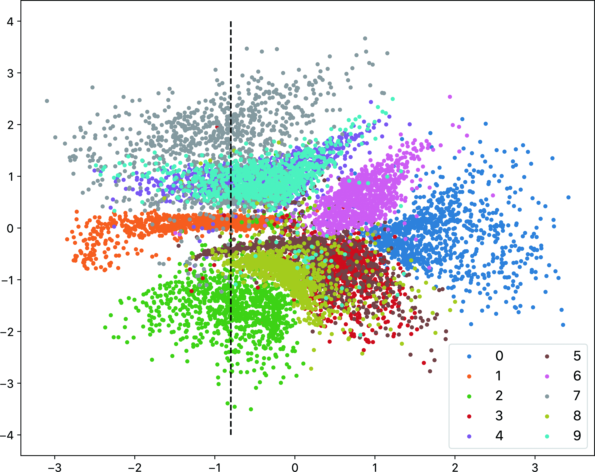

그림 13. 『핸즈온 생성형 AI』 132쪽 그림 3-6, 제공된 원본 그림을 PNG로 변환. 색별로 영역이 겹치며, 각 평균 좌표가 0 근처에만 모여 있는 것은 아니다. 수업의 그림 6과는 모델과 학습 조건이 다르다.

보간에서는 두 실제 이미지의 잠재 좌표 사이를 움직인다.

$$
z(\alpha)=(1-\alpha)z_a+\alpha z_b,\qquad 0\leq\alpha\leq1.
$$

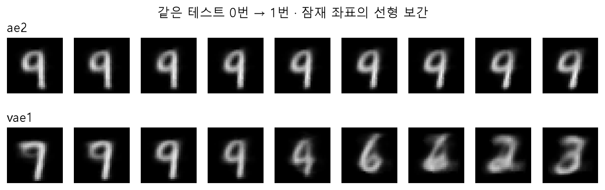

그림 14. [`interpolation`](https://github.com/lunalab-ai/genAI/blob/2026-fall-w05a-v2/src/luna_genai/representation.py#L249)의 실제 출력. VAE의 끝점은 각 이미지의 평균 $\mu$다. 중간 이미지가 부드럽게 바뀌어도 각 중간 결과가 정확히 어떤 숫자라는 보장은 없다. 끝점의 출력도 원본이 아니라 복원이다.

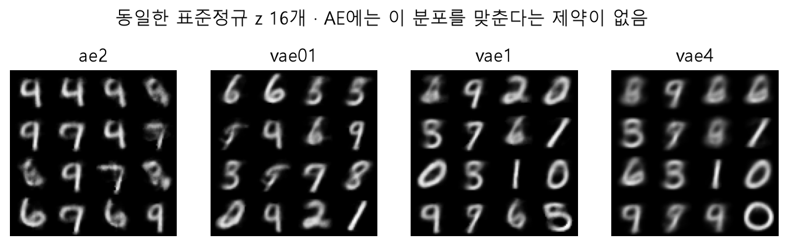

그림 15. 같은 seed로 뽑은 동일한 표준정규 좌표를 사용했다. VAE는 이 prior와 연결하도록 학습하지만, AE는 그런 제약이 없다. 표본 16개의 인상만으로 생성 분포 전체의 품질을 평가하지 않는다. 숫자가 불분명하거나 서로 비슷한 결과도 관찰 내용으로 남긴다.

## 10. CLIP: 이미지와 문장을 어떻게 같은 공간에서 비교할까?

“눈 위의 고양이”라는 글자와 고양이 사진의 픽셀은 직접 내적할 수 없다. CLIP은 이미지 인코더와 텍스트 인코더를 각각 사용하고, 두 출력을 **같은 차원의 공유 공간에 투영**한다. 그런 뒤 길이를 1로 정규화해 방향의 유사성을 비교한다.


그림 16. 『핸즈온 생성형 AI』 136쪽 그림 3-7 원본 발췌. 초록색 행은 이미지, 보라색 열은 문장이다. 대각선은 함께 주어진 올바른 짝이다. 이 그림은 OpenAI CLIP 구조를 참고한 교재 도식이다.

학습 데이터는 이미지–문장 쌍이다. 서로 맞는 쌍의 유사도를 다른 쌍보다 높게 하도록 학습한다. CLIP 자체는 이미지 디코더가 없으며 사진을 생성하지 않는다. 생성형 AI 시스템의 구성 요소로 쓰일 수 있다는 사실과 CLIP 자체의 출력은 구별한다.

| 구분 | 교재 예시 ViT-L/14 | 이번 실습 ViT-B/32 |
|---|---:|---:|
| 이미지 인코더 pooled 차원 | 1024 | 768 |
| 텍스트 인코더 pooled 차원 | 768 | 512 |
| 최종 공유 임베딩 차원 | 768 | 512 |
| 활용 | 교재 원리·구현 예 | 작은 사진 모음을 CPU로 검색 |

**서로 다른 두 인코더의 내부 차원까지 같을 필요는 없다.** 최종 비교 벡터 차원을 맞춘다. 모델 이름이 바뀌면 차원·입력 크기·전처리도 실제 설정에서 확인해야 한다.

[`CLIPSearch`](https://github.com/lunalab-ai/genAI/blob/2026-fall-w05a-v2/src/luna_genai/semantic_search.py#L65)는 고정된 `openai/clip-vit-base-patch32` 사전학습 가중치를 CPU에 불러온다. 이 수업에서는 CLIP을 재학습하지 않는다. 사진은 RGB로 바꾸고 모델 전처리의 크기 조정·중앙 자르기·정규화를 적용한다. 긴 사진의 가장자리가 잘릴 수 있다는 점도 검색 결과 해석에 영향을 준다.

### 교재 3.4의 다른 선택지

교재 148쪽은 목적과 학습 방식이 다른 대안을 소개한다. 이번 실습에서는 CLIP 하나의 동작을 끝까지 확인하고, 다음 표로 선택 기준을 연결한다.

| 선택지 | 교재에서 연결하는 관점 | 이번 수업과의 연결 |
|---|---|---|
| OpenCLIP·LAION | 공개 구현과 다양한 모델·학습 데이터 선택 | 모델을 바꾸면 임베딩 차원·전처리·인덱스도 다시 확인한다. |
| BLIP·CoCa·CapPa | 캡션 학습을 활용한 이미지 표현 | 이미지–문장 순위 학습과 문장 생성 목적의 차이를 구별한다. |
| SigLIP | softmax 대조 손실 대신 sigmoid 기반 손실 | 같은 이미지–텍스트 정렬 목표에도 손실 설계는 달라질 수 있다. |

위 표의 모델 소개는 교재에서 가져왔으며, 마지막 열은 수업용 해석이다. 이들 모델을 이번 노트북에서 학습하거나 성능 비교했다는 뜻은 아니다.

## 11. 임베딩, 정규화, 코사인 유사도

임베딩은 입력을 비교나 학습에 유용한 숫자 벡터로 나타낸 것이다. 임베딩의 의미는 학습 목적에서 온다. 같은 차원이라는 이유만으로 서로 다른 모델이 만든 벡터끼리 비교할 수 있는 것은 아니다.

$$
v_i=\frac{W_I f_I(x_i)}{\|W_I f_I(x_i)\|_2},\qquad
t_j=\frac{W_T f_T(c_j)}{\|W_T f_T(c_j)\|_2},\qquad S_{ij}=v_i^\top t_j.
$$

정규화 전 벡터의 내적은 길이에도 영향을 받는다. 길이가 1인 벡터끼리의 내적은 두 벡터 사이 각도의 코사인이다. 값이 클수록 이 모델이 학습한 공간에서 방향이 비슷하다.

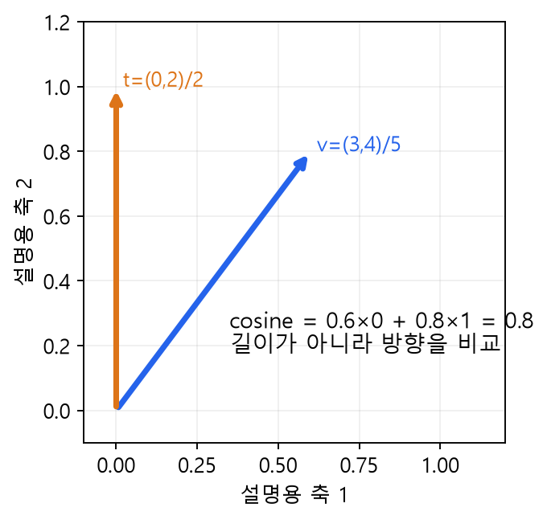

그림 17. 설명용 2차원 예. $(3,4)$의 길이는 5, $(0,2)$의 길이는 2이므로 정규화하면 $(0.6,0.8)$과 $(0,1)$이다. 코사인은 0.8이다. 실제 CLIP은 이 그림의 두 축이 아니라 512차원을 사용한다.

```python
image_vectors = image_vectors / image_vectors.norm(dim=1, keepdim=True)
text_vectors = text_vectors / text_vectors.norm(dim=1, keepdim=True)
similarities = image_vectors @ text_vectors.T
```

`dim=1`은 **각 이미지/문장 한 개의 특징 축**이다. 배치 방향인 `dim=0`으로 나누면 다른 연산이다. [`unit_rows`](https://github.com/lunalab-ai/genAI/blob/2026-fall-w05a-v2/src/luna_genai/semantic_search.py#L23)는 0벡터를 오류로 처리한다. 0벡터에는 방향이 없으므로 코사인이 정의되지 않는다.

현재 실습 버전 Transformers 5.15.1의 `get_image_features`와 `get_text_features`는 결과 객체를 반환하며, 투영된 벡터는 `.pooler_output`에서 꺼낸다. 예전 예제처럼 반환 객체에 바로 `.norm()`을 호출하지 않는다. [`CLIPSearch.encode_images`](https://github.com/lunalab-ai/genAI/blob/2026-fall-w05a-v2/src/luna_genai/semantic_search.py#L106)와 [`CLIPSearch.encode_texts`](https://github.com/lunalab-ai/genAI/blob/2026-fall-w05a-v2/src/luna_genai/semantic_search.py#L125)에서 실제 처리를 확인할 수 있다.

## 12. 대조 학습의 3×3 짝맞추기

이미지 3장과 그에 맞는 문장 3개가 있다면 가능한 짝은 9개다. CLIP의 학습은 올바른 3개 짝을 나머지와 구별하도록 진행된다. 이미지에서 맞는 문장을 찾는 방향과, 문장에서 맞는 이미지를 찾는 방향을 모두 사용한다.

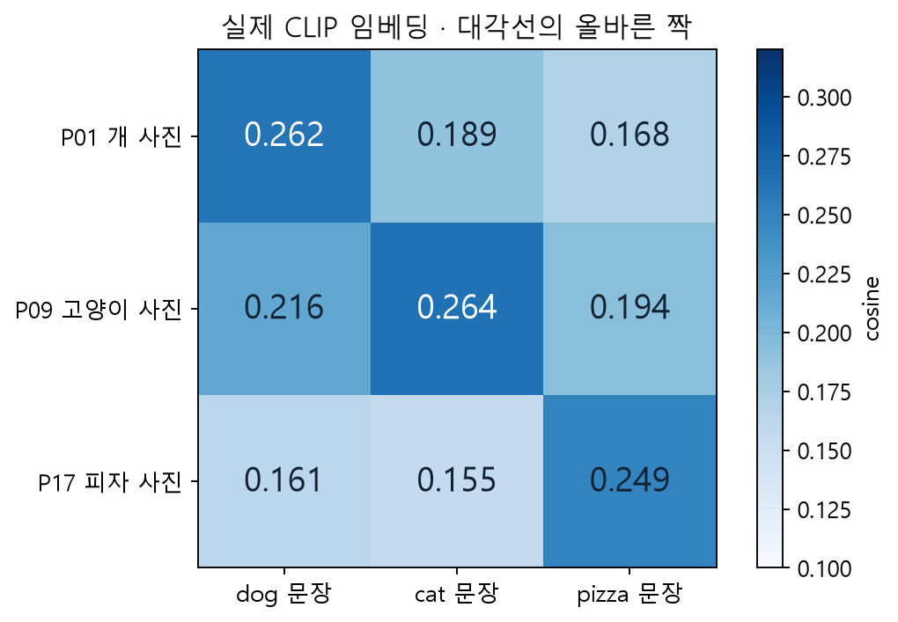

그림 18. P01 개, P09 고양이, P17 피자 사진의 실제 유사도. 대각선이 해당 행·열의 다른 후보보다 큰지 읽는다. 이 3쌍에서의 성공이 모든 장면에서의 정확도를 뜻하지 않는다.

학습용 로짓은 정규화 내적에 양의 스케일 $a$를 곱해 만든다. 보통 $a=\exp(s)$처럼 학습 가능한 로그 스케일을 사용한다.

$$
L_{I\to T}=-\frac{1}{N}\sum_i\log\frac{\exp(aS_{ii})}{\sum_j\exp(aS_{ij})},\qquad
L_{T\to I}=-\frac{1}{N}\sum_j\log\frac{\exp(aS_{jj})}{\sum_i\exp(aS_{ij})}.
$$

$$
L_{\mathrm{CLIP}}=\frac{L_{I\to T}+L_{T\to I}}{2}.
$$

행 방향 softmax는 이미지 한 장을 고정한 문장 후보의 경쟁이고, 열 방향은 문장 하나를 고정한 이미지 후보의 경쟁이다. 실제로는 다른 이미지·문장도 의미가 비슷할 수 있지만, 기본 학습 구성은 배치에서 함께 제공된 짝을 정답으로 둔다.

softmax로 얻은 값은 **현재 후보 집합 안의 상대 점수**다. 후보를 더하면 분모가 바뀐다. 이를 현실에서 “정답일 확률”로 그대로 해석하지 않는다. 검색에서는 raw cosine을 정렬한다. 같은 후보에 양의 공통 스케일을 곱해도 순위는 바뀌지 않는다.

## 13. 의미 기반 이미지 검색: 인덱스는 한 번, 질의는 매번

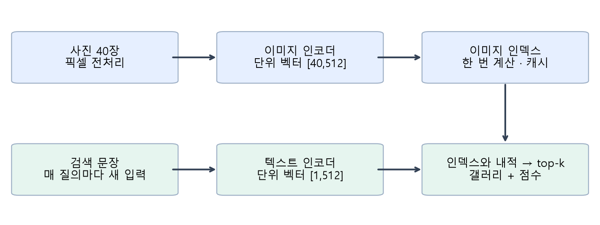

그림 19. 자체 제작 검색 흐름. 사진의 임베딩은 먼저 계산해 저장한다. 사용자가 문장을 바꿀 때마다 사진 40장을 다시 인코딩하지 않고, 새 문장 벡터만 만들어 저장된 행렬과 비교한다.

[`load_gallery`](https://github.com/lunalab-ai/genAI/blob/2026-fall-w05a-v2/src/luna_genai/semantic_search.py#L36)는 사진과 출처 메타데이터를 준비한다. 사진은 패키지 설치 때 함께 내려받으므로 개인 파일 업로드는 필요 없다. [`CLIPSearch.index_images`](https://github.com/lunalab-ai/genAI/blob/2026-fall-w05a-v2/src/luna_genai/semantic_search.py#L137)는 `(40,512)` 행렬을 만들고 캐시한다. 파일명·분류명은 화면에 보여 줄 정보이며 **이미지 인코더의 입력으로 사용하지 않는다.**

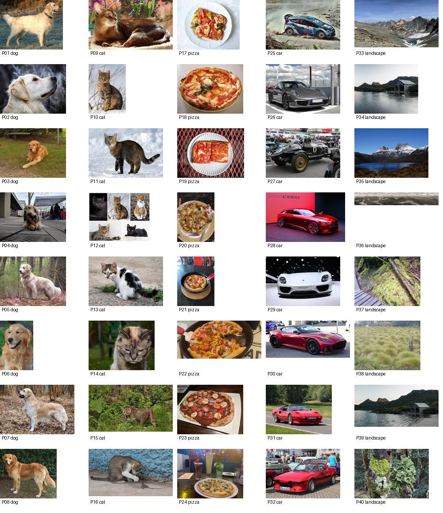

그림 20. P01–P40의 전체 사진. Wikimedia Commons의 개별 저자·이용 조건은 [사진별 출처표](https://github.com/lunalab-ai/genAI/blob/2026-fall-w05a-v2/src/GALLERY-CREDITS.md)에 제공한다. 축소된 사진을 사용했으며 각 원본의 이용 조건을 유지한다. 이 소규모 모음은 실제 서비스 전체를 대표하는 벤치마크가 아니다.

문장 벡터가 $t\in\mathbb{R}^{512}$이고 저장한 이미지 행렬이 $V\in\mathbb{R}^{40\times512}$라면 점수는 다음과 같다.

$$
s=Vt\in\mathbb{R}^{40}.
$$

[`CLIPSearch.search`](https://github.com/lunalab-ai/genAI/blob/2026-fall-w05a-v2/src/luna_genai/semantic_search.py#L159)는 점수가 큰 순서대로 k개의 행을 반환한다. `k=3`이 기본이다. 반환 표의 `rank`는 검색 순위, `id`는 사진 ID, `cosine`은 유사도다. 같은 점수에서는 원래 사진 순서를 유지한다.

### 검색과 제로샷 분류의 차이

| 작업 | 고정하는 쪽 | 비교하는 후보 | 출력 |
|---|---|---|---|
| 텍스트 → 이미지 검색 | 입력 문장 | 저장한 사진들 | 사진의 순위 |
| 제로샷 이미지 분류 | 입력 사진 | “a photo of a cat” 같은 라벨 문장들 | 후보 라벨의 순위 |

같은 두 인코더를 쓰지만 어떤 쪽을 고정하고 어떤 후보를 비교하는지가 다르다. 제로샷은 이번 후보 라벨을 위해 별도 분류기를 학습하지 않는다는 뜻이며, CLIP이 그 개념을 사전학습에서 전혀 본 적 없다는 보장은 아니다.

## 14. 검색 결과를 평가하기: 맞는 사례와 없는 대상

평가 기준은 검색 결과를 본 뒤 유리하게 정하지 않는다. 수업 사진을 먼저 살펴 “눈 위의 고양이”에 해당하는 ID를 P10·P11로 정했다. Precision@k는 상위 k개 중 관련 있는 사진의 비율이다.

$$
\mathrm{Precision@}k=\frac{\text{상위 }k\text{개 중 관련 사진 수}}{k}.
$$

`a cat in the snow`의 실제 상위 3개는 P11, P10, P13이었다. 사전 정의에 맞는 것은 두 장이므로 Precision@3은 $2/3$이다. P13은 고양이지만 눈이라는 조건을 충족하지 않는다. k를 늘리면 관련 결과의 수가 늘어도 비율은 낮아질 수 있다.

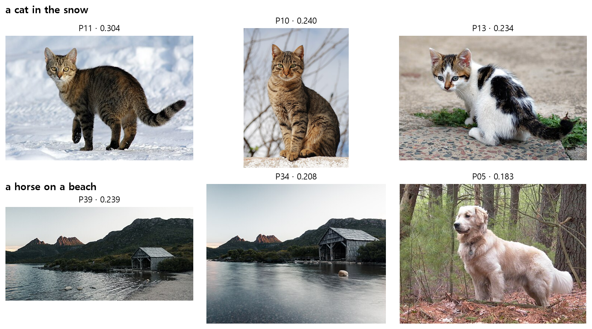

그림 21. 위쪽은 조건이 있는 성공·부분 실패 사례, 아래쪽은 **관련 사진이 없는 질의**다. 각 사진의 출처와 이용 조건은 ID로 출처표에서 확인한다. 검색은 어떤 입력에도 상위 후보를 내놓을 수 있으므로 결과가 있다는 사실을 정답이 있다는 뜻으로 읽지 않는다.

| 질의 | 실험에서 확인할 점 |
|---|---|
| `a photo of a dog` | 뚜렷한 대상 범주 |
| `a cat in the snow` | 대상과 배경 조건의 결합 |
| `a red car` | 색 속성 |
| `a cat playing with a lizard` | 작은 대상·관계 |
| `a horse on a beach` | 모음에 없는 대상도 결과가 나오는 현상 |

영어 쿼리에 한국어 뜻을 붙여 실험한다. 원 CLIP의 모델 카드에서는 영어 외 언어의 사용을 충분히 검증하지 않았다고 설명한다. 한국어를 직접 넣어 비교할 수는 있지만, 이 수업은 한국어 성능을 보장하지 않는다. 부정 표현, 수량, 작은 물체, 세밀한 관계, 편향된 사진 구성에서도 한계가 있다.

## 15. 마지막 활동: 관찰을 웹 앱으로 연결하기

Colab B 마지막의 누적 앱에는 **AE/VAE 복원**, **2차원 좌표 탐색**, **CLIP 의미 검색** 탭이 있다. A만 실행했다면 앞의 두 탭부터 이용할 수 있다. 세 모델을 직렬 연결하지 않고 같은 화면에서 목적과 출력을 비교한다.

| 화면 입력 | 실행되는 계산 | 화면 출력 |
|---|---|---|
| 모델 + 테스트 번호 | 인코딩 → 디코딩 → 오차 | 원본·복원·잔차·MSE |
| 2차원 모델 + z1,z2 | 선택한 좌표 디코딩 | 생성 이미지 |
| 문장 + k | 문장 인코딩 → 내적 → 정렬 | 사진·코사인·출처 |

[`build_embedding_app`](https://github.com/lunalab-ai/genAI/blob/2026-fall-w05a-v2/src/luna_genai/embedding_app.py#L42)는 준비된 모델과 데이터를 받아 화면과 기본 이벤트를 만든다. 다운로드·학습·서버 시작을 한꺼번에 숨겨 수행하지 않는다. [`reconstruction_view`](https://github.com/lunalab-ai/genAI/blob/2026-fall-w05a-v2/src/luna_genai/embedding_app.py#L12), [`latent_view`](https://github.com/lunalab-ai/genAI/blob/2026-fall-w05a-v2/src/luna_genai/embedding_app.py#L28), [`search_view`](https://github.com/lunalab-ai/genAI/blob/2026-fall-w05a-v2/src/luna_genai/semantic_search.py#L176)에서 버튼이 실제로 호출하는 함수를 확인한다.

학생은 마지막에 **두 문장 비교 탭**을 추가한다. 두 Textbox, 공통 k, 비교 버튼, 두 Gallery를 만들고 입력 순서와 반환 순서를 연결한다. 문제를 완성하지 않아도 기본 검색 탭은 독립적으로 동작한다. `Blocks` 객체 생성, callback 직접 실행, 서버 시작, 브라우저 버튼 클릭은 서로 다른 검증 단계다.

공유 링크는 실행 중인 Colab 런타임에 연결된다. 런타임을 종료하면 링크도 끝난다. 다시 사용하려면 데이터·모델 준비와 앱 실행을 다시 진행한다. 웹 앱을 영구 배포한 주소와 혼동하지 않는다.

### 실행 전 확인

1. A와 B는 각각 새 Colab 사본으로 실행한다. CPU 기본이며 API 키는 필요 없다.
2. 설치 셀부터 순서대로 실행한다. 패키지는 0.1.7, 고정 태그는 `2026-fall-w05a-v2`다.
3. A는 MNIST 약 11.6 MB를 최초 준비한다. 수업 체크포인트·사진은 패키지에 포함된다. B는 CLIP 가중치 약 605 MB를 최초 준비하고 캐시를 재사용한다. 패키지 의존성 설치량은 환경에 따라 추가된다.
4. 설치 후 이미 import한 패키지가 바뀌었다면 런타임을 재시작하고 첫 셀부터 실행한다. 다운로드 실패를 가짜 결과로 대체하지 않는다.
5. 출력 shape, 유한한 점수, 실제 이미지, 마지막 점검 셀을 확인한다. 실험 기록지에는 본인이 실제로 관찰한 결과를 남긴다.

## 16. 점검 질문

먼저 자신의 문장과 작은 계산으로 답한 뒤 별도 해설을 확인한다.

1. Q1. AE의 학습 target은 무엇이며, 숫자 라벨은 이번 실습에서 어디에 쓰이는가?
2. Q2. 네 픽셀의 제곱 오차 합이 0.1일 때 MSE는 얼마인가?
3. Q3. backward와 optimizer.step은 각각 무엇을 하는가?
4. Q4. AE의 좋은 복원이 표준정규 잠재 샘플의 좋은 생성을 보장하는가?
5. Q5. logvar가 log 4이면 분산과 표준편차는 각각 얼마인가?
6. Q6. 평균 (1,-1), 표준편차 (2,0.5), 잡음 (0.5,-2)의 재매개변수화 결과는 무엇인가?
7. Q7. VAE 복원항을 픽셀 합에서 픽셀 평균으로 바꾸고 β를 유지하면 무엇이 달라지는가?
8. Q8. CLIP의 두 인코더 내부 차원이 달라도 비교할 수 있는 이유는 무엇인가?
9. Q9. CLIP 검색의 코사인 점수나 후보 softmax를 정답 확률로 읽으면 안 되는 이유는 무엇인가?
10. Q10. 관련 사진이 두 장인 상위 3개 결과의 Precision@3은 얼마이며, 관련 대상이 없을 때 top-k는 어떻게 동작하는가?

## 참고자료와 재현 범위

주교재의 용어·그림·전개를 바탕으로 수업 예제와 설명을 독립 작성했다. 원본 그림의 출처는 각 캡션에 표시했다. 교재 전체 스캔과 출판사 예제 원본은 학생 저장소에 포함하지 않는다. 실측은 Python 3.12.10, PyTorch 2.8 CPU, 위에 명시한 분할과 설정에서 얻었다. 실제 실행의 상세 조건은 [모델 기록](https://github.com/lunalab-ai/genAI/blob/2026-fall-w05a-v2/src/luna_genai/assets/w05a/models.json)과 [공통 API](https://github.com/lunalab-ai/genAI/blob/2026-fall-w05a-v2/src/W05A-API.md)에 제공한다.

- [Kingma & Welling, Auto-Encoding Variational Bayes](https://arxiv.org/abs/1312.6114): 변분 하한·재매개변수화의 이론적 근거.
- [Radford et al., Learning Transferable Visual Models From Natural Language Supervision](https://proceedings.mlr.press/v139/radford21a.html): CLIP의 이미지–텍스트 대조 학습과 제로샷 전이.
- [OpenAI CLIP 공식 구현](https://github.com/openai/CLIP): 인코딩·정규화·유사도 계산의 원 구현.
- [Transformers 5.15.1 CLIP 문서](https://huggingface.co/docs/transformers/v5.15.1/en/model_doc/clip): 현재 실습 버전의 반환 형식과 전처리.
- [ViT-B/32 모델 카드](https://huggingface.co/openai/clip-vit-base-patch32): 모델의 사용 범위와 언어·평가 한계.
- [PyTorch 2.8 MSELoss](https://docs.pytorch.org/docs/2.8/generated/torch.nn.MSELoss.html): reduction과 평균 정의.
- [Gradio Blocks와 이벤트](https://www.gradio.app/guides/blocks-and-event-listeners): 입력·callback·출력 연결.

이 수업에서는 별도 성적 반영 과제나 제출 기한을 추가하지 않는다. 기록지와 점검 질문으로 관찰과 설명을 연습한다.
