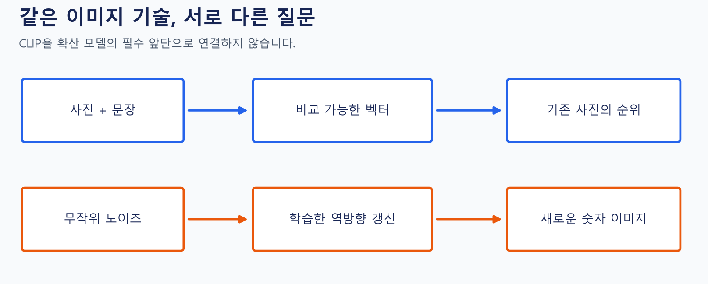
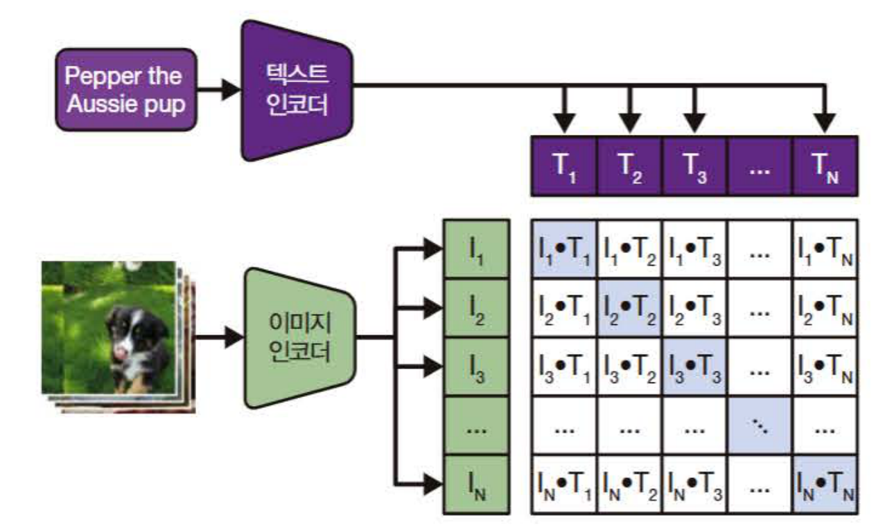
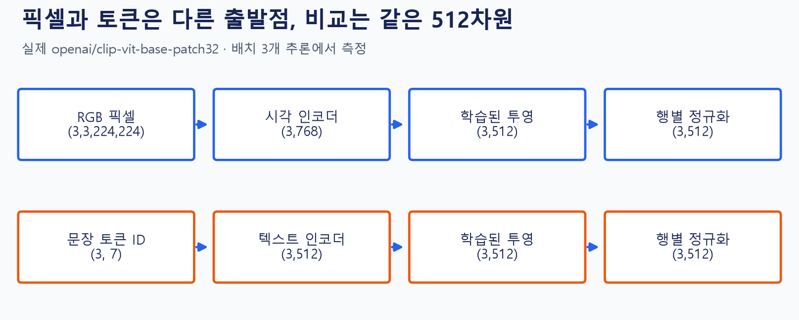
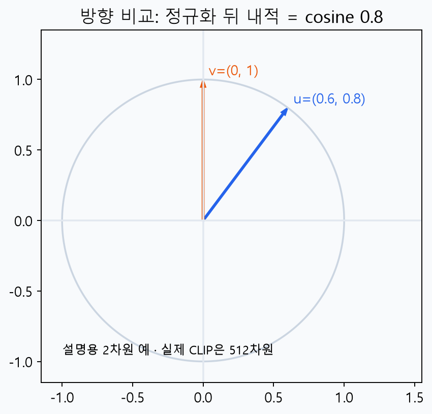
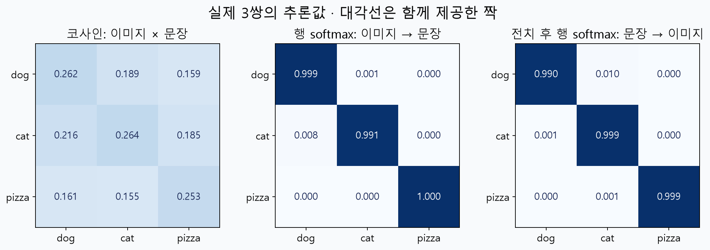
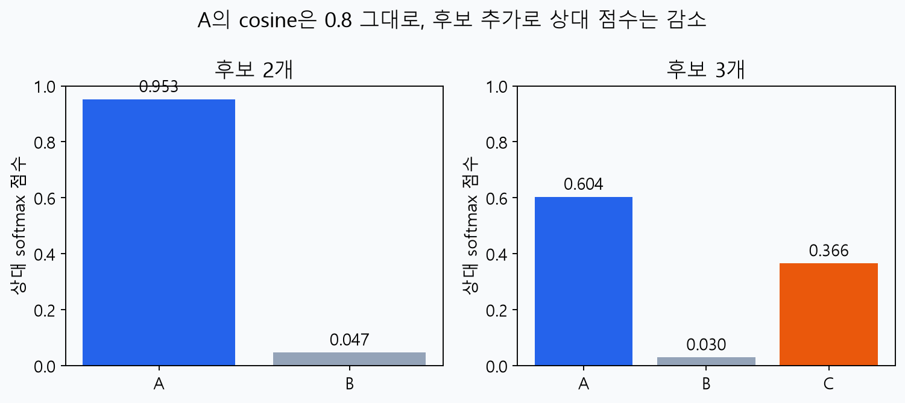
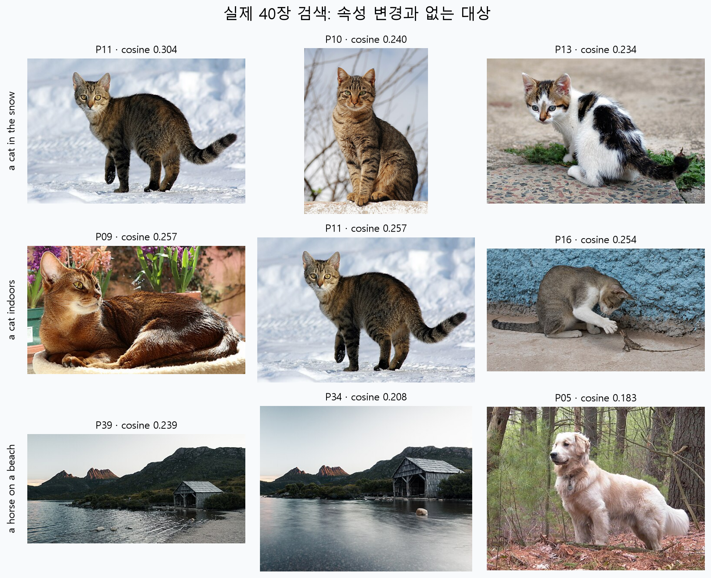

# W05B · CLIP: 이미지와 문장을 연결하고 의미로 검색하기

**데이터 사이언스를 위한 생성형 인공지능 · 2026년 9월 30일 수요일 · 5주차 2차시**

주교재 『핸즈온 생성형 AI』 3장 중 CLIP과 의미 기반 이미지 검색. 지난 시간에 진행하지 못한 내용을 처음부터 설명한다. 이번 차시의 [확산 모델 강의](w05b-diffusion.md)는 4.1–4.2에 대응한다.

[Colab A · CLIP 검색](https://colab.research.google.com/github/lunalab-ai/genAI/blob/2026-fall-w05b/notebooks/student/w05b_clip_search.ipynb) · [실험 기록지](w05b-workbook.md) · [클래스·함수·메소드 소스 바로가기](https://github.com/lunalab-ai/genAI/blob/2026-fall-w05b/src/W05B-API.md)

## 1. 오늘의 두 질문: 찾기와 만들기

사진 40장 중에서 “눈 위의 고양이”를 찾으려면 무엇이 필요할까? 사진에는 픽셀만 있고, 검색창에는 글자가 들어온다. 파일명에 ‘고양이’가 적혀 있지 않아도 장면을 찾아야 한다. CLIP은 이미지와 문장을 비교 가능한 벡터로 바꾸어 이 문제에 접근한다.

반대로 확산 모델은 “기존 사진 중 하나를 찾아라”가 아니라 “배운 이미지 분포에서 새 이미지를 만들어라”는 문제를 다룬다. 두 모델 모두 이미지와 신경망을 사용하지만 입력·학습 목표·출력이 다르다.

그림 1. 수업용 자체 도식. 위 줄은 사진과 문장의 유사도로 **기존 후보의 순위**를 낸다. 아래 줄은 노이즈를 반복 갱신하여 **새 픽셀**을 만든다. 이번 무조건부 숫자 확산 모델은 CLIP을 입력 모듈로 사용하지 않는다.

수업을 마친 뒤에는 이미지·문장 임베딩의 차원, 코사인 점수와 확률의 차이, 검색 실패의 의미를 설명할 수 있어야 한다. 공통 함수를 웹 앱의 버튼에 연결하고, 입력 조건을 하나씩 바꾸며 결과를 해석한다.

## 2. CLIP은 어떤 것을 학습했을까?

CLIP은 **Contrastive Language–Image Pre-training**의 약자다. 이미지와 그 이미지에 함께 붙은 문장을 학습 자료로 사용한다. 이미지 인코더는 픽셀을, 텍스트 인코더는 토큰을 받는다. 두 표현을 투영한 뒤, 함께 제공한 쌍의 점수가 다른 조합보다 높아지도록 학습한다.

그림 2. 『핸즈온 생성형 AI』 136쪽, 그림 3-7의 원본 일부를 수업용으로 사용했다. 먼저 두 인코더의 입력을 따로 읽고, 마지막 유사도 표에서 어떤 이미지와 문장이 짝인지 확인한다. 교재에 등장하는 다른 CLIP 변형의 내부 차원을 이번 실습 B/32의 차원과 혼동하지 않는다.

“고양이라는 정수 라벨을 분류하도록 학습한 모델”과는 관점이 다르다. 텍스트가 자유로운 설명이므로 사물 이름뿐 아니라 장면·속성에 관한 신호를 받을 수 있다. 다만 문장과 이미지가 항상 완벽하게 대응하는 것은 아니며, 복잡한 수·부정·관계까지 정확히 이해한다고 보장하지 않는다.

이번 실습에서는 고정된 `openai/clip-vit-base-patch32`를 **추론에 사용**한다. 학생이 수행하는 사진 인덱싱은 이미지를 벡터로 변환하는 작업이며, CLIP의 가중치를 다시 학습하는 작업은 아니다.

## 3. 서로 다른 입력을 같은 공간에 놓는 과정

이미지 파일과 문자열을 바로 곱하지 않는다. 다음 표의 각 행에서 ‘무엇이 들어오고 무엇이 나오는지’를 읽는다.

| 단계 | 이미지 쪽 | 문장 쪽 | 의미 |
|---|---|---|---|
| 입력 준비 | RGB 픽셀, 크기 조정·중앙 자르기·정규화 | 토큰 ID, padding·attention mask | 학습된 모델이 요구하는 형식 맞추기 |
| 인코더 | 시각 특징 768차원 | 텍스트 특징 512차원 | 각 입력의 내부 표현 |
| 학습된 투영 | 768→512 | 512→512 | 비교할 공통 특징 공간에 놓기 |
| 행별 정규화 | 길이 1인 512차원 | 길이 1인 512차원 | 길이 대신 방향 비교 |
| 점수 | 이미지 벡터와 문장 벡터의 내적 | 같은 연산 | 코사인 유사도 |

그림 3. 실제 사진 3장과 문장 3개를 처리한 결과다. `(3,3,224,224)`의 첫 3은 배치 크기, 두 번째 3은 RGB 채널이다. 문장 토큰 길이 7은 **이 세 문장을 padding한 결과**이며 모든 질의의 고정 길이가 아니다. 공통 임베딩 512차원은 이 모델에서 고정이다.

차원만 같다고 의미가 자동으로 맞는 것은 아니다. 서로 다른 두 사람이 같은 개수의 숫자를 적었다고 같은 좌표계를 쓴다고 할 수 없듯, 투영과 인코더는 짝맞추기 목적에 맞게 학습되어야 한다. “512개 숫자 중 1번은 고양이, 2번은 눈”처럼 특징을 독립된 단어 목록으로 읽지도 않는다. 의미는 여러 좌표에 분산되어 표현된다.

### 전처리도 결과에 영향을 준다

실습은 원본 사진과 실제 모델 입력의 224×224 crop을 나란히 보여 준다. 화면 가장자리의 작은 물체가 잘리면 관계를 판단할 단서가 줄어들 수 있다. 검색 실패를 보았을 때 인코더의 의미 이해뿐 아니라 입력 전처리와 후보 사진도 함께 살펴본다.

## 4. 코사인: 숫자의 크기보다 방향을 비교하기

이미지 벡터를 $u$, 문장 벡터를 $v$라고 하자. 코사인은 두 벡터의 내적을 각각의 길이로 나눈 값이다.

$$s(u,v)=\frac{u^\top v}{\lVert u\rVert_2\lVert v\rVert_2}.$$

먼저 $\hat u=u/\lVert u\rVert_2$, $\hat v=v/\lVert v\rVert_2$로 정규화했다면 $s=\hat u^\top\hat v$만 계산하면 된다. 벡터의 길이가 0이면 이 코사인은 정의되지 않으므로 실습 함수는 오류를 알려 준다.

그림 4. 설명용 2차원 예다. 실제 CLIP의 512차원 구조를 2차원으로 축소한 측정 그림은 아니다. 파란 벡터와 주황 벡터의 방향이 가까울수록 내적이 커진다.

| 수계산 단계 | 결과 | 읽는 뜻 |
|---|---|---|
| 원래 벡터 | $(3,4)$, $(0,2)$ | 아직 길이가 다르다 |
| 원래 내적 | $3\cdot0+4\cdot2=8$ | 길이의 영향이 섞였다 |
| 벡터 길이 | $5$, $2$ | 각각 정규화할 분모 |
| 정규화 벡터 | $(0.6,0.8)$, $(0,1)$ | 단위원 위의 방향 |
| 코사인 | $8/(5\cdot2)=0.8$ | 정규화 뒤 내적과 같다 |

실제 `(40,512)` 행렬에서는 **한 행이 사진 하나**다. 각 행의 512개 특징을 기준으로 길이를 구하므로 `norm(dim=1, keepdim=True)`를 쓴다. 정규화 축을 잘못 고르면 코드가 실행되더라도 다른 계산이 된다.

## 5. 작은 행렬로 이해하는 대조 학습

이미지 3장과 각각의 설명 문장 3개를 같은 순서로 배치했다고 하자. 이미지 행과 문장 열을 조합하면 9개의 점수가 생긴다. 정답으로 제공한 세 쌍은 대각선에 놓인다.

$$S_{ij}=\hat u_i^\top\hat v_j,\qquad Z_{ij}=aS_{ij},\qquad a=\exp(\ell)>0.$$

$S$는 코사인 행렬, $a$는 학습된 양의 점수 배율, $Z$는 softmax에 넣을 logits다. 같은 코사인 차이라도 배율이 커지면 상대 점수 분포가 더 뾰족해진다.

이미지 $i$에서 올바른 문장 $i$를 고르는 확률 형태의 상대 점수는 다음과 같다.

$$p(j\mid i)=\frac{\exp(Z_{ij})}{\sum_{k=1}^{N}\exp(Z_{ik})},\qquad L_{I\to T}=-\frac1N\sum_{i=1}^{N}\log p(i\mid i).$$

분자는 올바른 짝의 점수, 분모는 그 이미지에 대한 **모든 문장 후보의 점수 합**이다. 정답 쌍의 상대 점수가 1에 가까워지면 $-\log p$는 0에 가까워진다. 문장 하나에서 올바른 이미지를 고르는 방향도 계산한다.

$$L=\frac{L_{I\to T}+L_{T\to I}}{2}.$$

그림 5. P01 개·P09 고양이·P17 피자와 각각의 영어 문장을 실제 모델에 넣었다. 왼쪽은 코사인, 가운데는 이미지에서 문장, 오른쪽은 문장에서 이미지로 고르는 상대 점수다. 오른쪽은 전치한 뒤 행 softmax를 했으므로 **행의 의미가 문장으로 바뀐다**. 가운데·오른쪽 각 행의 합은 1이다.

예를 들어 P01의 세 코사인은 약 0.262, 0.189, 0.159다. 이 모델의 배율은 약100이어서 개 문장의 상대 점수는 약0.999가 된다. 이 값은 아래에서 설명할 후보 의존성을 가진다. 작은 추론 배치의 값이며 대규모 사전학습 성능 평가를 대신하지 않는다.

여기서 ‘다른 쌍’은 배치 안에서 함께 주어진 짝이 아니라는 뜻이다. 다른 문장도 의미상 어느 정도 맞을 수 있다. 이런 자료의 불완전성까지 생각해야 대조 학습을 무조건적인 참·거짓 판별과 혼동하지 않는다.

## 6. 0.95라는 점수를 읽는 올바른 방법

코사인은 방향 유사도다. softmax는 현재 후보와 배율에서 합이 1이 되도록 만든 **상대 점수**다. 어느 쪽도 추가 검증 없이 “실제 정답일 확률”이라고 해석하지 않는다.

그림 6. 설명용 코사인 A=0.8, B=0.2에 C=0.7을 추가하고 배율5를 사용했다. A 자체의 점수는 같지만 상대 점수는 약0.953에서 0.604로 줄어든다. 분모에 C가 추가되었기 때문이다.

따라서 “0.95이니 정답 확률95%”보다 “현재 두 후보와 이 배율에서 A의 상대 점수가 약0.95”라고 말한다. 후보에 정답 사진이 한 장도 없어도 softmax 합은 1이고 top-k 결과는 나온다.

## 7. 의미 검색의 계산을 직접 따라가기

사진 40장을 한 번 인코딩하여 $E\in\mathbb R^{40\times512}$에 저장한다. 새 문장을 인코딩하여 $q\in\mathbb R^{512}$로 만든 뒤, 행렬곱 $s=Eq$로 40개의 코사인을 동시에 계산한다.

| 순서 | 실제 연산 | 확인할 중간 결과 |
|---|---|---|
| 사진 준비 | 픽셀 전처리→인코딩→투영→정규화 | 40×512, 각 행 길이1 |
| 질의 준비 | 문장 토큰화→인코딩→투영→정규화 | 512, 길이1 |
| 비교 | `scores = E @ q` | 사진마다 점수 하나, shape40 |
| 정렬 | 큰 점수부터 stable sort | 상위 사진 인덱스 |
| 표시 | ID·사진·점수·출처 연결 | 정렬 순서와 실제 장면 |

같은 사진 모음에서 질의만 바뀌면 이미지 인코딩을 반복할 필요가 없다. 캐시는 모델 revision·라이브러리 버전·사진 ID와 해시가 같을 때만 재사용한다. 파일명이 아니라 픽셀을 인코딩하므로 사진 metadata의 제목을 바꾼다고 검색 의미가 바뀌지는 않는다.

실습 A에서는 wrapper의 결과와 직접 행렬곱·정렬한 결과가 같은지 검사한다. 함수를 가져온 뒤에도 실제 선언 줄을 열어 반환 순서와 중간 연산을 확인할 수 있다.

## 8. 성공 사례와 실패 사례를 함께 보기

그림 7. 고정 CLIP·40장 후보에서 측정한 top3다. ‘눈 위 고양이’는 P11·P10·P13, ‘실내 고양이’는 P09·P11·P16이었다. P11은 두 검색에 모두 등장한다. 대상이 고양이라는 강한 신호가 배경 조건을 완전히 구분하지 못할 수 있음을 보여 준다. ‘해변의 말’은 모음에 말이 없는데도 P39·P34·P05를 반환했다. 사진별 저자·원본·라이선스는 [사진 출처표](https://github.com/lunalab-ai/genAI/blob/2026-fall-w05b/src/GALLERY-CREDITS.md)에 있고 실습·앱 캡션에도 제공한다.

관련성 기준은 검색 전에 정한다. “눈 위 고양이”는 고양이와 눈이 모두 있어야 하므로 P10·P11을 관련 집합으로 둔다. 상위3개 중 관련 사진은 두 장이다.

$$\mathrm{Precision@3}=\frac{\text{상위 3개 중 관련 사진 수}}{3}=\frac23.$$

관련 사진 자체가 두 장뿐이므로 이 모음에서 Precision@3의 최댓값도 2/3이다. “고양이와 도마뱀”은 관련 사진 P16이 한 장뿐이어서 최댓값이 1/3이다. 이때 1/3을 보고 세 결과 모두가 틀렸다고 해석하면 분모와 후보 모음을 놓친 것이다.

| 관찰 유형 | 질의 예 | 확인할 내용 |
|---|---|---|
| 대상 | a photo of a cat | 고양이가 실제로 있는가 |
| 속성·배경 | a cat in the snow / a cat indoors | 대상은 같고 배경 조건이 달라지는가 |
| 관계·동시 등장 | a cat and a lizard | 두 대상이 함께 있는가; 관계까지 확인했는가 |
| 없는 대상 | a horse on a beach | 반환됨과 정답임을 구분하는가 |
| 언어 | 의미가 비슷한 한국어·영어 | 작은 탐색 결과를 전체 언어 능력으로 일반화하지 않는가 |

고정된 임계값 하나로 모든 질의의 정답 부재를 해결했다고 주장하지 않는다. 실제 검색 서비스라면 별도의 검증 자료·거절 기준·사용자 피드백이 필요하다. 여기서는 “후보 안에서 높은 순위”와 “사용자가 원하는 조건 충족”을 분리하는 것이 목표다.

## 9. 실습과 웹 앱에서 결과를 설명하기

Colab A의 순서는 사진 확인 → 내부 텐서 크기 → 작은 코사인 계산 → 양방향 행렬 → 후보 변경 → 직접 검색 → 평가 → 웹 앱이다. 문장이나 k를 바꾸기 전에 예상하는 변화를 [기록지](w05b-workbook.md)에 적고, 관찰 후 설명을 수정한다.

웹 앱은 새 탭에서 열린다. 두 질의를 나란히 입력하고 버튼을 누르면 이미지·코사인 표·공통 ID가 나온다. 같은 대상에서 속성 한 단어만 바꾸어 비교한다. 화면의 점수표만 보지 말고 사진을 확대해 실제로 조건을 충족하는지 판단한다.

버튼은 함수를 대신하지 않는다. 입력 컴포넌트의 순서가 함수 인자 순서와 같아야 하고, 반환한 두 gallery·표·문자열은 네 출력 컴포넌트와 대응해야 한다. 실습의 마지막 짧은 활동에서 이 연결을 직접 조립한다.

## 참고자료와 범위

- 주교재 『핸즈온 생성형 AI』 3.3 CLIP, 3.5 의미 기반 이미지 검색. 교재 그림의 필요한 부분은 출처를 표시해 직접 사용했다.
- [Radford et al., Learning Transferable Visual Models From Natural Language Supervision](https://proceedings.mlr.press/v139/radford21a.html): 이미지–문장 대조 사전학습의 원논문.
- [Hugging Face CLIPModel 공식 문서](https://huggingface.co/docs/transformers/model_doc/clip): 모델 입력·출력·투영 API.
- [수업 API와 실제 소스 선언 줄](https://github.com/lunalab-ai/genAI/blob/2026-fall-w05b/src/W05B-API.md): 설치와 같은 고정 태그.
- 수계산·40장 후보 실험·후보 의존성·실패 분석·웹 앱은 수업에서 추가한 설명이다. 2026-09-29 실제 CPU 추론값이며 모델이나 후보를 바꾸면 결과도 달라질 수 있다.
