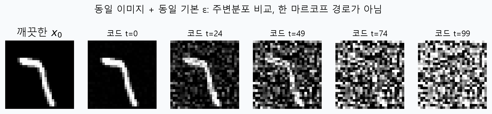
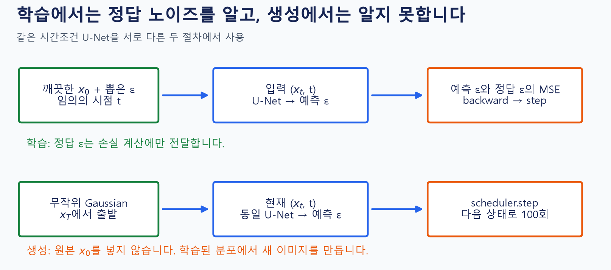
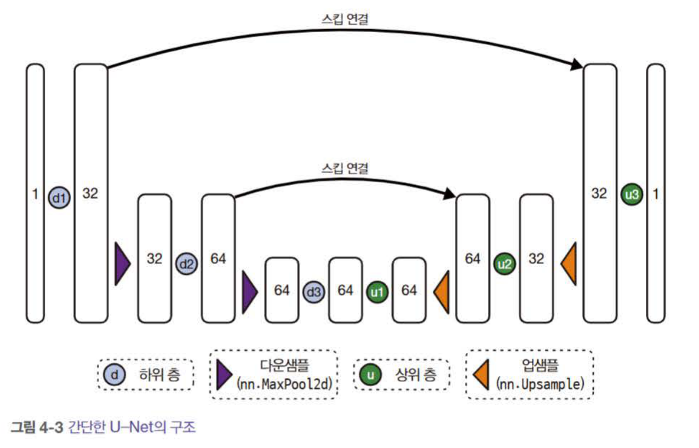
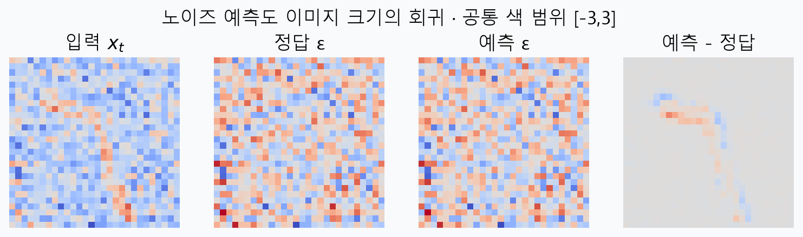
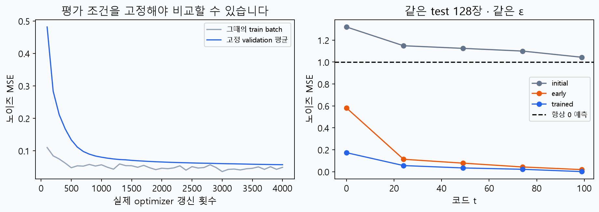
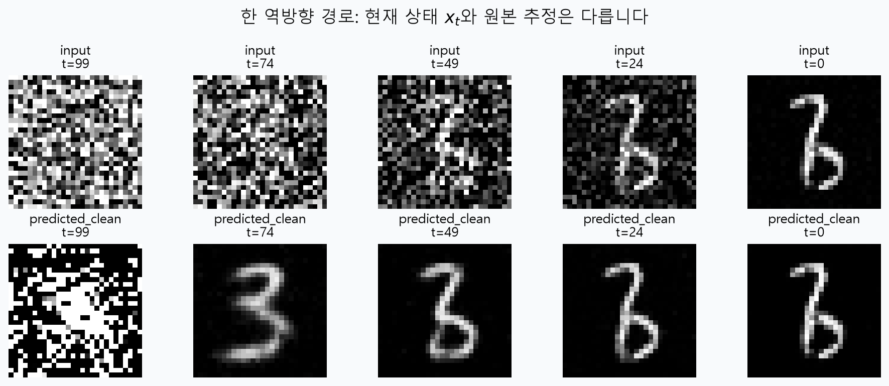
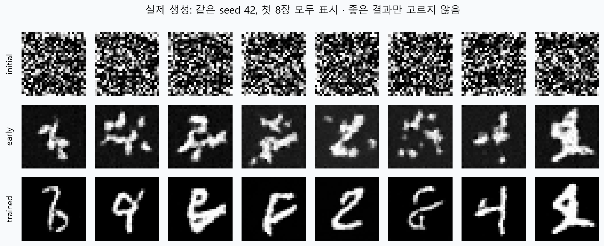

# W05B · 확산 모델: 노이즈 예측을 학습하여 새 이미지를 만들기

**2026년 9월 30일 · 생성형 인공지능 · 주교재 4.1–4.2**

[Colab B · 확산 학습과 누적 웹 앱](https://colab.research.google.com/github/lunalab-ai/genAI/blob/2026-fall-w05b/notebooks/student/w05b_diffusion.ipynb) · [CLIP 강의](w05b-clip-search.md) · [실험 기록지](w05b-workbook.md) · [API 정의 바로가기](https://github.com/lunalab-ai/genAI/blob/2026-fall-w05b/src/W05B-API.md)

## 1. 한 번에 완성하기 대신 여러 번 정제하기

확산 모델을 처음 보면 “노이즈에서 어떻게 그림이 나오지?”라는 질문이 자연스럽다. 이 모델은 아무 규칙 없이 노이즈를 지우는 것이 아니다. **여러 노이즈 수준에서 데이터의 구조를 예측하는 신경망을 학습**하고, 그 신경망을 역방향 갱신 과정에 반복 사용한다.


그림 1. 『핸즈온 생성형 AI』 156쪽, 그림 4-1 원본 일부. 왼쪽에서 오른쪽으로 이미지가 구체화되는 ‘반복 정제’의 개념 그림이다. 이번 MNIST 실습의 실제 생성 결과가 아니며, 아래의 실측 그림과 구별한다.

학습할 때는 깨끗한 이미지를 알고 있다. 우리가 노이즈를 섞었으므로 어떤 노이즈를 넣었는지도 안다. 생성할 때는 깨끗한 원본이 없다. 무작위 노이즈에서 출발하여 학습된 규칙을 반복 적용한다. 이 두 상황을 구분하면 이후의 식과 코드가 훨씬 읽기 쉬워진다.

## 2. 교재 4.2 전체를 따라가는 실험 지도

| 교재 | 핵심 질문 | 이번 실습의 대응 |
|---|---|---|
| 4.1 핵심 원리 | 왜 반복해서 정제하는가 | 실제 역확산 경로와 현재 상태·원본 추정 비교 |
| 4.2.1 데이터 | 어떤 이미지 분포를 배우는가 | MNIST, train/validation/test, [-1,1] 변환 |
| 4.2.2 노이즈 | 어느 시점에 얼마나 섞는가 | Gaussian 잡음, 닫힌 형태의 노이즈 식, 직접 검산 |
| 4.2.3 모델 | 무엇을 입력하고 예측하는가 | 작은 시간조건 U-Net, skip, 입력·출력 shape |
| 4.2.4 학습 | 정답과 손실은 무엇인가 | epsilon-MSE, backward, 실제 optimizer 갱신 |
| 4.2.5 샘플링 | 학습한 모델로 어떻게 생성하는가 | Gaussian 시작, scheduler.step 100회 |
| 4.2.6 평가 | 손실이 낮으면 좋은 그림인가 | 고정 노이즈 평가·같은 seed 생성·품질 한계 |

교재의 나비 데이터는 64×64 RGB이며 더 큰 U-Net과 긴 학습을 사용한다. 이번 핵심 실습은 **28×28 흑백 MNIST, 141,873개 모수의 작은 U-Net**으로 줄였다. CPU에서 실제 학습 단계를 추적하고 생성 결과까지 확인하기 위한 선택이다. 교재 원본 모델의 성능을 재현했다고 주장하지 않는다. 4.3의 스케줄 상세 비교와 5장의 Stable Diffusion은 이번 범위에 추가하지 않는다.

## 3. 먼저 기호를 실제 물건과 연결하기

| 기호 | 뜻 | 코드에서의 모양 |
|---|---|---|
| $x_0$ | 깨끗한 원본 이미지 | float32 `(B,1,28,28)`, [-1,1] |
| $\epsilon$ | 우리가 뽑아 섞은 표준정규 잡음 | 이미지와 같은 shape |
| $t$ | 노이즈 수준을 나타내는 단계 | int64 `(B,)` |
| $x_t$ | 해당 단계의 noisy 이미지 | 이미지와 같은 shape, [-1,1] 밖도 가능 |
| $\epsilon_\theta(x_t,t)$ | 신경망이 예측한 잡음 | 이미지와 같은 shape |
| $\theta$ | 학습되는 U-Net의 모수 | 합성곱·정규화·시간 투영 등 가중치 |

코드 t=0은 **첫 노이즈 단계**, t=99는 **100번째 노이즈 단계**다. 수학에서 원본을 나타내는 $x_0$와 코드 인덱스0을 같은 상태라고 해석하지 않는다. 그림에서는 ‘깨끗한 원본’ 칸을 따로 둔다.

## 4. 전방 과정: 구조를 조금씩 약하게 만들기

각 단계에서 이전 상태를 조금 줄이고 새 Gaussian 잡음을 더하는 과정을 생각하자.

$$q(x_t\mid x_{t-1})=\mathcal N\!\left(\sqrt{1-\beta_t}\,x_{t-1},\,\beta_t I\right).$$

$\beta_t$는 그 단계에서 더하는 잡음의 분산이다. 평균에는 $\sqrt{1-\beta_t}$를 곱하므로 이미지 신호도 점차 약해진다. 매번 잡음을 더하기만 하는 임의의 이미지 효과와 다르다.

$\alpha_t=1-\beta_t$, $\bar\alpha_t=\prod_{s=1}^{t}\alpha_s$라고 두면, 중간 단계를 모두 계산하지 않고도 원하는 시점의 이미지를 직접 뽑을 수 있다.

$$x_t=\sqrt{\bar\alpha_t}\,x_0+\sqrt{1-\bar\alpha_t}\,\epsilon,\qquad \epsilon\sim\mathcal N(0,I).$$

첫 계수는 원본의 세기, 둘째 계수는 잡음의 세기다. 여기서 곱하는 것은 분산 자체가 아니라 **표준편차에 해당하는 제곱근**이다. 학습에서는 이미지마다 임의의 t를 뽑아 다양한 노이즈 수준을 배우므로 이 직접 식이 편리하다.



그림 2. 실제 test 이미지 한 장과 seed42의 기본 잡음을 사용했다. 뒤로 갈수록 원본 계수는 작아지고 잡음 계수는 커진다. 같은 잡음을 여러 t에 재사용한 **시점별 주변분포 비교**이며 하나의 Markov 전방 경로는 아니다. 실습에는 단계마다 새 잡음을 뽑는 실제 전방 경로도 별도로 들어 있다. 흑백 표시 범위만 [-1,1]로 고정하고 계산 텐서는 자르지 않았다.

### 한 픽셀만 계산해 보기

원본 픽셀 $x_0=0.5$, 잡음 $\epsilon=-1$, $\bar\alpha_t=0.64$라면 다음과 같다.

$$x_t=\sqrt{0.64}\times0.5+\sqrt{0.36}\times(-1)=0.4-0.6=-0.2.$$

신호가 남아 있지만 잡음 때문에 픽셀값이 바뀌었다. 실제 코드에서는 이 연산을 배치의 모든 픽셀에 동시에 수행한다.

### 왜 randn이어야 할까?

`torch.randn`은 평균0·분산1인 Gaussian 잡음을 뽑는다. `torch.rand`는 [0,1) 균등잡음이어서 평균과 분산이 다르다. 두 함수는 이름이 비슷하지만 위 식의 가정이 달라진다. 제공된 교재 노트북의 노이즈 시각화 예에는 `rand_like`, 학습 루프에는 Gaussian 잡음이 사용되어 있어, 이번 수업 코드는 **그림과 학습을 모두 Gaussian으로 통일**했다. 교재 원본 파일은 수정하지 않았다.

## 5. 학습과 생성은 다른 절차다



그림 3. 수업용 자체 도식. 위 줄은 학습, 아래 줄은 생성이다. 학습의 정답 $\epsilon$은 loss를 계산하는 곳에만 연결된다. 모델 입력에 정답 잡음을 함께 넣으면 배워야 할 문제를 누설하게 된다.

| 구분 | 학습 | 생성 |
|---|---|---|
| 시작 | 실제 이미지 $x_0$ | Gaussian 상태 $x_T$ |
| t 선택 | 배치마다 임의의 수준 | 큰 단계부터 작은 단계로 순서대로 |
| 모델 입력 | $(x_t,t)$ | $(x_t,t)$ |
| 정답 잡음 | 직접 뽑았으므로 알고 있음 | 정답으로 주어지지 않음 |
| 수행 | 손실·미분·모수 갱신 | 예측과 scheduler 갱신 |
| 결과 | 더 나은 모수 $\theta$ | 새로 생성된 이미지 |

‘정답 잡음을 안다’는 설명은 학습 상황의 이야기다. 생성에서도 이미 정답을 알고 빼는 것이 아니다. 또한 학습에서는 매 이미지마다 전방100회·역방향100회를 반드시 실행하지 않는다. 임의 t의 입력을 직접 만드는 식으로 noise predictor를 학습한다.

## 6. U-Net은 왜 내려갔다 올라올까?



그림 4. 『핸즈온 생성형 AI』 165쪽, 그림 4-3 원본 일부. 하강 경로는 해상도를 줄여 넓은 문맥을 모으고, 상승 경로는 출력 해상도를 복구한다. skip 연결은 대응하는 해상도의 세부 정보를 전달한다. 그림 속 채널 수와 아래 수업 구현의 채널 수는 다르다.

노이즈가 많은 이미지에서 픽셀 하나만 보고 획을 판단하기 어렵다. 넓은 주변 정보가 필요하다. 동시에 최종 출력은 픽셀마다 잡음값을 내야 하므로 위치와 세부 구조도 중요하다. U-Net은 이 두 요구를 하강·상승 경로와 skip으로 연결한다.


그림 5. 수업용 실제 구현의 구조다. 배치 축을 생략해 `(채널,높이,너비)`로 썼다. 28→14→7→14→28을 읽고, skip이 들어오는 지점에서는 특징을 채널 방향으로 이어 붙인다고 이해한다. 이는 원본 이미지 자체를 정답으로 복사하는 연결이 아니다.

시간 t는 sin/cos 특징과 작은 신경망을 거쳐 각 블록에 더해진다. 같은 noisy 값도 어떤 노이즈 수준에서 왔는지에 따라 해석이 달라지므로 시간 조건이 필요하다. 출력은 `(B,1,28,28)`이며, 원본 이미지가 아니라 **예측 잡음**이다. 입력과 출력의 shape이 같다는 사실만으로 의미까지 같다고 결론 내리지 않는다.

## 7. 학습 데이터·정답·손실을 한 배치에서 추적하기

이번 split은 공식 MNIST에서 train12000, validation1000, test1000을 seed1337로 선택한다. train과 validation의 인덱스 교집합은 0이다. 원래 픽셀 [0,1]을 `2*x-1`로 [-1,1]로 바꾸고, 숫자 이름 라벨은 학습에 사용하지 않는다.

| 코드 단계 | 알고리즘의 의미 | 관찰할 것 |
|---|---|---|
| 이미지 배치 선택 | 우리가 배우려는 데이터 분포 | `(B,1,28,28)` |
| t와 epsilon 추출 | 다양한 손상 수준의 학습 문제 만들기 | t는 `(B,)`, epsilon은 이미지 shape |
| `add_noise` | 원본과 잡음을 정해진 비율로 섞기 | 직접 식과 일치 여부 |
| `model(noisy,t)` | 정답을 보지 않고 잡음 예측 | 출력 shape과 값 |
| MSE | 예측과 실제로 넣은 잡음의 차이 | finite loss |
| `backward()` | 모수에 대한 gradient 계산 | gradient norm, 아직 모수 값 동일 |
| `optimizer.step()` | gradient를 이용한 모수 갱신 | 모수 변화량 양수 |

$$L_{\mathrm{simple}}=\mathbb E_{x_0,t,\epsilon}\left[\lVert\epsilon-\epsilon_\theta(x_t,t)\rVert^2\right].$$

이 기대값을 한 배치로 근사하고, 실제 구현의 mean reduction은 모든 배치·채널·공간 원소로 나눈다.

$$L_{\mathrm{batch}}=\frac{1}{BCHW}\sum_{b=1}^{B}\sum_{c=1}^{C}\sum_{h=1}^{H}\sum_{w=1}^{W}\left(\epsilon_{bchw}-\epsilon_\theta(x_t,t)_{bchw}\right)^2.$$

예측 오차가 네 원소에서 $(0.2,-0.2,0.1,-0.1)$이라면 제곱합0.10, 평균0.025다. 합과 평균은 분모가 다르므로 loss의 크기를 비교할 때 reduction도 확인한다. 여기서는 DDPM의 단순화한 epsilon-MSE를 사용하며 전체 변분 목적의 모든 가중항을 유도하는 수업으로 범위를 넓히지 않는다.



그림 6. 실제 test 한 장, 코드 t49에서 입력·정답 epsilon·학습 모델의 예측·잔차를 표시했다. 네 그림은 공통 색 범위 [-3,3]을 사용한다. 예측 잡음은 숫자 라벨도, 완성된 숫자 이미지도 아니다. 잔차가 남는 위치에서 모델의 예측이 불완전함을 확인한다.

## 8. 실제로 짧게 학습하고, 충분히 학습한 모형도 관찰하기

학생 노트북은 새 U-Net으로 **실제 8회 갱신**한다. 첫 갱신에서 backward 전후 모수, gradient norm, optimizer 뒤 모수 변화를 출력한다. 이 짧은 실행의 목적은 학습 연산을 관찰하는 것이다. 8회만으로 좋은 숫자가 만들어져야 한다는 기대는 두지 않는다.

생성 비교에는 동일한 수업 코드로 따로 학습한 체크포인트를 사용한다.

| 항목 | 기록 |
|---|---|
| 데이터 | train12000, validation1000, test1000; 라벨 미사용 |
| 모수 | 141,873개 |
| 최적화 | Adam, learning rate0.001, batch64, 4000회 갱신 |
| 비교 체크포인트 | initial0회, early400회, trained4000회 |
| 평가 | 고정 이미지128장, t0/24/49/74/99, epsilon seed901 |
| 학습 가중치 처리 | early·trained는 decay0.995의 지수이동평균(EMA) |
| 준비 환경 | Python3.12.10, PyTorch2.8 CPU; 약492초의 실제 학습·주기적 평가 |

EMA는 여러 갱신 시점의 모수를 부드럽게 평균내는 처리다. 새 모델을 하나 더 별도로 학습한 것이 아니다. 학생의 짧은 학습은 갱신 관찰에 집중하고, 배포 체크포인트의 EMA 사용은 기록에 명시한다. 체크포인트는 SHA-256과 엄격한 모수 이름 검사를 통과해야 로드된다.

## 9. 평가 조건을 고정해야 무엇이 좋아졌는지 보인다



그림 7. 왼쪽 회색선은 그 시점에 뽑은 학습 배치의 loss, 파란선은 고정 validation 평가다. 배치·t·잡음이 바뀌므로 회색선이 매번 내려갈 필요는 없다. 오른쪽은 같은 test128장·같은 잡음으로 측정한 시점별 MSE다. 항상0만 예측하는 기준선은 약1이다.

| 모형 | 다섯 시점의 test noise-MSE 평균 |
|---|---:|
| initial | 1.147518 |
| early400 | 0.166637 |
| trained4000 | 0.056865 |

이는 위 **다섯 시점에 동일 가중치**를 준 평균이다. t전체에 대한 보편적 성능 값이나 이미지 인식 정확도가 아니다. 학생 노트북은 CPU 시간을 줄이기 위해 test64장으로 다시 측정하므로 표의 128장 수치와 소수점까지 같을 필요가 없다. 비교 조건이 같은지 먼저 확인한다.

노이즈가 매우 작은 단계에서는 실제 입력에 담긴 잡음 신호가 작아 epsilon을 정확히 맞히기 어렵다. 반대로 노이즈가 매우 큰 단계에서는 epsilon 예측 MSE가 작아도 원본 이미지 추정이 안정적이라고 보장할 수 없다. 다음 절의 분모를 보면 그 이유가 드러난다.

## 10. 잡음 예측에서 원본 추정으로

전방 식을 원본에 대해 정리하면 다음과 같은 추정식이 나온다.

$$\hat x_0=\frac{x_t-\sqrt{1-\bar\alpha_t}\,\epsilon_\theta(x_t,t)}{\sqrt{\bar\alpha_t}}.$$

예측 잡음을 비율에 맞추어 빼고 신호 계수로 나눈다. 단순히 `x_t - predicted_noise`가 아니다. 특히 $\bar\alpha_t$가 매우 작으면 작은 잡음 예측 오차도 원본 추정에서 크게 증폭될 수 있다. 그래서 높은 t의 원본 추정이 거칠거나 포화되어 보이는 것을 관찰할 수 있다.

이 원본 추정은 **다음 상태 자체**와도 다르다. DDPM scheduler는 현재 상태, 원본 추정과 스케줄에 따른 평균·분산을 사용하여 다음 상태를 만든다. 이번 설정은 원본 추정을 [-1,1]로 제한하는 `clip_sample=True`를 사용한다. 이는 학습 입력 noisy 텐서를 미리 자르는 것과 다른 위치의 처리다.

## 11. 역방향 생성: 학습된 규칙을 순서대로 반복하기

$$x_T\sim\mathcal N(0,I),\qquad x_{t-1}=\mu_\theta(x_t,t)+\sigma_t z.$$

잡음이 남는 단계에서는 $z$도 Gaussian에서 뽑는다. 마지막 단계는 추가 잡음 없이 마무리한다. 이번 코드는 100개의 모든 단계를 사용하며, 중간 단계를 임의로 건너뛰는 가속 기법은 다루지 않는다.

```python
predicted_noise = model(x, batch_t)
update = scheduler.step(predicted_noise, t, x, generator=generator)
x = update.prev_sample
```

모델의 출력은 epsilon, `pred_original_sample`은 원본 추정, `prev_sample`은 다음 상태다. 한 줄씩 역할을 분리해 읽는다. scheduler는 학습된 신경망이 아니라 정해진 확률적 갱신 규칙을 구현한 객체다.



그림 8. trained 모델, count8·seed42에서 첫 표본의 실제 경로다. 위는 해당 단계의 입력 상태, 아래는 그 상태에서 추정한 원본이다. 생성 중 깨끗한 정답 이미지를 넣지 않았다. 초기 추정이 이후 단계에서 달라지는 모습도 관찰한다.

## 12. 손실과 생성 품질을 함께 판단하기



그림 9. initial·early·trained를 같은 count8·seed42·100단계로 비교했다. 첫8장을 모두 표시했으며 좋은 것만 골라 내지 않았다. 학습 후 숫자 형태가 나타나지만 애매한 획이나 알아보기 어려운 표본도 남는다. seed뿐 아니라 배치 크기·모델·라이브러리 버전도 재현 조건이다.

교재4.2.6의 평가는 다음 두 질문을 함께 다룬다. 생성물이 그럴듯한가? 데이터의 여러 모습을 충분히 포함하는가? 선명한 숫자 한 장만으로 분포 전체를 잘 배웠다고 할 수 없다.

FID는 특징 공간에서 실제·생성 이미지 집합의 평균과 공분산 차이를 비교하는 지표다. 표본 수, 특징 추출기, 이미지 전처리에 영향을 받는다. 이번 8장짜리 흑백 숫자 시연에서 FID를 안정적인 성능 점수처럼 계산해 과장하지 않는다. 대신 **고정 조건의 노이즈 MSE + 같은 seed의 전체 샘플 격자 + 모호한 표본과 다양성에 관한 서술**을 함께 기록한다.

## 13. 마지막 웹 앱에서 바꾸어 볼 세 가지

검색 탭에서는 문장을 바꾸고, 노이즈 탭에서는 t를 바꾸고, 생성 탭에서는 체크포인트를 바꾼다. 한 번에 요인 하나만 바꾸면 원인을 설명하기 쉽다. 체크포인트 선택과 슬라이더 조작은 재학습이 아니다. 버튼을 누르면 같은 검증된 함수가 실제 계산을 수행한다.

실습 B의 누적 앱은 CLIP을 독립적으로 준비하므로 실습 A를 같은 런타임에서 먼저 실행할 필요가 없다. 최초 모델 다운로드가 끝나면 캐시를 재사용한다. 공유 URL은 해당 Colab 런타임 동안만 유지되며, 앱이 만료되면 노트북을 새 런타임에서 다시 실행한다.

## 참고자료와 추가 설명의 출처

- 주교재 『핸즈온 생성형 AI』 4.1 반복 정제, 4.2.1–4.2.6 데이터·노이즈·모델·학습·샘플링·평가, 156–172쪽 중4.3 시작 전까지. 그림4-1·4-3은 선별한 원본을 직접 사용했다.
- [Ho, Jain & Abbeel, Denoising Diffusion Probabilistic Models](https://arxiv.org/html/2006.11239v2): 전방 Gaussian 과정, 직접 노이즈 식, epsilon 예측과 역과정의 수학적 보강.
- [DDPM 저자 프로젝트](https://hojonathanho.github.io/diffusion/): 학습·샘플링 알고리즘과 반복 생성의 맥락.
- [Diffusers DDPMScheduler 공식 문서](https://huggingface.co/docs/diffusers/api/schedulers/ddpm): add_noise, step, pred_original_sample, prev_sample.
- 작은 MNIST U-Net·실제 학습 기록·평가 분리·웹 앱은 수업용 추가 구현이다. 교재의 큰 나비 모델과 데이터·크기·학습량이 다름을 명시했다.
