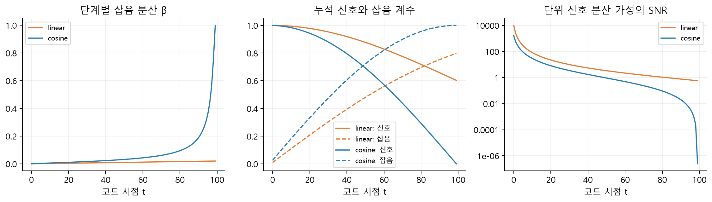
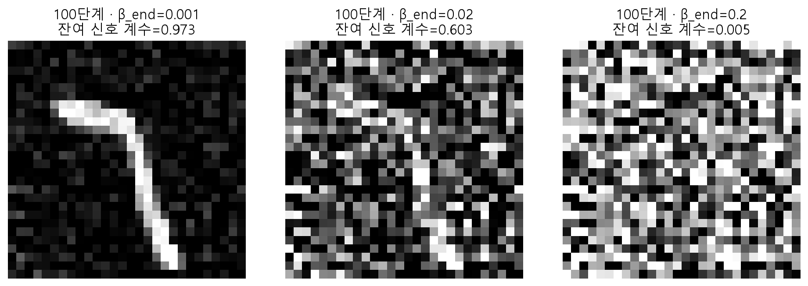
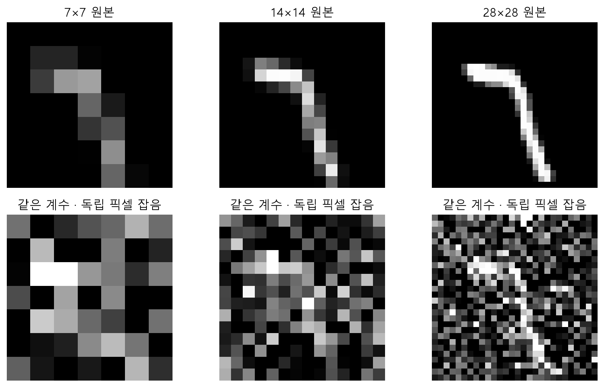
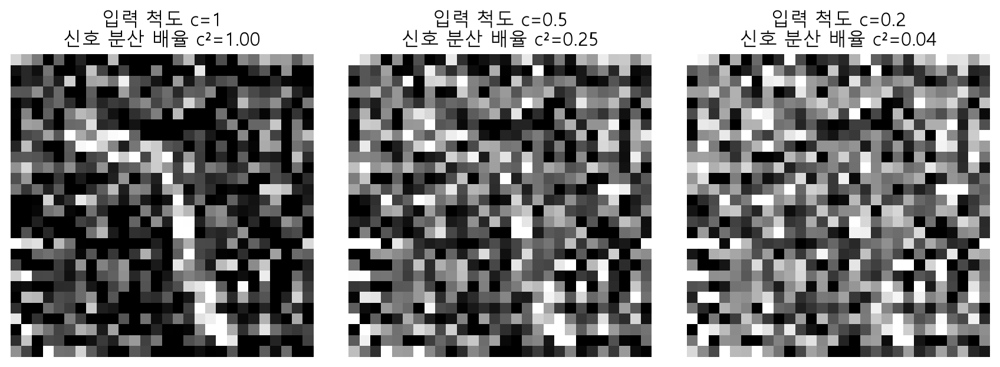
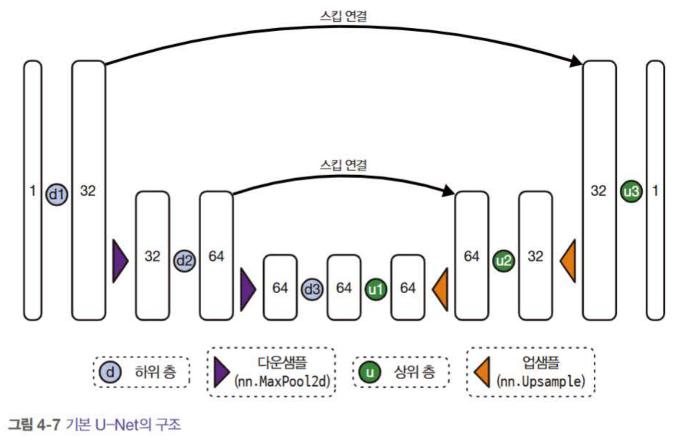
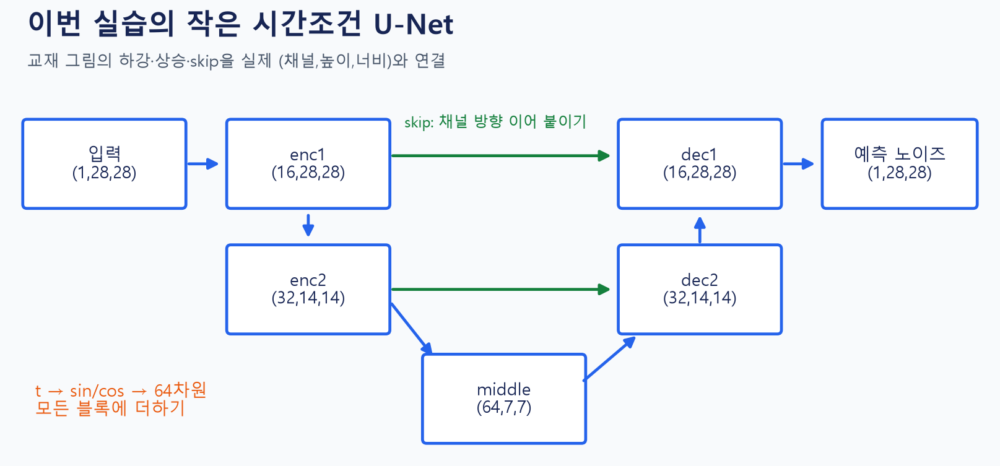
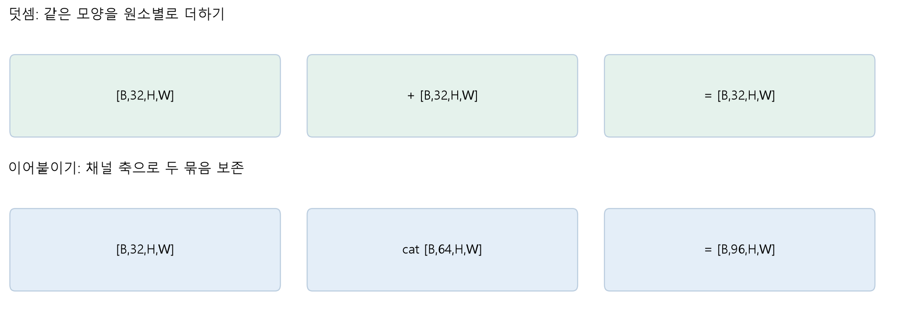
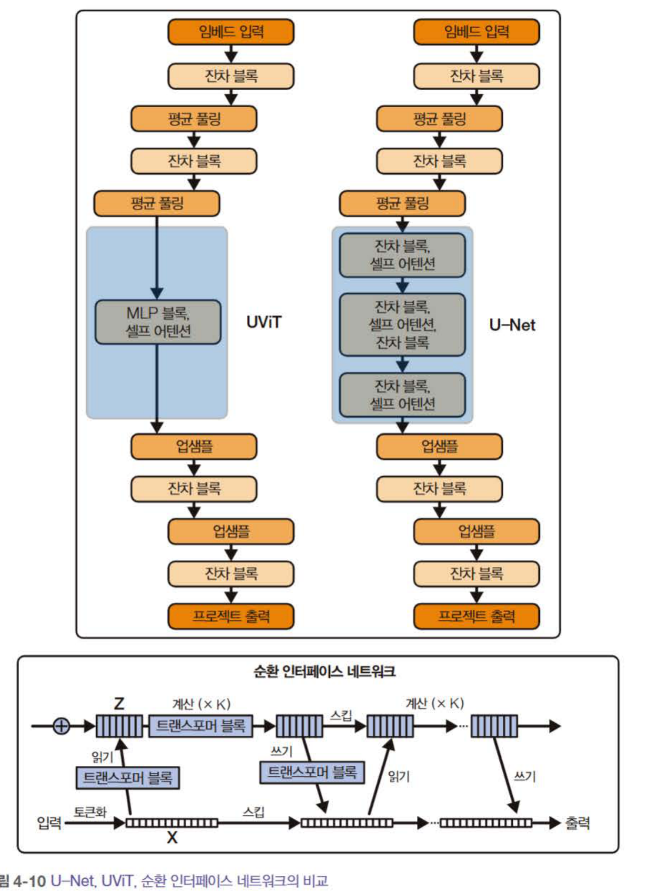
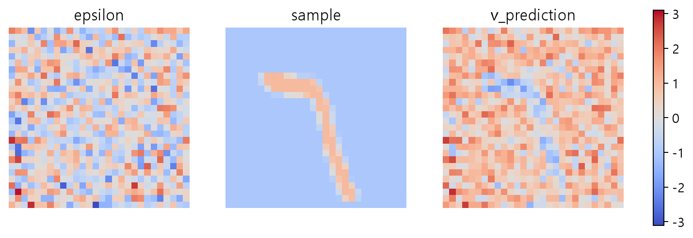
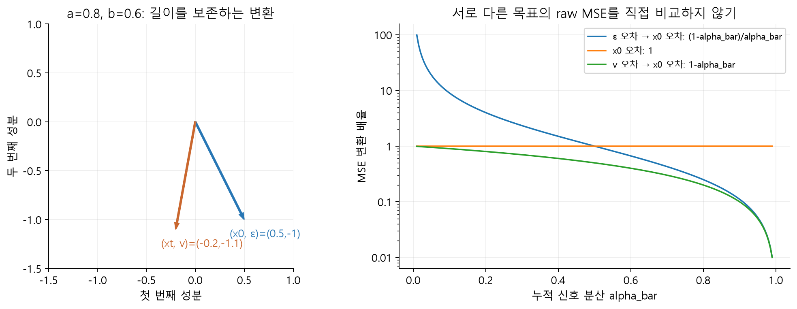

# W06A · 확산 모델의 세 선택: 스케줄·구조·예측 목표

**2026년 10월 5일 · 생성형 인공지능 · 주교재 4.3–4.5**

[기초 노트](w06a-foundations.md) · [실습 A](https://colab.research.google.com/github/lunalab-ai/genAI/blob/2026-fall-w06a/notebooks/student/w06a_noise_targets.ipynb) · [실습 B](https://colab.research.google.com/github/lunalab-ai/genAI/blob/2026-fall-w06a/notebooks/student/w06a_train_generate.ipynb) · [기록지](w06a-workbook.md)

## 1. 세 선택이 만나는 곳

확산 모델을 바꾼다는 말은 여러 뜻을 포함한다. **스케줄**은 어떤 손상 문제를 만들어 학습할지, **구조**는 그 문제를 어떤 신경망이 풀지, **예측 목표**는 신경망에게 무엇을 정답으로 요구할지 결정한다. 추론 때 호출 횟수를 줄이는 샘플러 선택은 이 세 가지와 관련되지만 동일한 변경은 아니다.

| 선택 | 바꾸는 것 | 이번 실습에서 확인할 것 |
|---|---|---|
| 노이즈 스케줄 | 시점별 신호·잡음 비율 | 계수 곡선과 같은 이미지의 손상 |
| 신경망 구조 | 특징을 처리하는 경로·연산·모수 | U-Net의 실제 shape와 시간 조건 |
| 예측 목표 | 학습 정답과 손실의 의미 | 잡음·원본·v 변환과 검산 |
| 추론 샘플러 | 학습된 예측을 이용하는 갱신법 | 동일 학습 설정을 유지한 DDPM/DDIM 비교 |

## 2. 4.3.1 왜 노이즈를 추가할까?

손상 정도를 조절하면 쉬운 국소 복원부터 매우 불확실한 구조 예측까지 하나의 학습 문제로 연결할 수 있다. 원본을 조금씩 손상시키는 분포는 우리가 정의할 수 있고, 충분히 손상된 끝에서는 다루기 쉬운 분포를 시작점으로 삼는다.

Gaussian이 유일한 가능한 손상이라는 뜻은 아니다. 교재는 흐림 등 다른 손상을 이용한 연구도 소개한다. 다만 손상 방식을 바꾸면 학습 목표, 끝 분포, 역방향 복원법도 함께 검토해야 한다. Gaussian DDPM의 식을 그대로 두고 잡음만 임의의 분포로 바꾸면 같은 모델이 되지 않는다.

## 3. 4.3.2 단순 보간과 확산 스케줄 구별하기

단순 보간 $x=(1-u)x_0+u\epsilon$에서는 두 계수의 합이 1이다. DDPM은 다음 식을 쓴다.

$$x_t=a_t x_0+b_t\epsilon,\quad a_t=\sqrt{\bar\alpha_t},\quad b_t=\sqrt{1-\bar\alpha_t},\quad a_t^2+b_t^2=1.$$

예를 들어 보간계수 $u=0.5$이면 신호·잡음 계수는 각각 0.5다. DDPM에서 $\bar\alpha_t=0.5$라면 두 계수는 각각 약 0.707이다. 원본과 잡음이 독립이고 각각 분산1일 때, 앞의 보간 결과 분산은 0.5이고 뒤의 결과 분산은 1이다. 화면상으로 두 결과가 비슷해 보여도 같은 분포는 아니다.

제공 코드에는 시간 조건 없는 U-Net이 직접 원본을 예측하는 단순 정제 예제도 있다. 기본 아이디어를 이해하는 데 도움이 되지만, 시간조건·Gaussian 전방 과정·스케줄러를 갖춘 이번 DDPM 구현과 구별한다. 보간계수로 정규난수를 사용하면 [0,1] 범위가 보장되지 않는다는 점도 확인한다.

## 4. 4.3.3 beta, alpha, 누적 alpha의 서로 다른 역할

그림 5. 실제 100단계 스케줄의 계산값. 왼쪽은 그 단계의 잡음 분산, 가운데는 누적 신호·잡음 계수, 오른쪽은 단위 신호 분산을 가정한 SNR이다. `linear`는 beta가 선형이라는 뜻이며, 누적곱이나 신호 계수가 선형이라는 뜻이 아니다. 오른쪽 세로축은 로그 척도다.

| 양 | 계산 | 해석 |
|---|---|---|
| $\beta_t$ | 지정한 스케줄 | 이번 단계의 추가 잡음 분산 |
| $\alpha_t$ | $1-\beta_t$ | 이번 단계에서 남기는 분산 비율 |
| $\bar\alpha_t$ | $\prod_{s=1}^t\alpha_s$ | 처음 원본에서 누적해 남은 신호 계수의 제곱 |
| $a_t,b_t$ | 각각 제곱근 | 실제 이미지와 잡음에 곱하는 계수 |

작은 감소가 반복되면 누적 효과는 커진다. 매 단계 $\alpha=0.99$여도 100단계의 누적곱은 약 0.366이다. “99%를 남기니 원본이 거의 그대로”라는 해석은 한 단계와 전체 과정을 혼동한 것이다.

단위 분산의 신호를 가정하면 $\mathrm{SNR}_t=\bar\alpha_t/(1-\bar\alpha_t)$다. 실제 정규화 이미지의 분산이 $V$이면 신호의 변동을 기준으로 한 비율은 $V\bar\alpha_t/(1-\bar\alpha_t)$가 된다. SNR 곡선은 분산에 관한 지표이며, 이미지가 사람이 보기에 무엇처럼 보이는지 전부 설명하는 지표는 아니다.

### 끝에 정말 잡음만 남았는가?

그림 6. 모두 100단계 linear 스케줄이고 beta 시작값은 0.0001이다. 끝값만 바꾸었다. 표시된 수치는 마지막 원본 계수다. 원본과 기본 잡음은 같다. 스케줄을 비교한 전방 실험이며, 세 생성 모델을 따로 학습한 결과가 아니다.

단계 수만 100으로 정했다고 마지막 분포가 자동으로 표준정규가 되지는 않는다. beta 끝값0.02인 이 linear 예에서는 $\bar\alpha_T$가 약0.364로 원본 신호가 상당히 남는다. 그런 마지막 학습 입력과 완전한 표준정규 생성 시작점을 같다고 취급하면 불일치가 생긴다. 스케줄 이름뿐 아니라 마지막 신호 계수를 확인해야 한다.

cosine 스케줄도 모든 데이터·모델에서 반드시 우수하다는 뜻은 아니다. 스케줄은 학습 난이도와 시점별 강조를 바꾼다. 품질 비교를 하려면 학습량·구조·데이터·평가 조건을 통제해 각 설정에 맞게 학습해야 한다.

**분산 보존과 분산 증가.** 이번 식은 원본을 감쇠시키면서 잡음을 더하는 분산 보존 계열의 설명이다. 신호를 유지하고 증가하는 표준편차의 잡음을 더하는 분산 증가 계열도 있다. 두 계열의 계수·시점·샘플러를 같은 의미로 섞지 않는다.

## 5. 4.3.4 해상도와 입력 척도

그림 7. 같은 숫자를 area 방식으로 7×7, 14×14, 28×28로 바꾸고 같은 스케줄 시점에 독립 픽셀 잡음을 더했다. 픽셀 수가 달라 잡음 배열 자체가 동일한 것은 아니다. 해상도 외에 모델이나 학습 결과를 비교한 그림도 아니다.

해상도가 높으면 인접 픽셀에 비슷한 구조가 여러 번 나타날 수 있다. 신호가 거의 일정한 네 픽셀을 평균내면, 독립 잡음의 분산은 원래의 1/4이지만 공통 신호는 남는다. 따라서 같은 픽셀별 계수에서도 구조를 찾는 난이도는 이미지의 공간 중복성에 영향을 받는다. 해상도만으로 하나의 최적 스케줄을 단정할 수는 없다.

그림 8. 시점49와 기본 잡음을 고정하고 원본에만 척도 $c$를 곱했다. $c=0.5$이면 신호 분산은 1/4이다. 잡음이나 화면의 대비를 각 칸에 맞춰 자동 정규화하지 않았으므로 척도 변화가 보인다.

$$x_t=a_t(c x_0)+b_t\epsilon,\qquad \mathrm{SNR}_{\mathrm{data}}=\frac{c^2 a_t^2\operatorname{Var}(x_0)}{b_t^2}.$$

“[-1,1] 정규화는 단순한 코드 취향”이 아니다. 입력 척도가 학습 문제의 신호·잡음 비율을 바꾸기 때문이다. 학습과 추론 사이에서 정규화 규칙도 유지해야 한다.

## 6. 4.4.1 U-Net: 작은 지도에서 문맥을, 큰 지도에서 위치를

그림 9. 『핸즈온 생성형 AI』 185쪽 그림 4-7 원본 발췌. 왼쪽에서 아래 경로로 내려가며 공간 크기를 줄이고, 오른쪽으로 올라가며 되돌린다. 긴 화살표는 같은 해상도 사이의 skip 연결이다. 교재의 이 기본 구현은 특징을 **더하는** 방식을 사용한다.

다운샘플링은 이웃의 정보를 요약하여 더 넓은 문맥을 보게 한다. 업샘플링은 공간 크기를 늘리지만 사라진 세부 정보를 자동으로 복원하지는 못한다. skip 연결은 앞쪽의 높은 해상도 특징을 뒤쪽으로 전달한다. 오토인코더와 닮은 모양이지만, 이번 U-Net의 출력은 압축 코드가 아니라 픽셀 위치별 잡음 예측이다.

그림 10. 실제 수업 코드의 구조. 공간은 28→14→7→14→28, 주요 채널은16→32→64→32→16이다. 교재 기본 모델과 크기가 다르며, 이번 코드는 시간 특징과 residual block을 사용한다. `trace_unet`이 실제 forward에서 출력한 shape와 대조한다.

| 블록 | 들어오는 특징 | 나오는 특징 |
|---|---|---|
| enc1 | `(B,1,28,28)` | `(B,16,28,28)` |
| enc2 | `(B,16,14,14)` | `(B,32,14,14)` |
| middle | `(B,32,7,7)` | `(B,64,7,7)` |
| dec2 | `(B,96,14,14)` | `(B,32,14,14)` |
| dec1 | `(B,48,28,28)` | `(B,16,28,28)` |
| out | `(B,16,28,28)` | `(B,1,28,28)` |

dec2의 입력 채널96은 업샘플한64채널과 skip의32채널을 이어 붙인 결과다. 시간 임베딩은 별도의 벡터로 각 block에 투영되어 공간축으로 broadcast된다. 표에 나타난 이미지 채널과 시간 벡터의 길이를 혼동하지 않는다.

그림 11. 수업용 비교 도식. 덧셈은 크기가 맞아야 하고 채널 수를 유지한다. 이어붙이기는 공간 크기를 맞추고 채널 수를 합친다. 교재 그림의 채널 수를 그대로 이번 코드에 대입하지 말고 실제 구현을 확인한다.

## 7. 4.4.2 개선과 4.4.3 대안 구조

모수를 늘리면 표현력이 커질 수 있지만 비용과 과적합 가능성도 바뀐다. 정규화는 특징의 스케일과 학습 안정성, residual 연결은 정보·gradient 전달, dropout은 정규화, attention은 떨어진 위치 사이의 관계에 관여한다. 여러 요소와 모델 크기를 동시에 바꿔 결과가 좋아졌다면, 그 개선을 attention 하나의 효과라고 단정할 수 없다.

그림 12. 『핸즈온 생성형 AI』 189쪽 그림 4-10 원본 발췌. 위쪽은 낮은 해상도에서 연산을 집중하는 구조 비교, 아래쪽은 데이터 토큰과 잠재 토큰 사이의 읽기·쓰기 연결이다. 아래 표를 보며 연산이 집중되는 위치를 찾는다.

| 구조 | 핵심 생각 | 계산 비용을 볼 때의 질문 |
|---|---|---|
| U-Net | 여러 공간 크기의 특징과 skip을 결합 | 높은 해상도 특징맵을 얼마나 유지하는가? |
| 확산 Transformer | 이미지의 패치·토큰 관계를 attention으로 처리 | 토큰 수 증가에 따른 계산·메모리 부담은? |
| 교재의 UViT | U-Net의 저해상도 중간 부분에 Transformer 연산을 집중 | 고해상도 처리와 문맥 연산을 어떻게 나누는가? |
| RIN | 데이터 토큰과 작은 잠재 토큰 집합 사이에서 정보를 읽고 씀 | 핵심 연산을 입력 차원과 어떻게 분리하는가? |

여기서 UViT는 교재가 인용한 *Simple diffusion*의 구조다. 비슷한 이름의 다른 U-shaped Transformer와 자동으로 동일시하지 않는다. RIN의 잠재 토큰은 그 구조의 내부 계산 공간이며, 이번 장의 설명을 곧바로 VAE 기반 latent diffusion이라고 바꾸어 부르지 않는다. 이번 실습은 작은 U-Net을 실행하고, 대안들은 설계 의도를 비교한다.

## 8. 4.5 무엇을 예측할까: epsilon, x0, v

같은 noisy 입력과 같은 시점에서도 학습 정답을 여러 방식으로 정의할 수 있다.

| 코드의 prediction_type | 정답 | 원본 추정으로 바꾸기 |
|---|---|---|
| `epsilon` | $\epsilon$ | $\hat x_0=(x_t-b_t\hat\epsilon)/a_t$ |
| `sample` | $x_0$ | $\hat x_0=$ 모델 출력 |
| `v_prediction` | $v_t=a_t\epsilon-b_t x_0$ | $\hat x_0=a_t x_t-b_t\hat v_t$ |

그림 13. 시점49의 실제 원본·잡음으로 만든 **정답 target**들이다. 세 배열의 shape은 같지만 의미가 다르다. 같은 대칭 색상 범위를 사용했다. 신경망 세 개를 학습한 성능 비교 그림이 아니다.

### 한 픽셀로 세 목표 검산하기

$a=0.8$, $b=0.6$, $x_0=0.5$, $\epsilon=-1$이면 $x_t=-0.2$이고 다음과 같다.

$$v=0.8(-1)-0.6(0.5)=-1.1.$$

$$\hat x_0^{(\epsilon)}=\frac{-0.2-0.6(-1)}{0.8}=0.5,\qquad \hat x_0^{(v)}=0.8(-0.2)-0.6(-1.1)=0.5.$$

정답을 정확히 알면 세 표현에서 같은 원본으로 돌아온다. 실제 학습된 예측에는 오차가 있으므로 완벽한 복원을 보장하지 않는다. 노트북과 앱의 역변환 오차가 거의0인 것은 **대수적 검산**이며 모델 성능이 아니다.

보충: 다음 행렬은 $a^2+b^2=1$일 때 길이를 보존한다. 역변환은 전치행렬이다.

$$\begin{pmatrix}x_t\\v_t\end{pmatrix}=\begin{pmatrix}a_t&b_t\\-b_t&a_t\end{pmatrix}\begin{pmatrix}x_0\\\epsilon\end{pmatrix},\qquad \begin{pmatrix}x_0\\\epsilon\end{pmatrix}=\begin{pmatrix}a_t&-b_t\\b_t&a_t\end{pmatrix}\begin{pmatrix}x_t\\v_t\end{pmatrix}.$$

**표기 대조.** 제공 교재 192쪽과 노트북 일부의 v 식은 두 항 사이에 더하기가 표시되어 있다. 이번 자료는 Diffusers 0.40.0의 `get_velocity`와 일치하는 **빼기 정의**를 사용한다. 이 정의에서 위 역변환을 검산하며, 원본 교재 파일은 수정하지 않았다.

### 손실 숫자를 그대로 비교하면 안 되는 이유

그림 14. 왼쪽은 한 픽셀의 두 성분을 변환한 결과, 오른쪽은 같은 크기의 목표 오차가 원본 추정 MSE에 전달되는 배율이다. 오른쪽 세로축은 로그 척도다. 목표의 MSE를 실제 동일한 값으로 학습했다는 실험 결과가 아니라 식에서 계산한 관계다.

잡음 예측의 오차가 $\delta$이면 원본 추정 오차는 $-(b_t/a_t)\delta$다. 따라서 원본 MSE는 잡음 MSE의 $b_t^2/a_t^2$배다. v 예측에서는 $-b_t\delta$이므로 배율이 $b_t^2$다. 시점에 따라 강조하는 오차와 수치 크기가 다르다. “v loss가0.2이고 epsilon loss가0.3이므로 v가 우수하다”라고 결론내릴 수 없다.

학습 정답과 `prediction_type`은 함께 맞춰야 한다. epsilon으로 학습한 가중치를 불러와 추론 설정만 `v_prediction`으로 바꾸면 출력의 해석이 달라진다. 목표 변환식을 안다는 것과 세 목표를 학습한 모델을 이미 보유한다는 것은 별개다.

## 참고자료

- 주교재 『핸즈온 생성형 AI』 4.3–4.5, 172–192쪽. 그림 9·12는 선별 원본, 나머지는 수업용 계산·실측 도식이다.
- [Diffusers 0.40.0의 DDPM 구현](https://github.com/huggingface/diffusers/blob/v0.40.0/src/diffusers/schedulers/scheduling_ddpm.py): `get_velocity`와 예측 타입 대조.
- [Simple diffusion](https://arxiv.org/abs/2301.11093): 고해상도 스케줄·연산 집중의 설계 취지.
- [RIN](https://arxiv.org/abs/2212.11972): 데이터·잠재 토큰 사이의 읽기·쓰기.
- [Diffusion Transformer](https://arxiv.org/abs/2212.09748): 대안 구조의 맥락.
- [수업용 API와 소스 정의](https://github.com/lunalab-ai/genAI/blob/2026-fall-w06a/src/W06A-API.md).
