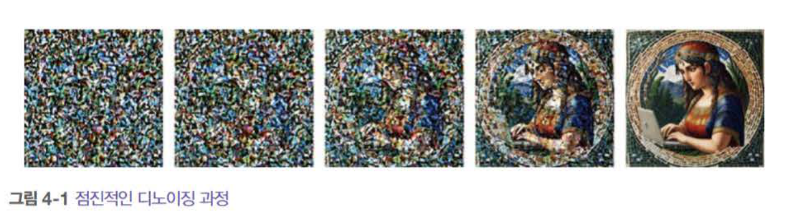
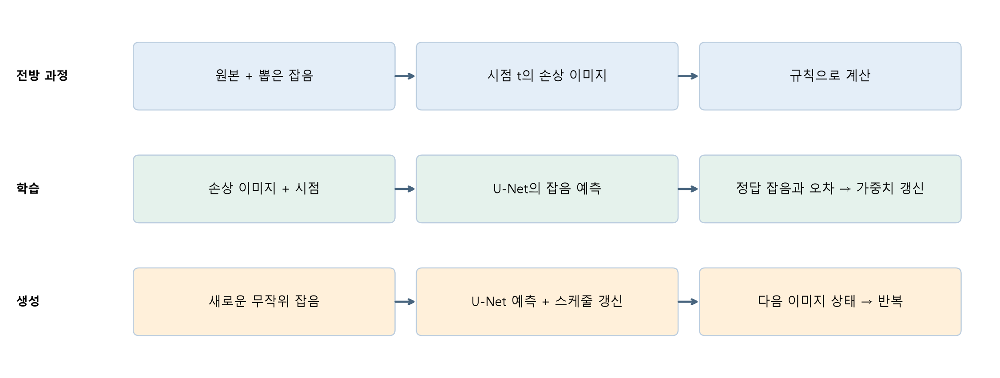
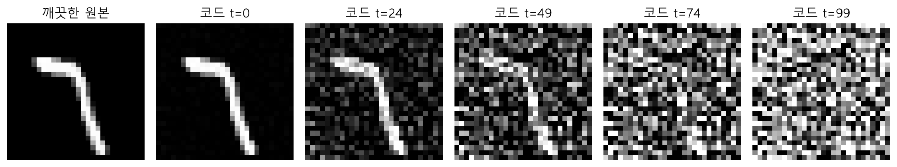
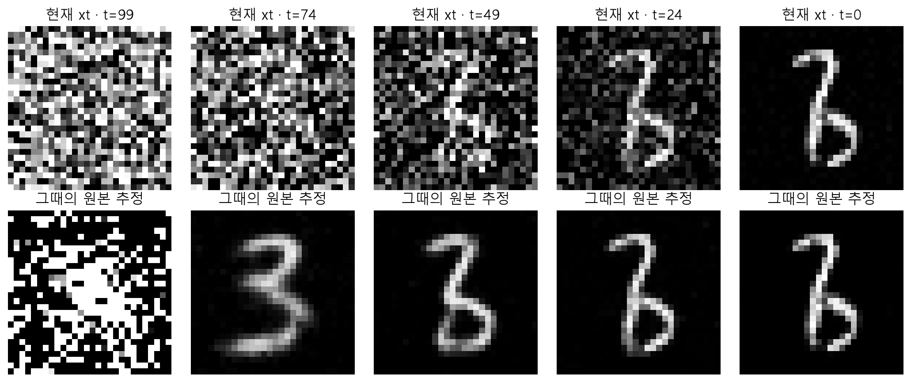

# W06A · 확산 모델 기초: 노이즈를 예측하면 왜 생성할 수 있을까?

**2026년 10월 5일 · 생성형 인공지능 · 주교재 4.1–4.2**

[실습 A](https://colab.research.google.com/github/lunalab-ai/genAI/blob/2026-fall-w06a/notebooks/student/w06a_noise_targets.ipynb) · [설계 선택](w06a-design.md) · [학습 프로젝트](w06a-project.md) · [손계산·기록지](w06a-workbook.md)

지난 차시에 확산 모델을 진행하지 못했으므로 여기서 처음부터 시작한다. 이전 Colab 실행 결과나 변수를 가져올 필요가 없다. 이 장의 목표는 식을 외우기보다 **어떤 값은 우리가 알고 만들고, 어떤 값은 신경망이 예측하며, 무엇이 바뀌는지** 설명하는 것이다.

## 1. 4.1 핵심 원리: 작은 정제를 반복하기

그림 1. 『핸즈온 생성형 AI』 156쪽 그림 4-1의 원본 일부. 왼쪽에서 오른쪽으로 구조가 드러나는 순서로 읽는다. 반복 정제의 개념 예시이며, 이번 MNIST 모델이 생성한 결과는 아니다.

희미한 그림을 한 번에 완성하라고 하면 매우 어렵다. 대신 “현재의 손상 정도에서 어느 방향으로 조금 고쳐야 할까?”를 여러 번 물어보자. 확산 모델에서는 **노이즈 수준을 아는 신경망**과 **변화의 크기를 정하는 스케줄러**가 이 역할을 나누어 맡는다.

“노이즈를 지우는 방법”은 단순한 흐림 필터와 다르다. 이미지 데이터로 학습한 신경망이 자주 나타나는 구조를 이용한다. 심하게 손상된 이미지에는 가능한 원본이 여러 개이므로, 정확한 원본 하나를 언제나 알아맞히는 장치라고 생각하면 안 된다.

## 2. 꼭 나누어 볼 세 과정

그림 2. 수업용 자체 도식. 파랑은 손상 데이터를 만드는 계산, 초록은 신경망의 가중치를 바꾸는 학습, 주황은 이미지 상태를 바꾸는 생성이다. 같은 U-Net을 반복 호출해도 생성 중에 가중치가 학습되는 것은 아니다.

| 과정 | 처음 알고 있는 것 | 수행하는 일 | 바뀌는 것 |
|---|---|---|---|
| 전방 손상 | 원본, 직접 뽑은 잡음, 시점 | 정해진 식으로 둘을 섞음 | 이미지 텐서 |
| 학습 | 손상 이미지, 시점, 정답 잡음 | 예측 오차를 계산하고 optimizer 적용 | 모델 모수와 optimizer 상태 |
| 생성 | 새로운 무작위 잡음, 학습된 모수 | 예측과 역방향 갱신을 반복 | 현재 이미지 상태 |

학습 때 정답을 얻는 데 사람이 픽셀별 답을 달 필요가 없다. 우리가 원본에 섞은 잡음을 알고 있기 때문이다. 하지만 그 정답 잡음을 신경망의 입력에 넣지는 않는다. **입력은 손상 이미지와 시점, 정답은 손실 계산에 사용하는 잡음**이다.

## 3. 기호를 실제 배열과 연결하기

| 기호 | 뜻 | 이번 실습의 실제 값 |
|---|---|---|
| $x_0$ | 깨끗한 원본 | float32 `(B,1,28,28)`, 범위 [-1,1] |
| $\epsilon$ | 새로 뽑은 표준정규 잡음 | 원본과 같은 shape, 범위 제한 없음 |
| $t$ | 손상 수준 | int64 `(B,)` |
| $x_t$ | 손상된 이미지 | 원본과 같은 shape, [-1,1] 밖도 가능 |
| $\epsilon_\theta(x_t,t)$ | 모델의 잡음 예측 | 같은 shape의 실수 배열 |
| $\theta$ | 학습되는 모수 | 합성곱, 시간 투영, 정규화 등의 가중치 |

수학에서 $x_0$는 깨끗한 원본이다. **코드 배열의 `t=0`은 첫 번째 노이즈 단계**이고, `t=99`는 수학적 100번째 단계다. 모든 그림에서 깨끗한 원본은 별도 칸에 표시한다. 숫자 클래스 0과 코드 시점 0도 서로 다른 값이다.

## 4. 4.2.1 데이터: 어떤 이미지의 분포를 배울까?

교재의 예시는 64×64 RGB 나비 이미지다. 이번 실습은 CPU에서 계산을 직접 확인할 수 있도록 MNIST 28×28 흑백 이미지와 작은 시간조건 U-Net을 사용한다. 교재의 큰 모델과 같은 성능을 재현하는 실험은 아니다.

공식 학습 집합에서 train 12,000장과 validation 1,000장을 겹치지 않게 선택하고, 별도 공식 테스트 집합에서 test 1,000장을 선택한다. 선택 seed는 1337이다. 모델 선택과 설정 조정에는 validation을 사용하고, 정리된 모델의 최종 확인에는 test를 사용한다.

로더가 반환하는 픽셀은 [0,1]이다. `2*x-1`을 적용하면 검정은 -1, 흰색은 1이 된다. 이 변환은 값의 범위를 바꿀 뿐, 모든 데이터의 평균이 정확히 0이고 분산이 1임을 보장하지 않는다. 이 차이는 뒤의 SNR 설명에서 중요하다.

## 5. 4.2.2 전방 노이즈: 단계식에서 직접식으로

각 단계에서는 이전 신호를 조금 줄이고 독립적인 Gaussian 잡음을 더한다.

$$q(x_t\mid x_{t-1})=\mathcal N\left(\sqrt{1-\beta_t}\,x_{t-1},\,\beta_t I\right).$$

$\beta_t$는 그 단계에 추가하는 **잡음의 분산**이다. 픽셀에 곱하는 잡음의 계수는 그 제곱근이다. $\alpha_t=1-\beta_t$, $\bar\alpha_t=\prod_{s=1}^t\alpha_s$로 놓으면 원하는 시점을 중간 계산 없이 직접 뽑을 수 있다.

$$x_t=\sqrt{\bar\alpha_t}\,x_0+\sqrt{1-\bar\alpha_t}\,\epsilon,\qquad \epsilon\sim\mathcal N(0,I).$$

한 픽셀에서 $x_0=0.5$, $\epsilon=-1$, $\bar\alpha_t=0.64$라면 다음과 같다.

$$x_t=0.8\times0.5+0.6\times(-1)=-0.2.$$

0.64를 그대로 원본에 곱하지 않는다. 신호와 잡음의 **계수 제곱의 합**은 1이며, 계수 자체의 합이 1일 필요는 없다. 따라서 일반적인 두 이미지의 선형 보간과도 다르다.

그림 3. 실제 MNIST 테스트 이미지와 seed42의 잡음. 원본과 잡음을 고정하고 시점만 바꾸었다. 이는 각 시점의 주변분포를 비교하는 실험이다. 단계마다 새 잡음을 뽑아 이어 붙이는 하나의 Markov 경로와 구별한다. 표시 범위만 [-1,1]로 고정하며 계산 텐서는 자르지 않는다.

**직접식이 나오는 이유.** 두 단계를 대입하면 원본 계수는 $\sqrt{\alpha_1\alpha_2}$이고, 독립 잡음들의 분산 합은 $\alpha_2\beta_1+\beta_2=1-\alpha_1\alpha_2$다. 독립 정규변수의 합도 정규분포이므로 새 표준정규 잡음 하나로 표현할 수 있다. 이 계산을 반복하면 누적곱이 나온다. 기록지에서 두 단계 숫자로 확인한다.

`torch.randn`은 표준정규 잡음, `torch.rand`는 [0,1) 균등 잡음을 만든다. 제공 노트북 일부 예제의 균등 잡음과 단순 보간은 위 Gaussian DDPM과 구분해야 한다. 이번 실습의 DDPM 식과 코드는 Gaussian으로 일치시킨다.

## 6. 4.2.3 모델: 이미지와 시점을 함께 받기

U-Net은 입력 이미지와 같은 공간 크기의 출력을 만드는 신경망이다. 이번 모델은 noisy 이미지와 시점을 받아 **노이즈 배열**을 예측한다. 출력 모양이 이미지와 같다는 사실만으로 원본 이미지나 숫자 분류 확률을 뜻하지는 않는다.

아주 조금 손상된 경우와 거의 잡음만 남은 경우에 필요한 판단은 다르다. 시간 임베딩은 지금 어느 난이도의 문제를 풀고 있는지 알려 준다. 시간 임베딩도 스케줄러의 계수 배열과는 다르다. 전자는 신경망 안에서 쓰는 특징이고, 후자는 전방·역방향 계산 규칙이다. 구조의 크기와 skip 연결은 다음 노트에서 실제 출력으로 추적한다.

## 7. 4.2.4 학습: 한 배치를 끝까지 추적하기

1. 학습 이미지 배치를 꺼낸다.
2. 이미지마다 시점과 Gaussian 잡음을 뽑는다.
3. 직접식으로 noisy 배치를 만든다.
4. `model(noisy, t)`가 잡음을 예측한다.
5. 예측 잡음과 직접 뽑은 정답 잡음의 MSE를 계산한다.
6. `backward()`로 미분값을 계산하고 `optimizer.step()`으로 모수를 바꾼다.

$$L_{\mathrm{simple}}=\mathbb E_{x_0,t,\epsilon}\left[\|\epsilon-\epsilon_\theta(x_t,t)\|^2\right].$$

코드의 평균 MSE는 배치·채널·높이·너비의 전체 원소로 나눈다. 배치16, 채널1, 높이28, 너비28이면 평균의 분모는 $16\times1\times28\times28=12544$다. 매번 다른 배치와 잡음을 뽑으므로 훈련 손실이 한 단계씩 반드시 내려가지는 않는다.

`backward()`는 gradient를 만들며 가중치 자체는 그대로다. 실제 가중치 변화는 optimizer 단계 뒤에 확인한다. 실습은 손실, gradient 크기, backward 직후 변화량, optimizer 뒤 변화량을 모두 출력한다.

보충 이론: DDPM의 확률적 학습 목적은 역방향 전이분포가 데이터를 잘 설명하도록 만드는 변분 하한과 연결된다. Gaussian 역방향 평균을 잡음 예측으로 매개화하면 시점별 가중치가 있는 제곱오차 항으로 정리할 수 있다. 위의 단순 MSE는 그 가중치를 단순화한 목적이다. 두 목적이 계수까지 항상 동일하다고 해석하지 않는다.

## 8. 4.2.5 생성: 원본 없이 시작하기

생성에서는 원본 이미지를 입력하지 않는다. 학습된 가중치를 고정하고 새로운 Gaussian 잡음 $x_T$에서 출발한다. 각 시점에 신경망이 예측한 잡음으로 역방향 평균을 구성한다.

$$\mu_\theta(x_t,t)=\frac{1}{\sqrt{\alpha_t}}\left(x_t-\frac{\beta_t}{\sqrt{1-\bar\alpha_t}}\epsilon_\theta(x_t,t)\right).$$

$$\tilde\beta_t=\frac{1-\bar\alpha_{t-1}}{1-\bar\alpha_t}\beta_t,\qquad x_{t-1}=\mu_\theta(x_t,t)+\sqrt{\tilde\beta_t}\,z.$$

여기서는 고정 posterior variance를 사용하는 대표적인 DDPM 설명이며, $z$는 새로운 표준정규 잡음이다. 마지막 원본 단계에서는 추가 잡음을 넣지 않는다. 실제 라이브러리는 원본 추정값 clipping 등 설정도 반영하므로 `scheduler.step`의 반환값을 사용한다. 단순히 `noisy - predicted_noise`로 대체하지 않는다.

**원본 추정과 다음 상태의 차이.** `pred_original_sample`은 현재 상태에서 생각한 깨끗한 원본이다. `prev_sample`은 스케줄의 평균·분산에 따라 다음 반복에 넘길 상태다. 두 값은 목적과 시점이 다르다.

그림 4. 기존 4000회 학습 체크포인트, seed42, DDPM 100회 갱신의 실제 출력. 위 행은 모델에 들어간 현재 상태, 아래 행은 그 시점의 원본 추정이다. 초기 원본 추정이 애매할 수 있으며, 하단 이미지를 매번 바로 다음 입력으로 넣은 실험이 아니다.

생성을 여러 번 수행해도 같은 원본 하나를 되찾는 것이 아니다. 데이터에서 배운 분포를 따라 새 표본을 만드는 것이다. 그렇다고 훈련 이미지 암기가 자동으로 배제되는 것은 아니므로, 데이터 중복·최근접 이웃 검토도 별도의 평가가 된다.

## 9. 4.2.6 평가: 무엇이 좋아졌다고 말할 수 있을까?

| 확인할 것 | 방법 | 그 결과만으로 말할 수 없는 것 |
|---|---|---|
| 구현이 맞는가 | 식·shape·정답·모수 갱신 검산 | 생성 품질이 좋다는 결론 |
| 잡음 예측이 나아졌는가 | 고정된 미사용 이미지·시점·잡음의 MSE | 모든 종류의 숫자를 잘 생성한다는 결론 |
| 생성물이 적절한가 | 고정 seed의 전체 격자, 형태·다양성·실패 분석 | 소수의 좋은 그림만으로 전체 분포 품질 판단 |
| 분포가 유사한가 | 충분한 표본과 적절한 특징 공간의 분포 평가 | 표본8장의 FID를 안정된 품질 점수로 사용 |

FID는 특징 벡터 분포의 평균·공분산을 비교하는 지표다. 표본 수, 전처리, 특징 추출기 선택에 민감하다. 자연영상용 특징을 작은 숫자 데이터에 적용하는 것이 적절한지도 검토해야 한다. 이번 소규모 실습은 FID 숫자를 만들기보다 실제 오차와 전체 생성 격자의 한계를 해석한다.

## 참고자료

- 주교재 『핸즈온 생성형 AI』 4.1–4.2, 156–172쪽. 그림 1은 선별 원본 사용, 나머지 계산·실험 도식은 수업용으로 작성했다.
- [DDPM 원논문](https://arxiv.org/abs/2006.11239): 전방 직접식, 역방향 매개화, 학습 목적.
- [Diffusers의 모델·스케줄러 분리](https://huggingface.co/docs/diffusers/using-diffusers/write_own_pipeline).
- [DDPMScheduler 공식 API](https://huggingface.co/docs/diffusers/api/schedulers/ddpm).
- [이번 실습의 함수·클래스 정의와 입출력](https://github.com/lunalab-ai/genAI/blob/2026-fall-w06a/src/W06A-API.md).
