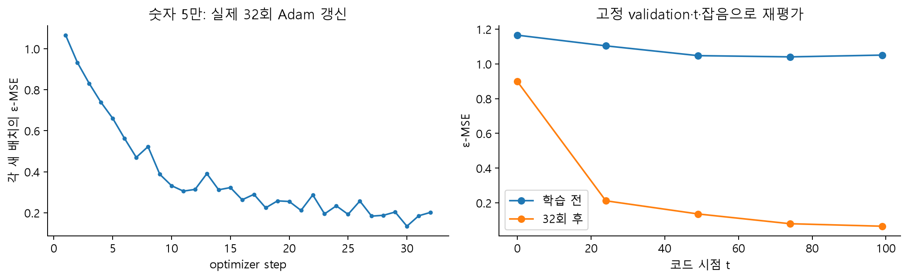
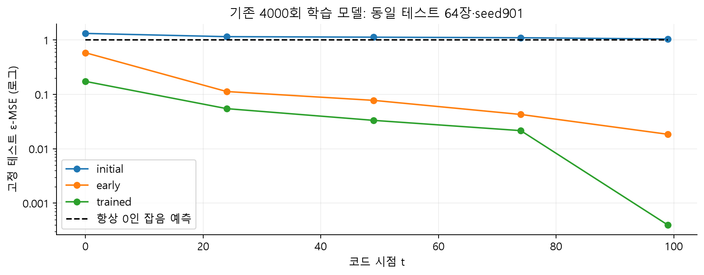
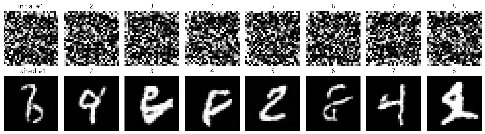
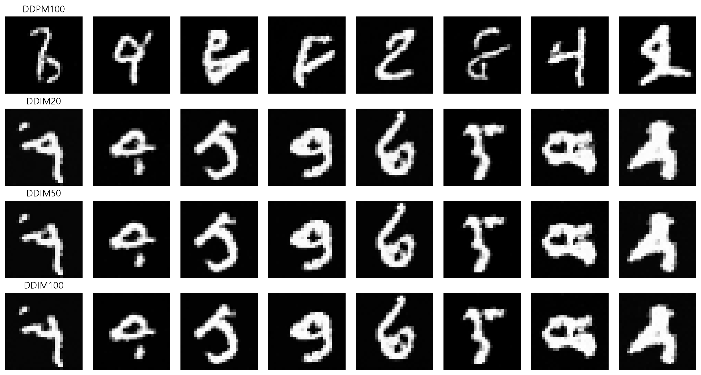

# W06A · 비조건부 이미지 생성 프로젝트와 결과 해석

**2026년 10월 5일 · 생성형 인공지능 · 주교재 4.6–4.7, 4.2 학습·평가 연결**

[기초 노트](w06a-foundations.md) · [설계 선택](w06a-design.md) · [Colab B](https://colab.research.google.com/github/lunalab-ai/genAI/blob/2026-fall-w06a/notebooks/student/w06a_train_generate.ipynb) · [기록지](w06a-workbook.md)

## 1. 4.6 프로젝트를 여섯 결정으로 나누기

교재는 데이터 선택부터 직접 비조건부 확산 모델을 학습하는 프로젝트로 마무리한다. 전체 데이터, 특정 종류의 이미지, 더 높은 해상도의 데이터는 서로 다른 생성 문제다. 이번에는 자동 준비 가능한 MNIST를 사용하여 **전체 숫자와 숫자5만의 모집단 선택**을 비교한다.

| 단계 | 결정할 내용 | 이번 기본값 |
|---|---|---|
| 데이터 | 어떤 분포를 생성할 것인가 | 숫자5만 선택하는 짧은 프로젝트 |
| 분할 | 어떤 데이터로 선택·평가할 것인가 | 기존 train/validation/test 안에서 각각 필터 |
| 전처리 | 공간 크기·채널·입력 범위 | 1×28×28, [-1,1] |
| 모델·목표 | 구조와 정답의 의미 | TinyTimeUNet, epsilon prediction |
| 최적화 | 갱신 횟수·배치·학습률 | 32회, batch16, Adam 0.001 |
| 평가·생성 | 같은 조건에서 무엇을 확인할 것인가 | 고정 validation 오차, 별도 생성 관찰 |

기본 split과 seed1337에서 숫자5는 train 1,033장, validation 92장, test 85장이다. 숫자 라벨은 데이터 선택에만 쓰며 U-Net에는 넣지 않는다. **숫자5만으로 학습한 비조건부 모델**과 **숫자 이름을 입력받는 조건부 모델**은 다르다.

교재의 ImageFolder 방식으로 확장할 때는 이미지 파일을 일정한 디렉터리 구조에 모으고, 채널·해상도·픽셀 범위를 일관되게 만든다. 같은 원본의 변형본이 train과 validation 양쪽에 들어가지 않도록 분할하고, 공개·이용 조건도 확인한다. 이번 기본 실습은 개인 파일 업로드 없이 실행한다.

## 2. 짧은 실제 학습에서 확인할 것

그림 15. seed20261005, 새 모델, batch16, Adam 0.001, 32회 실제 갱신. 왼쪽은 매번 다른 배치·시점·잡음에서 계산한 손실이다. 오른쪽은 같은 validation 이미지 최대64장과 고정 잡음으로 학습 전후를 재평가했다. 두 그래프의 비교 조건이 다르다.

한 step은 한 배치로 한 번 모수를 갱신하는 것이다. 한 epoch는 데이터 전체를 한 차례 사용하는 관점이다. 이번 구현은 매 step 복원 추출로 배치를 뽑으므로 32step을 32epoch라고 부르지 않는다. 512회의 이미지 선택이 있어도 512개의 서로 다른 이미지를 봤다는 뜻은 아니다.

짧은 학습의 성공 판정은 유한한 손실과 gradient, 실제 가중치 변화, 올바른 데이터·정답·스케줄 연결이다. 이 판정을 통과했다고 좋은 숫자 이미지가 생성된다고 보장하지 않는다. 실습에서 학습 횟수를 늘릴 수 있지만 CPU 시간도 함께 기록한다.

| 바꿀 설정 | 예상할 변화 | 비교를 위해 유지할 조건 |
|---|---|---|
| 학습률 | 너무 크면 불안정, 너무 작으면 느린 변화 가능 | 초기화·배치 선택 seed·갱신 횟수 |
| 갱신 횟수 | 더 많은 최적화 기회와 계산 비용 | 학습률·배치·데이터·평가 잡음 |
| 데이터 선택 | 모델이 배우는 이미지 분포 | 그 모집단에 맞는 validation·test |
| 배치 크기 | gradient 추정·메모리·한 step 비용 | step 수와 본 이미지 수를 함께 보고 |

서로 다른 배치 크기에서 step 수만 같게 놓으면 총 데이터 사용량이 달라진다. 어떤 자원을 같게 맞춘 비교인지 먼저 적는다. 설정 선택에는 validation을 사용하고 test를 반복해서 최적화하지 않는다.

## 3. 학습된 체크포인트를 불러온다는 뜻

전체 숫자로 충분히 학습하는 데는 짧은 수업 실험보다 많은 갱신이 필요하다. 생성 관찰에는 기존 수업 코드로 실제 학습한 initial·early·trained 체크포인트를 함께 제공한다. 패키지가 NPZ의 SHA-256을 검사한 후 정확한 모델 구조에 가중치를 읽는다.

trained 모델의 기록은 **전체 숫자 train 12,000장, 4,000step, batch64, Adam 학습률0.001, EMA0.995, 100단계 cosine 스케줄, epsilon 목표**다. EMA는 학습 중 가중치의 이동평균이다. 새 숫자5 프로젝트의 32회 결과와 이 모델을 같은 실험으로 표시하지 않는다. 체크포인트 로드는 새로운 학습도 아니다.

그림 16. 테스트64장과 seed901의 잡음을 고정한 실제 재평가. 검은 점선은 항상0을 예측하는 기준선이다. 시점99에서 오차가 특히 작아도 이를 생성 품질 전체의 점수로 해석하지 않는다. 그 시점에는 입력 자체가 대부분 잡음이라 epsilon 예측 문제가 상대적으로 쉬울 수 있다.

예를 들어 이번 고정 평가에서 trained의 시점49 MSE는 약0.0333이며, 초기 모델은 약1.1275였다. 이 수치는 **그 평가 조건의 잡음 예측이 개선되었다**는 근거다. 모든 숫자 형태·다양성·원본과의 중복까지 평가한 결과는 아니다.

## 4. 전체 생성 격자로 판단하기

그림 17. seed42, 각각8장, DDPM100회. 위는 초기 가중치, 아래는 학습된 가중치다. 좋은 그림만 골라내지 않았다. 일부 결과는 숫자처럼 보이지만 모호하거나 끊어진 획도 있다. 이러한 실패를 숨기지 않고 함께 해석한다.

관찰 기록에는 어떤 모양이 분명한지, 어떤 모양이 모호한지, 여러 결과가 지나치게 비슷한지, 특정 형태가 반복되는지를 적는다. 사람의 판독도 주관적이므로 관찰 기준을 먼저 정하고 표본 수·seed를 남긴다. 생성된8장만 보고 10개 숫자 클래스의 빈도나 전체 분포를 추정하지 않는다.

픽셀 평균과 표준편차는 계산 이상이나 모든 픽셀이 같은 출력인지를 탐지하는 데 도움이 된다. 하지만 밝기가 다르다는 이유만으로 한 모델이 더 좋은 생성기라고 말할 수는 없다. 앱도 이 값들을 품질 점수로 표시하지 않는다.

## 5. 4.7 도전 연결: 호출 횟수를 줄이면?

그림 18. 같은 학습 가중치, 같은 최초 Gaussian 잡음 seed42에서 생성했다. 학습된 beta 배열과 epsilon 목표는 유지한다. DDIM은 eta0, 마지막 노이즈 수준에서 시작하는 trailing 간격을 사용한다. 행마다8장을 모두 표시한다. 이후의 갱신과 난수 사용까지 모든 방법에서 같다는 뜻은 아니다.

DDIM은 학습된 예측을 활용하여 더 적은 시점으로 생성 경로를 구성할 수 있다. 이번 코드는 기존 DDPM 스케줄 설정으로 DDIM 객체를 만들고 추론 시점만 선택한다. 학습 beta를 linear로 바꾸거나 epsilon 가중치를 v 가중치로 해석하지 않는다.

DDIM eta0에서는 초기 잡음 이후의 갱신이 결정론적이다. 그래서 모델과 환경·초기 잡음이 같으면 같은 결과를 재현할 수 있다. seed를 바꾸면 최초 잡음이 바뀌므로 결과도 달라진다. 결정론적이라는 말이 항상 같은 이미지 하나만 생성한다는 뜻은 아니다.

호출20회가100회보다 적은 계산을 요구하는 것은 분명하지만, 품질 변화는 실제 결과로 판단한다. 단계를 늘리면 모든 이미지가 항상 좋아진다는 단조 관계를 가정하지 않는다. 이 비교는 추론 실험이며, 구조·스케줄을 바꾸어 다시 학습한 비교는 아니다.

## 6. 마지막 웹앱: 입력에서 해석까지 직접 연결하기

Colab 마지막 셀 또는 설치 후 `python -m luna_genai.diffusion_lab_app`으로 확산 관찰실을 연다. 앞의 실험에 사용한 함수가 버튼의 callback으로 연결된다.

| 화면 | 조작 순서 | 읽을 결과 |
|---|---|---|
| 노이즈와 스케줄 | 이미지·seed 고정 → t 변경 → 입력 척도 변경 | 원본과 noisy 이미지, 계수, 자르기 전 범위 |
| 예측 목표 | 같은 이미지·t·seed → 목표 종류 변경 | 목표 배열, 정답을 사용한 역변환 오차 |
| 생성과 해석 | initial→trained → DDPM100→DDIM20 | 생성 격자, 현재 상태·원본 추정, 실제 소요 시간 |

학생은 노트북의 작은 해석 입력 화면에서 **입력 위젯 → 자신이 수정한 함수 → 출력 위젯**의 연결을 완성한다. 기본 관찰실은 독립적으로 실행되므로 연습 빈칸을 아직 풀지 않아도 실험을 계속할 수 있다. 수정한 후 실제 버튼을 눌러 문구와 값의 순서가 맞는지 확인한다.

Colab 공유 URL은 해당 런타임이 살아 있는 동안만 유지된다. 새 실행에서는 새로운 공유 URL을 사용한다. 앱 화면이 열렸다는 사실과 각 버튼이 정상 계산된다는 사실을 따로 확인한다. inline 표시가 되지 않으면 출력된 공유 링크를 새 탭에서 연다.

## 7. 4.7 전체 장을 한 문장씩 정리하기

- **4.1:** 이미지 생성을 여러 번의 정제로 나누어 생각한다.
- **4.2:** 우리가 만든 손상 데이터와 정답 잡음으로 신경망을 학습하고, 새로운 잡음에서 반복 생성한다.
- **4.3:** 스케줄·해상도·입력 척도는 손상 문제의 난이도를 바꾼다.
- **4.4:** U-Net과 대안 구조는 공간 세부와 전체 관계를 처리하는 방식을 달리한다.
- **4.5:** epsilon·원본·v는 서로 변환 가능한 표현이지만 학습 정답과 손실의 의미는 다르다.
- **4.6:** 데이터 선택부터 평가까지 일관된 비조건부 프로젝트를 구성한다.
- **4.7:** 계산의 정확성, 예측 오차, 생성 품질, 실행 비용을 함께 설명한다.

복습은 [기록지의 12개 점검 질문](w06a-workbook.md)에 먼저 답한 뒤 별도 해설을 확인하는 순서로 진행한다. 별도 성적 반영 과제나 새로운 제출 기한은 없다.

## 참고자료

- 주교재 『핸즈온 생성형 AI』 4.6–4.7 및 연습·도전, 192–196쪽.
- [DDIMScheduler 공식 API](https://huggingface.co/docs/diffusers/api/schedulers/ddim): 추론 단계·eta·갱신.
- [고정 버전 API와 실제 소스](https://github.com/lunalab-ai/genAI/blob/2026-fall-w06a/src/W06A-API.md).
- 이 문서의 실험 그림은 `TinyTimeUNet`과 실제 MNIST로 계산했다. 짧은 프로젝트와 기존 체크포인트의 학습 이력을 구별했다.
