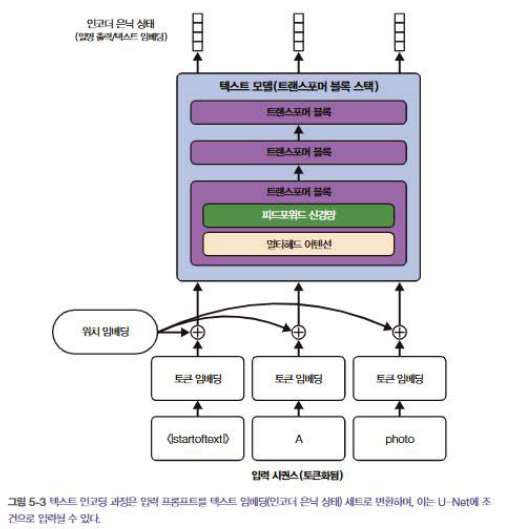
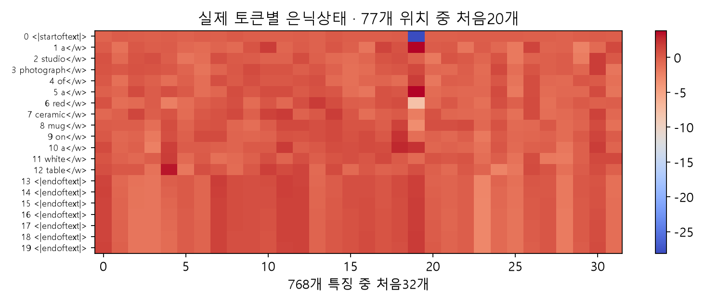
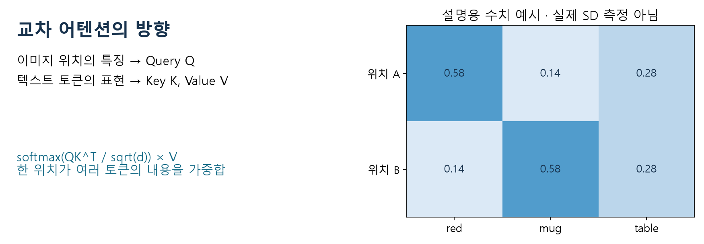
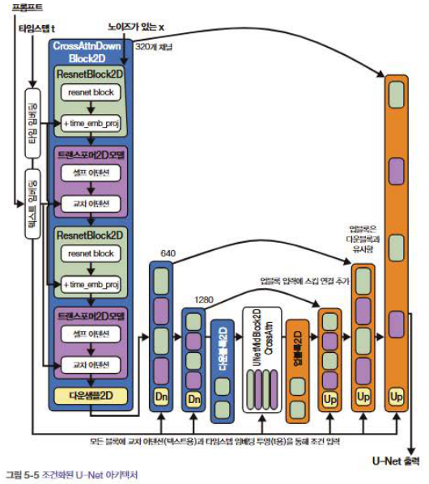
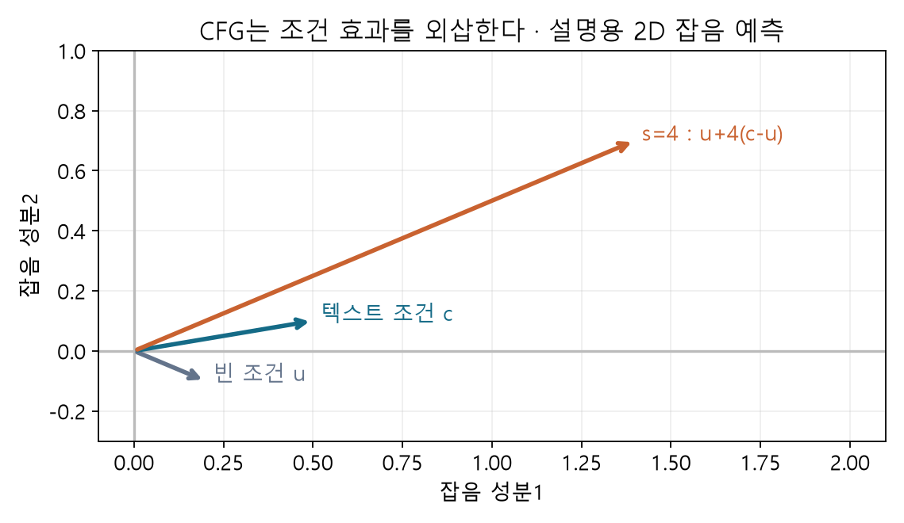
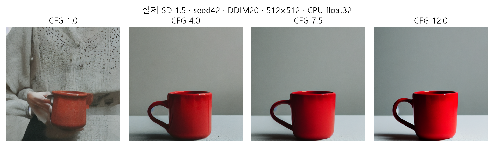
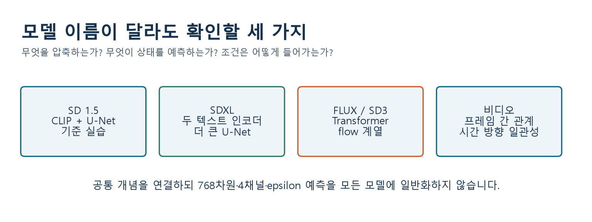

# W06B · 3. 텍스트, U-Net, CFG가 만나는 곳

2026-10-07 · 주교재 5.3.1, 5.3.3–5.3.6 · 기준 모델: SD 1.5

## 1. 파이프라인을 한 문장으로 읽기

**프롬프트를 토큰별 표현으로 바꾸고, 그 표현을 참조하면서 잡음 잠재 상태를 반복 갱신한 뒤 VAE 디코더로 이미지화합니다.**

모듈을 교체 가능한 부품으로 생각하되 역할을 섞지 마세요. `tokenizer`는 문자열을 ID로, `text_encoder`는 ID를 벡터로, `unet`은 상태·시점·조건을 잡음 예측으로 바꿉니다. `scheduler`는 예측을 이용해 다음 상태를 계산합니다. `vae.decode`는 마지막 잠재 상태를 픽셀로 바꿉니다.

## 2. 텍스트 조건은 한 문장 벡터 하나일까?

출처: 주교재 211쪽 그림 5-3. 토큰 ID에 위치 정보를 더한 뒤 트랜스포머를 통과해 각 위치의 은닉상태를 얻습니다.

CLIP 이미지 검색에서는 문장 전체를 나타내는 pooled embedding을 이용했습니다. SD 1.5의 조건부 U-Net에는 **토큰별 은닉상태의 시퀀스**가 들어갑니다. 둘 다 CLIP과 관련 있지만 같은 반환값이 아닙니다.

예시 프롬프트는 `a studio photograph of a red ceramic mug on a white table`입니다. 뜻은 “흰 테이블 위 빨간 도자기 머그컵의 스튜디오 사진”입니다. SD 1.5는 주로 영어 데이터로 학습되어 기본 실험은 영어를 사용합니다.

| 대상 | SD 1.5 예시 shape | 읽는 방법 |
| --- | --- | --- |
| 토큰 ID | `(1,77)` | 문장 1개, 최대 길이까지 패딩된 토큰 축 |
| 토큰별 조건 | `(1,77,768)` | 각 토큰에 768차원 표현 |
| CFG용 두 조건을 묶은 입력 | `(2,77,768)` | 빈 조건과 텍스트 조건을 배치로 묶음 |

77은 단어 수가 아닙니다. 시작·종료 토큰과 패딩을 포함합니다. 긴 프롬프트는 잘릴 수 있으므로 실습 표에서 `truncated`를 확인합니다. 교재 212쪽의 `(1,7,768)`은 짧은 문장을 패딩하지 않고 인코딩한 예입니다. 교재 그림 5-2의 1024차원은 SD 2 맥락이며 이 수업의 SD 1.5 768차원과 구별합니다.

## 3. 교차 어텐션: 지금 위치가 어느 토큰을 참고할까?

그림은 작동 원리를 설명하기 위한 **수업용 작은 예시**이며 실제 SD의 어텐션 측정값이 아닙니다. 잠재 이미지 위치의 특징에서 Query를 만들고, 텍스트 표현에서 Key와 Value를 만듭니다.

$$
\operatorname{Attention}(Q,K,V)=\operatorname{softmax}\left(\frac{QK^\top}{\sqrt{d_k}}\right)V
$$

Query가 “현재 위치에서 필요한 정보”, Key가 “각 토큰을 찾는 단서”, Value가 “가져올 내용”이라고 생각할 수 있습니다. 다만 사람이 만든 사전처럼 단어 하나가 특정 픽셀 하나를 직접 지정하는 것은 아닙니다. 투영과 여러 층의 처리를 통해 학습한 관계입니다.

행은 이미지 위치, 열은 텍스트 토큰이라고 놓으면 한 행의 softmax 가중치 합은 1입니다. 실제 모델에는 여러 head·층·해상도가 있으므로 그림의 표 하나로 전체 생성 원인을 설명할 수는 없습니다.

**잠깐 확인 S1.** 텍스트 인코더가 바로 RGB 이미지를 출력한다는 설명은 어느 화살표를 생략했나요?

## 4. U-Net은 무엇을 예측하나?

출처: 주교재 216쪽 그림 5-5. 시간 임베딩과 텍스트 조건은 다른 입력 경로입니다. skip 연결은 앞의 공간 특징을 뒤쪽으로 전달합니다.

입력과 출력이 둘 다 `(B,4,64,64)`라고 해서 의미까지 같지는 않습니다. 입력은 현재 잠재 상태이고 출력은 SD 1.5에서의 **예측 잡음**입니다. 이것을 스케줄러에 전달해 다음 잠재 상태를 얻습니다. 시점이 바뀔 때마다 입력 상태와 예측은 바뀌지만 생성 중 모델의 가중치는 고정됩니다.

## 5. CFG: 두 예측의 차이를 더 강조하기

분류기 없는 가이던스(Classifier-Free Guidance, CFG)는 외부 분류기 점수를 매 단계 계산하는 방법이 아닙니다. 학습 중 일부 예제에서 텍스트 조건을 비워 같은 모델이 조건부·비조건부 예측을 모두 할 수 있도록 합니다. 생성 때 같은 잠재 상태와 같은 시점에 대해 두 예측을 얻습니다.

$$
\hat\epsilon=\epsilon_u+s(\epsilon_c-\epsilon_u)
$$

여기서 $\epsilon_u$는 빈 조건의 예측, $\epsilon_c$는 텍스트 조건의 예측입니다. 차이 벡터는 텍스트를 넣었을 때 예측이 어느 방향으로 달라지는지 나타냅니다. $s>1$이면 그 차이를 더 강하게 반영합니다.

**함께 계산하는 예.** $\epsilon_u=(0.2,-0.1)$, $\epsilon_c=(0.5,0.1)$, $s=4$라면 차이는 $(0.3,0.2)$, 네 배는 $(1.2,0.8)$, 최종 예측은 $(1.4,0.7)$입니다. 결과가 두 벡터 사이에 있지 않고 바깥으로 나갑니다. CFG는 단순 평균이 아닙니다.

중요한 표기 구별이 있습니다. 원논문의 $(1+w)\epsilon_c-w\epsilon_u$는 이 식에서 $s=w+1$입니다. 또한 수학식의 $s=0$은 비조건 예측이지만, **Diffusers SD 파이프라인은 `guidance_scale<=1`일 때 두 갈래 CFG를 건너뜁니다.** API에 0을 넣고 비조건 생성 실험이라고 부르지 않습니다. 이번 실제 비교는 1·4·7.5·12입니다.

## 6. 큰 CFG가 항상 좋은가?

위 그림은 수업 제작 시 SD 1.5로 실제 생성한 기록입니다. seed 42, DDIM20, 512×512, CPU float32를 고정했습니다. Colab GPU 결과는 부동소수점 차이로 픽셀까지 동일하지 않을 수 있습니다. 네 이미지에서 프롬프트에 대한 충실도와 과도한 대비·색·형태를 따로 관찰합니다. 이 네 장으로 보편적 최적 scale을 정하지 않습니다.

출처: 주교재 221쪽, CFG 1·2·4·12 예시. 위의 수업 실측과 프롬프트·설정이 다른 **교재의 예시**입니다. 같은 scale 숫자라는 이유로 두 실험을 성능 순위로 직접 비교하지 않습니다.

**잠깐 확인 S2.** scale과 seed를 동시에 바꿔 결과가 달라졌다면 “CFG 때문에 바뀌었다”고 말할 수 있나요?

## 7. SDXL, FLUX, SD3, 비디오는 어디에 놓일까?

| 계열 | 오늘 구조에서 연결할 점 | 그대로 일반화하면 안 되는 점 |
| --- | --- | --- |
| SD 1.5 | VAE 잠재 공간, CLIP 텍스트, 조건부 U-Net | 768차원·0.18215는 모델별 설정 |
| SDXL | 더 큰 U-Net, 두 텍스트 인코더, 추가 조건; 선택적 refiner | SD 1.5와 동일 입력 차원·한 인코더라고 가정 |
| FLUX·SD3 | 잠재 표현과 텍스트 조건이라는 큰 흐름 | Transformer 기반 구조, flow matching 계열을 전부 같은 epsilon U-Net이라고 설명 |
| 비디오 모델 | 프레임 사이 일관성과 시간 방향 모델링이 필요 | 독립 이미지 생성만 반복하면 비디오 문제가 해결된다고 설명 |

이 표는 주교재 5.3.4–5.3.5의 개괄을 보완한 구조 비교입니다. 이 모델들을 모두 설치하거나 학습하지 않습니다. 오늘 구현 기준은 SD 1.5이며 후속 모델의 모든 버전이나 최신 성능 순위를 다루지 않습니다.

참고: 주교재 5.3; [CFG 원논문](https://arxiv.org/abs/2207.12598); [SDXL 원논문](https://arxiv.org/abs/2307.01952); [SD3 연구](https://arxiv.org/abs/2403.03206); [Diffusers SD 파이프라인](https://huggingface.co/docs/diffusers/api/pipelines/stable_diffusion/text2img).
