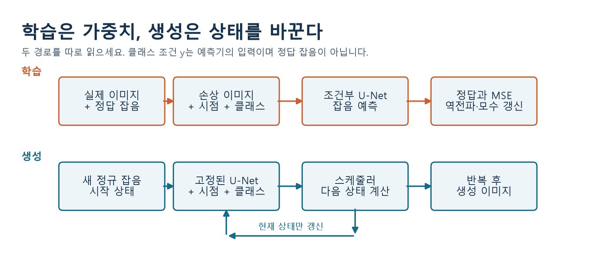
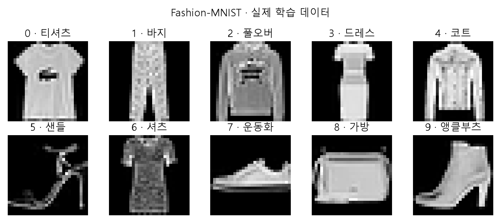
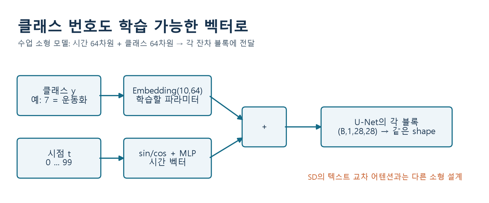
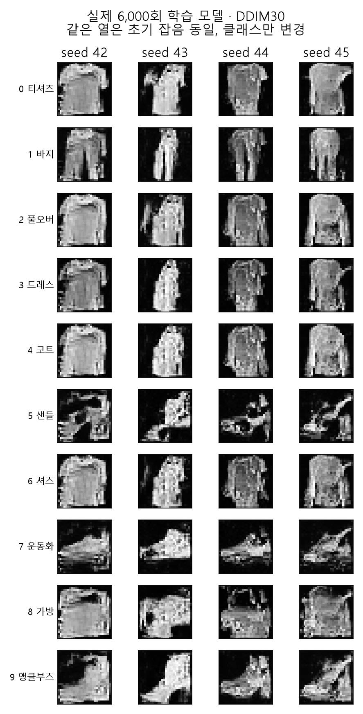
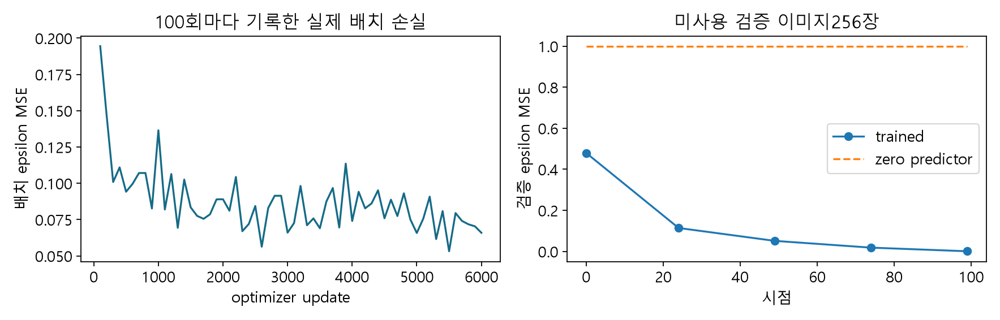

# W06B · 1. 같은 잡음에서 원하는 이미지를 만들려면

2026-10-07 · 생성형 인공지능 · 주교재 『핸즈온 생성형 AI』 5.1

오늘의 질문은 다음과 같습니다. **잡음에서 출발하되, 운동화를 만들라고 지정하려면 무엇을 추가해야 할까?** 지난 실습 파일을 실행하지 않았어도 이 노트와 새 Colab A에서 시작할 수 있습니다.

## 1. 지난 시간의 세 동작을 분리하기

확산 모델은 흐릿한 사진에 필터 하나를 적용하는 프로그램이 아닙니다. 학습 때는 정답을 알고 있는 손상 문제를 만들고, 생성 때는 배운 예측기를 반복 사용합니다.

| 과정 | 출발점 | 하는 일 | 바뀌는 것 |
| --- | --- | --- | --- |
| 전방 손상 | 실제 이미지와 우리가 뽑은 잡음 | 두 배열을 정해진 비율로 섞기 | 이미지 상태 |
| 학습 | 손상 이미지, 시점, 정답 잡음 | 예측과 정답의 차이로 역전파 | 모델의 가중치 |
| 생성 | 새로운 정규분포 잡음 | 예측기와 스케줄러를 반복 호출 | 생성 중인 이미지 상태 |



그림의 아래쪽 생성 경로에는 정답 이미지가 없습니다. 학습된 가중치를 고정하고, 스케줄러가 예측을 해석하여 다음 상태를 계산합니다. U-Net 출력에서 단순히 잡음을 한 번 빼면 생성이 끝난다고 생각하지 마세요.

**잠깐 확인 C1.** 생성 버튼을 누를 때마다 `optimizer.step()`을 실행해야 할까요? 그림에서 근거를 찾아 설명하세요.

## 2. 데이터 선택과 조건 입력은 다릅니다

운동화 사진만 골라 비조건부 모델을 학습하면 운동화와 비슷한 결과를 만들 수 있습니다. 그러나 티셔츠로 바꾸려면 데이터와 학습 문제 자체를 바꿔야 합니다. **클래스 조건부 모델은 여러 클래스를 함께 학습하면서 원하는 클래스도 입력으로 받습니다.**

| 모델 | 잡음 예측기의 입력 | 학습 정답 | 생성할 때 선택 |
| --- | --- | --- | --- |
| 비조건부 | 손상 이미지, 시점 | 추가했던 잡음 | seed 등 |
| 클래스 조건부 | 손상 이미지, 시점, 클래스 | 추가했던 잡음 | 클래스와 seed 등 |
| 텍스트 조건부 | 손상 잠재변수, 시점, 텍스트 표현 | 이 수업의 SD 1.5에서는 잡음 | 프롬프트와 seed 등 |

라벨을 받는 인자를 함수에 붙이는 것만으로 조건부 모델이 되지는 않습니다. 라벨과 이미지의 관계를 사용하는 가중치가 **실제로 학습**되어야 합니다.



출처: Zalando Research의 Fashion-MNIST. 각 이미지는 28×28 회색조입니다. 0 티셔츠/상의, 1 바지, 2 풀오버, 3 드레스, 4 코트, 5 샌들, 6 셔츠, 7 운동화, 8 가방, 9 앵클부츠입니다. 0·2·6처럼 육안으로도 구별하기 어려운 클래스가 있습니다.

## 3. 식에 라벨이 들어가도 정답은 잡음입니다

먼저 깨끗한 이미지 $x_0$에 표준정규 잡음 $\epsilon$을 섞습니다.

$$
x_t=\sqrt{\bar\alpha_t}x_0+\sqrt{1-\bar\alpha_t}\epsilon,\qquad \epsilon\sim\mathcal N(0,I)
$$

클래스 조건부 예측기에는 $y$를 추가합니다.

$$
\mathcal L(\theta)=\mathbb E_{x_0,y,t,\epsilon}\left[\|\epsilon-\epsilon_\theta(x_t,t,y)\|_2^2\right]
$$

| 기호 | 이번 실습에서의 실제 대상 | 예 |
| --- | --- | --- |
| $x_0$ | [-1,1]로 변환한 이미지 배열 | `(B,1,28,28)` |
| $t$ | 잡음 수준을 가리키는 정수 | `(B,)`, 0–99 |
| $y$ | 의류 클래스 번호 | `(B,)`, 0–9 |
| $\epsilon$ | 우리가 뽑아 정답으로 보관한 정규 잡음 | `(B,1,28,28)` |
| $\epsilon_\theta$ | 모델이 예측한 잡음 | `(B,1,28,28)` |

실습의 MSE는 배치·채널·공간 원소 전체의 평균입니다. 식의 노름 제곱과 상수 배율은 다르지만 같은 예측 오차를 최소화합니다. **클래스 7과 예측 이미지의 픽셀 사이에 MSE를 계산하지 않습니다.**

예를 들어 한 픽셀에서 신호 계수가 0.8, 잡음 계수가 0.6이고 원본이 0.5, 정답 잡음이 -1이라면 손상 값은 -0.2입니다. 모델이 -0.7을 예측했다면 해당 원소의 제곱 오차는 0.09입니다. 클래스 번호는 이 계산을 도와주는 입력입니다.

## 4. 클래스는 어디로 들어갈까?



수업의 `TinyClassUNet`은 클래스 번호를 64차원 벡터로 바꾸고 시간 임베딩에 더합니다. 합친 벡터를 각 합성곱 블록에 전달합니다. 이미지의 공간 정보는 U자형 경로와 skip 연결로 전달합니다. **이 그림은 수업의 소형 모델 설계**이며, 뒤에서 볼 SD의 토큰별 교차 어텐션과 같은 구현은 아닙니다.

학습 코드의 의미는 다음 네 줄로 압축할 수 있습니다.

```python
noisy = forward_noise(clean, timesteps, epsilon)
prediction = model(noisy, timesteps, labels)
loss = ((prediction - epsilon) ** 2).mean()
# 이어서 zero_grad → backward → optimizer.step
```

`epsilon`을 예측기의 입력으로 넣으면 정답을 미리 알려주는 셈입니다. `labels`는 원하는 종류를 말해 주지만, 그 이미지에 실제로 추가한 잡음 값까지 알려주지는 않습니다.

**잠깐 확인 C2.** 클래스 번호를 모두 7로 바꾸면 어떤 텐서의 shape가 변할까요? 어떤 의미가 변할까요?

## 5. 같은 초기 잡음으로 조건만 바꿔 보기



위 그림은 실제 학습한 수업 모델의 결과입니다. 각 열의 seed는 42–45로 고정하고, 같은 열에서는 클래스만 바꿨습니다. 생성 결과는 저해상도이며 일부 의류는 모호합니다. 원하는 클래스와 관계 있는 모양이 나타나는지, 클래스 간 혼동이 남는지 함께 봅니다. 잘 나온 한 장만 골라 모델 전체 성능이라고 주장하지 않습니다.

Colab A에서는 새 모델을 32번 짧게 갱신해 실제 학습 동작을 확인합니다. 그 뒤 **6,000번 갱신한 별도 제공 체크포인트**를 로드합니다. 32회 실습으로 위 결과가 나왔다고 해석하면 안 됩니다. 체크포인트의 학습 시간·분할·seed·손실 기록은 노트북에서 직접 읽습니다.



잡음 MSE는 예측 과제의 지표입니다. 의류가 자연스럽고 다양한지를 직접 나타내는 점수는 아닙니다. 생성 격자의 관찰과 함께 해석하세요.

## 6. 실습에서 확인할 세 가지

1. 손실은 유한한가? `backward()` 후에는 gradient가 생기고 `optimizer.step()` 뒤에는 가중치가 실제로 바뀌는가?
2. 같은 seed·모델·생성 단계에서 클래스만 바꿨는가? 초기 잡음 배열이 정말 같은가?
3. 관찰한 모양과 해석을 구별했는가? “클래스 7에서 밑창처럼 보이는 선이 생겼다”는 관찰, “모든 운동화를 잘 생성한다”는 아직 검증하지 않은 일반화입니다.

다음 노트에서는 이 이미지 공간 계산을 더 작은 **잠재 공간**으로 옮깁니다.

참고: 주교재 5.1; [Fashion-MNIST 원자료](https://github.com/zalandoresearch/fashion-mnist); [수업 함수 정의 색인](https://github.com/lunalab-ai/genAI/blob/2026-fall-w06b/src/W06B-API.md).
