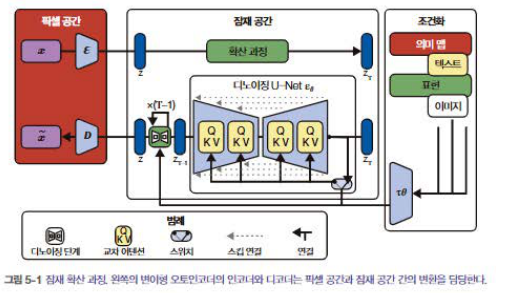
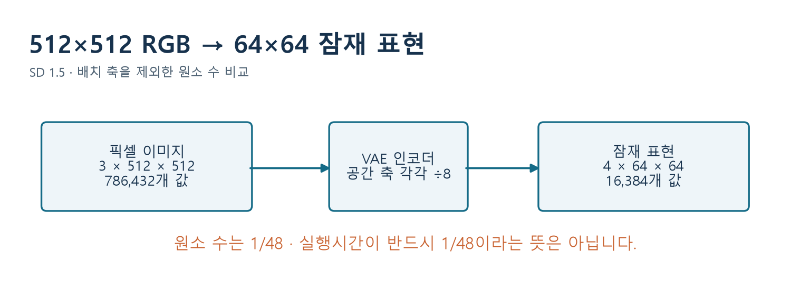
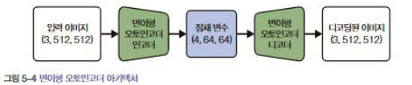
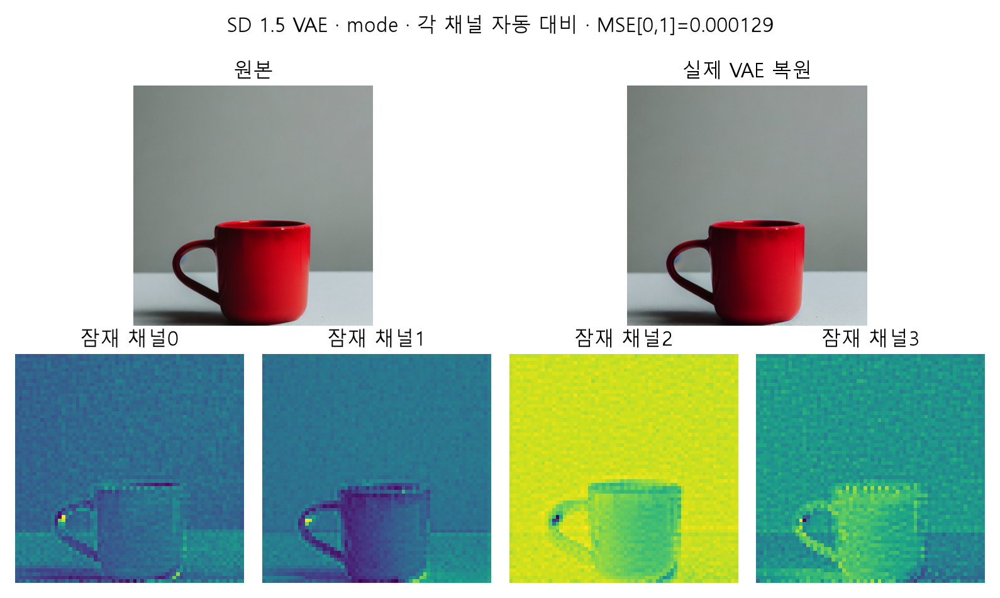

# W06B · 2. 작은 잠재 공간에서 확산하기

2026-10-07 · 주교재 5.2, 5.3.2 · 목표: 압축과 생성의 역할을 구별하기

## 1. 왜 픽셀 대신 잠재 표현을 쓸까?

512×512 RGB 이미지에는 786,432개의 값이 있습니다. 이 큰 배열을 매 단계 처리하려면 계산과 메모리가 많이 듭니다. 잠재 확산은 VAE가 만든 작은 표현에서 잡음 제거를 수행하고, 마지막에 이를 이미지로 디코딩합니다.

출처: 『핸즈온 생성형 AI』 207쪽 그림 5-1, 제공 교재에서 발췌. 그림 왼쪽은 픽셀과 잠재 표현의 변환, 가운데는 잠재 공간의 확산, 오른쪽은 조건 입력입니다. 이번 범위에서는 텍스트 조건에 집중합니다.

한꺼번에 모든 화살표를 외우지 마세요. **VAE는 표현을 변환하고, U-Net은 현재 잠재 상태의 잡음을 예측하며, 스케줄러는 상태를 갱신한다**는 세 역할을 먼저 찾습니다.

## 2. “8배”와 “48배”의 대상이 다릅니다

배치 하나를 제외한 수계산입니다.

$$
3\times512\times512=786432,\qquad 4\times64\times64=16384
$$

$$
\frac{786432}{16384}=48
$$

공간의 가로·세로 길이는 각각 8분의 1입니다. 채널이 3개에서 4개로 바뀌므로 **원소 수는 48분의 1**입니다. 네트워크의 채널 수·층·어텐션·하드웨어 비용까지 같아지는 것은 아니므로 실행 시간이 정확히 48배 빨라진다고 결론 내리지 않습니다.

**잠깐 확인 L1.** “4채널이므로 압축 전 RGB보다 정보가 많다”는 주장에서 빠진 축은 무엇인가요?

## 3. VAE의 인코더와 디코더

출처: 주교재 213쪽 그림 5-4. 괄호의 순서는 채널·높이·너비입니다. 코드에서는 맨 앞에 배치 축을 추가합니다.

VAE 인코더는 입력 이미지에 대한 잠재 분포를 만듭니다. 잠재 표본 또는 대표값을 디코더에 넣으면 복원 이미지가 나옵니다. 손실 압축이므로 복원이 원본과 완전히 같을 필요는 없습니다. SD에서는 이미 학습된 VAE를 사용하며 이 시간에 VAE를 다시 학습하지 않습니다.

수업에서 실제 생성한 머그컵 이미지를 VAE에 다시 통과시킨 결과입니다. 비교를 안정적으로 하기 위해 이 실험에서는 잠재 분포의 `mode()`를 사용합니다. 네 채널의 색은 수치 표시용이며 RGB 색 채널이나 “모양·색·배경·질감”이라는 네 독립 의미가 아닙니다. 각 채널을 따로 대비 조정한 시각화는 절대 크기 비교용이 아님을 표시합니다.

## 4. scaling_factor를 왜 곱하고 다시 나눌까?

SD 1.5의 VAE가 내놓는 잠재 값은 확산 모델이 사용하는 척도로 변환합니다. 이 모델의 설정에는 `scaling_factor=0.18215`가 있습니다.

$$
z_0=s_{\mathrm{VAE}}\,E(x),\qquad \hat x=D(z_0/s_{\mathrm{VAE}})
$$

`E(x)`는 이 표기에서 선택한 VAE 잠재 표본/대표값을 뜻합니다. 실제 API의 `encode`는 바로 배열이 아니라 잠재 분포를 담은 결과를 반환합니다. 척도 값은 `pipe.vae.config.scaling_factor`에서 읽습니다. 모든 확산 모델이 0.18215를 쓰는 것은 아닙니다.

이 계수는 공간 크기를 줄이지 않습니다. `(1,4,64,64)`의 각 값을 같은 수로 곱합니다. 디코딩 전 나눗셈을 생략하면 디코더가 기대한 척도와 다른 입력을 받습니다.

**잠깐 확인 L2.** `z.shape`가 맞으면 디코딩도 반드시 올바를까요? shape와 값의 의미를 나누어 설명하세요.

## 5. 잠재 공간에서도 정답 잡음 만들기는 같습니다

$$
z_t=\sqrt{\bar\alpha_t}z_0+\sqrt{1-\bar\alpha_t}\epsilon
$$

달라진 것은 배열이 픽셀 이미지가 아니라 압축된 잠재 표현이라는 점입니다. SD 1.5의 잡음 예측기는 `(B,4,64,64)`의 상태와 시점, 텍스트 조건을 받아 같은 크기의 잡음을 예측합니다.

| 복원 실험 | 텍스트로 새 이미지 생성 |
| --- | --- |
| 기존 이미지 → VAE 인코더 → 잠재 표현 → 디코더 | 프롬프트와 새 잡음 → 반복 갱신 → VAE 디코더 |
| 원본과 복원 차이를 관찰 | 조건과 생성 결과의 관계를 관찰 |
| 기존 이미지가 필요 | 시작할 원본 사진은 필요하지 않음 |

텍스트로 새 이미지를 만들 때 VAE 인코더가 반드시 시작 사진을 읽어야 하는 것은 아닙니다. 인코더는 학습 데이터의 표현을 만들거나 위의 복원 실험을 할 때 사용합니다.

## 6. 학생이 직접 설명할 문장

“잠재 확산은 ______에서 잡음 제거를 반복하고 마지막에 ______로 이미지를 만든다. VAE 복원 오차와 잡음 예측 오차는 ______이 다르므로 같은 지표로 취급할 수 없다.”

빈칸은 실습 기록지 L3에 자신의 문장으로 작성합니다. 다음 노트에서는 텍스트가 잠재 상태에 영향을 주는 경로를 따라갑니다.

참고: 주교재 5.2·5.3.2; [Latent Diffusion 원논문](https://arxiv.org/abs/2112.10752); [Diffusers AutoencoderKL 문서](https://huggingface.co/docs/diffusers/api/models/autoencoderkl).
