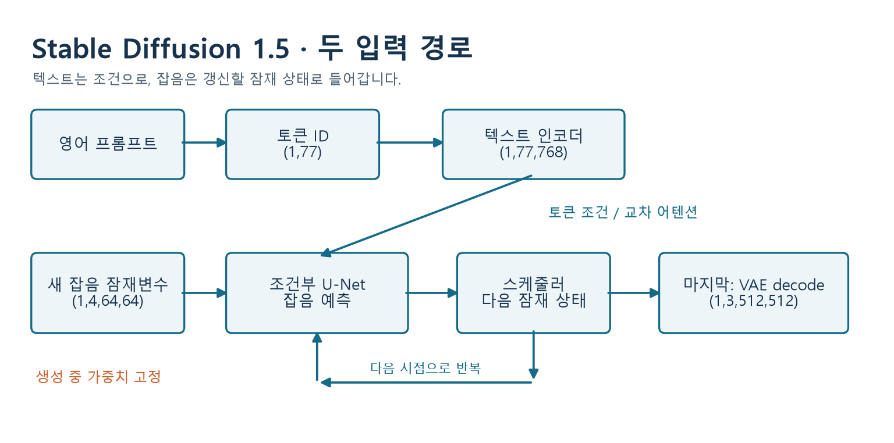

# W06B · 한 장 구조 지도

2026-10-07 · 스테이블 디퓨전과 조건부 이미지 생성 · 주교재5.1–5.3

| 부품 | 입력 → 출력 | 핵심 역할 |
| --- | --- | --- |
| Tokenizer | 문장 → `(B,77)` ID | 단어 조각을 번호로 |
| Text encoder | ID → `(B,77,768)` | 토큰별 문맥 표현 |
| 조건부 U-Net | 잠재 상태·시점·텍스트 → 잡음 예측 | 무엇을 만들지 참고 |
| Scheduler | 현재 상태·잡음 예측 → 다음 상태 | 고정된 가중치로 반복 |
| VAE decoder | `(B,4,64,64)` → `(B,3,512,512)` | 잠재 표현을 이미지로 |

수치는 SD 1.5·512×512의 예입니다. 77은 단어 수가 아니며 네 잠재 채널은 RGB가 아닙니다.

**학습:** 정답 잡음과 예측의 MSE로 가중치 갱신. 클래스는 정답 대신 들어가는 값이 아니라 조건 입력입니다.

**생성:** 새 잠재 잡음에서 상태 갱신. 시작할 원본 사진은 필요하지 않습니다. VAE 인코더를 쓰는 복원 실험과 구별합니다.

**CFG:** `빈 조건 예측 + s × (텍스트 조건 예측 − 빈 조건 예측)`. 같은 가중치·현재 상태·시점에서 두 예측을 얻습니다. API의 scale1 이하는 별도 분기이므로 실제 비교는1·4·7.5·12입니다.

**좋은 비교:** 모델·프롬프트·seed·해상도·scheduler·steps 중 한 변수만 바꾸고, 충실도·결함·변화를 구별합니다. 기록 재생과 실제 생성 성공도 따로 기록합니다.
