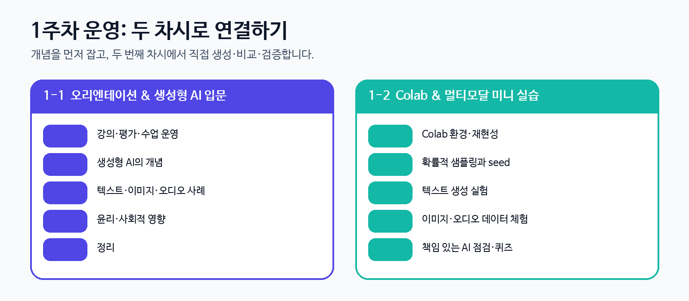
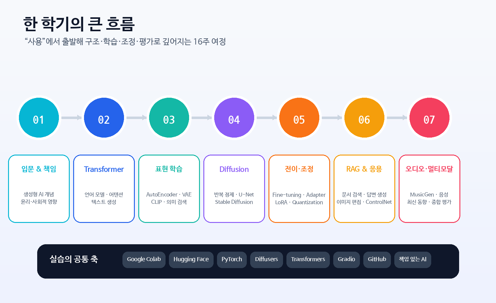
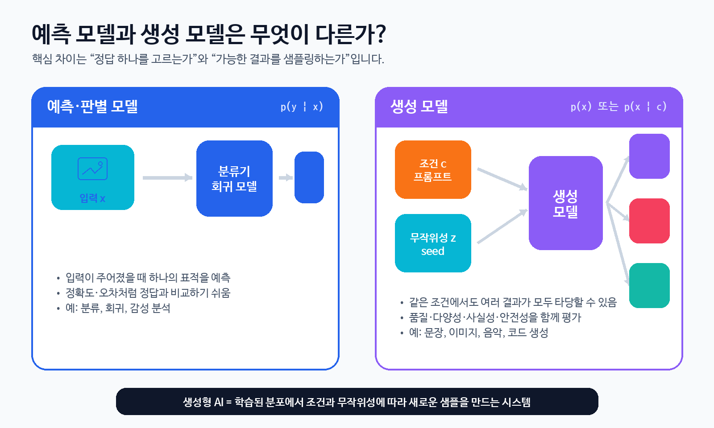
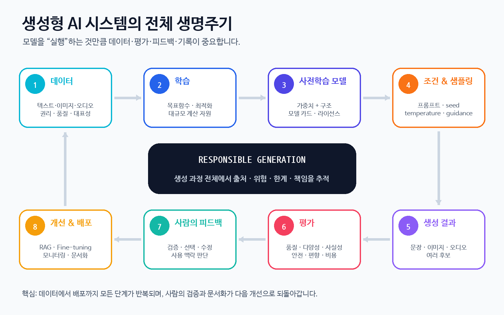
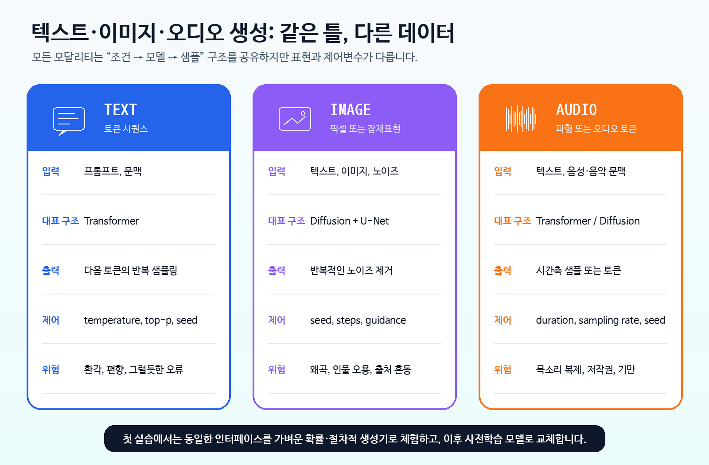
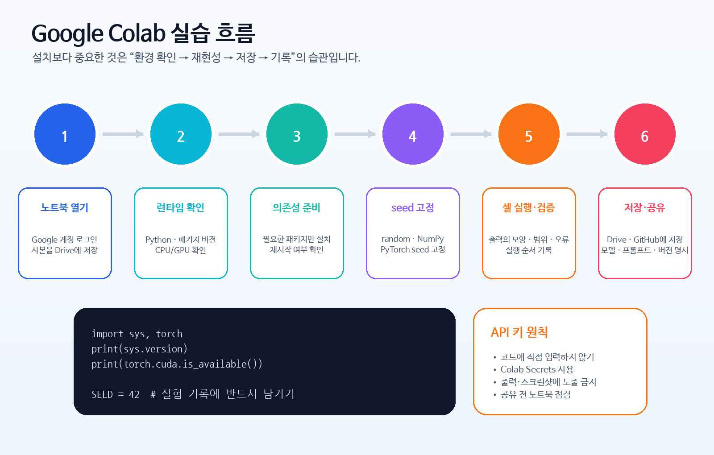

# 1주차 — 생성형 인공지능과 생성 미디어 입문


> **데이터 사이언스를 위한 생성형 인공지능**  
> 동덕여자대학교 데이터사이언스전공 · 유원상 교수 · 2026년 2학기  
> 월·수 10:30–11:45 · 전공선택 3학점 · 교과목 코드 데사K0038

> **이번 주의 큰 질문**  
> 생성형 AI는 학습 데이터로부터 무엇을 배우며, 왜 같은 프롬프트에도 서로 다른 결과를 만들까요? 우리는 그 결과를 어떻게 검증하고 책임 있게 사용할 수 있을까요?

---

## 0. 이번 주 학습목표

이번 주가 끝나면 다음을 할 수 있어야 합니다.

1. 생성형 AI와 생성 모델을 자신의 말로 설명하고, 예측 모델과 구분할 수 있다.
2. 텍스트·이미지·오디오 생성에서 공통적으로 등장하는 **프롬프트, 모델, 샘플링, seed**의 역할을 설명할 수 있다.
3. 생성 결과가 매번 달라지는 이유와 재현 가능한 실험을 위해 seed를 기록해야 하는 이유를 설명할 수 있다.
4. 개인정보·동의, 편향·공정성, 사실성·안전, 저작권·출처, 인간의 책임 관점에서 생성 결과를 점검할 수 있다.
5. Google Colab에서 Python 런타임과 CPU/GPU 환경을 확인하고 첫 실습 노트북을 실행할 수 있다.

### 1주차 권장 운영



- **1-1차시:** 강의 소개, 평가 및 운영, 생성형 AI 개념, 생성 미디어 사례, 윤리·사회적 영향
- **1-2차시:** Google Colab 환경 설정, 확률적 샘플링, 텍스트·이미지·오디오 미니 실습, 책임 있는 AI 점검

---

## 1. 강의 소개

### 1.1 이 강의에서 무엇을 배우는가

이 과목은 생성형 인공지능을 단순히 “써 보는 도구”로만 다루지 않습니다. 다음 세 층을 연결해 학습합니다.

| 층 | 핵심 질문 | 대표 내용 |
|---|---|---|
| 활용 | 사전학습 모델로 무엇을 만들 수 있는가? | 텍스트·이미지·오디오 생성, 의미 검색, 이미지 편집, RAG |
| 원리 | 모델은 어떤 구조와 학습목표로 작동하는가? | Transformer, AutoEncoder/VAE, CLIP, Diffusion, Stable Diffusion |
| 책임 | 결과를 어떻게 평가하고 안전하게 사용할 것인가? | 사실성, 편향, 개인정보, 저작권·출처, 인간의 최종 책임 |

강의계획서의 교육목표에 따라 이론 강의와 Python 실습을 병행합니다. 사전학습 모델을 불러오고, 텍스트·이미지·오디오 데이터를 다루며, 생성 결과를 해석하고 한계와 윤리적·사회적 영향을 검토합니다.

### 1.2 한 학기의 흐름



| 주차 | 핵심 주제 |
|---:|---|
| 1 | 생성형 AI 입문, 생성 미디어 사례, 책임 있는 활용, Colab 환경 |
| 2–3 | 언어 모델, Transformer, 토큰화, 프롬프트와 텍스트 생성 |
| 4 | AutoEncoder, VAE, CLIP, 이미지·텍스트 임베딩, 의미 검색 |
| 5–6 | Diffusion, U-Net, 잠재 확산, Stable Diffusion, 조건부 생성 |
| 7 | 오픈 모델과 Gradio 기반 인터랙티브 데모, 전반부 정리 |
| 8 | 중간고사 |
| 9–10 | 언어 모델 Fine-tuning, Adapter, Quantization, RAG |
| 11–12 | DreamBooth, LoRA, 이미지-이미지 변환, 인페인팅, ControlNet |
| 13 | 오디오 데이터, 음성·음악 생성과 평가 |
| 14–15 | 최신 동향, 긴 컨텍스트, MoE, 멀티모달·비디오, 종합 비교 |
| 16 | 기말고사 |

---

## 2. 평가 및 수업 운영 안내

### 2.1 평가

| 평가 요소 | 반영 비율 | 이번 학기 학습과의 연결 |
|---|---:|---|
| 중간고사 | 30% | 전반부 모델의 핵심 개념·구조·작동 원리 |
| 기말고사 | 40% | 전 범위의 비교·응용·비판적 해석 |
| 과제 | 10% | Python 구현, 실험 비교, 결과 분석과 보고 |
| 출석 | 20% | 수업 참여와 실습 과정 |
| **합계** | **100%** |  |

### 2.2 출결과 준비사항

- 지각 2회는 결석 1회로 산정합니다.
- 결석시수가 총 수업시수의 1/5을 초과하면 학칙에 따라 F학점이 부여됩니다.
- Python 프로그래밍 또는 이에 준하는 과목을 선수강하여 기본 문법과 코딩 역량을 갖추는 것을 권장합니다.
- 실습을 위해 개인 노트북을 준비합니다. 실습은 주로 JupyterLab 또는 Google Colab에서 진행합니다.
- 실습 범위는 수강생의 이해도, Colab/GPU 환경, 모델 다운로드 상황에 따라 일부 조정될 수 있습니다.

### 2.3 강의 연락처

| 항목 | 내용 |
|---|---|
| 담당교수 | 유원상 교수 |
| 이메일 | wonsang@dongduk.ac.kr |
| 연구실 | 예지관 B553호 |
| 연락처 | 02-940-4753 |
| 면담시간 | 월–목 15:00–18:00 |

### 2.4 생성형 AI 도구 사용 원칙

이 과목은 생성형 AI를 배우는 과목이므로 도구 사용 자체를 숨기지 않습니다. 대신 **사용 과정의 투명성과 결과에 대한 책임**을 요구합니다.

- 사용한 모델·서비스·버전과 핵심 프롬프트를 기록합니다.
- AI가 작성한 코드나 설명을 그대로 신뢰하지 말고 직접 실행·검증·수정합니다.
- 과제 제출물에는 본인이 이해하고 설명할 수 있는 내용만 포함합니다.
- 개인정보, 미공개 연구자료, 타인의 과제나 대화 등 민감한 자료를 공개 서비스에 입력하지 않습니다.
- 생성물의 출처·라이선스·인용 필요성을 확인하고, AI를 사용한 범위를 투명하게 밝힙니다.

> **수업의 기준:** “AI가 만들어 주었는가?”보다 “내가 왜 이 결과가 나왔는지 설명하고 검증할 수 있는가?”가 더 중요합니다.

---

## 3. 생성형 AI란 무엇인가

### 3.1 가장 간단한 정의

**생성 모델(generative model)**은 학습 데이터에서 반복되는 통계적 규칙과 표현을 학습한 뒤, 그 학습된 분포로부터 새로운 데이터를 만들어 내는 모델입니다.

- 무조건 생성: `p(x)` — 별도의 조건 없이 데이터와 비슷한 새 샘플을 생성
- 조건부 생성: `p(x | c)` — 프롬프트, 클래스, 이미지, 음성 등 조건 `c`에 맞는 새 샘플을 생성

여기서 “새롭다”는 말은 완전히 무에서 창조한다는 뜻이 아닙니다. 모델은 학습 데이터에서 배운 패턴을 바탕으로 **가능성이 높은 조합을 확률적으로 샘플링**합니다.

### 3.2 예측 모델과 생성 모델



| 구분 | 예측·판별 모델 | 생성 모델 |
|---|---|---|
| 주된 질문 | “이 입력의 정답은 무엇인가?” | “이 조건에서 가능한 결과는 무엇인가?” |
| 대표 분포 | `p(y | x)` | `p(x)` 또는 `p(x | c)` |
| 출력 | 클래스, 점수, 실수값 등 | 문장, 이미지, 오디오, 코드 등 고차원 데이터 |
| 정답 구조 | 대체로 하나의 표적 | 여러 결과가 모두 타당할 수 있음 |
| 평가 | 정확도, 오차 등 | 품질, 다양성, 사실성, 안전성, 선호도 등 |

> **생각해 보기**  
> “서울의 현재 기온을 답하라”는 질문과 “비 오는 서울을 배경으로 짧은 소설을 써라”는 요청은 평가 방법이 왜 달라야 할까요?

### 3.3 생성의 공통 인터페이스

대부분의 생성형 AI 시스템은 다음 요소를 공유합니다.

1. **학습 데이터:** 모델이 패턴을 배우는 원천
2. **모델:** 학습된 가중치와 계산 구조
3. **조건(condition):** 프롬프트, 이미지, 클래스, 음성 등 생성 방향을 정하는 정보
4. **무작위성(randomness):** 같은 조건에서도 여러 결과가 나오게 하는 샘플링 요소
5. **생성 제어변수:** temperature, top-p, steps, guidance, duration 등
6. **평가와 사람의 피드백:** 결과를 검증하고 선택·수정하는 과정



### 3.4 학습과 추론

- **학습(training):** 많은 데이터와 계산 자원을 사용하여 모델의 가중치를 조정합니다.
- **추론(inference) 또는 생성(generation):** 이미 학습된 모델에 조건과 무작위성을 입력해 결과를 만듭니다.
- **전이학습·경량 조정:** 사전학습 모델을 새로운 데이터나 목적에 맞게 Fine-tuning, Adapter, LoRA 등으로 조정합니다.
- **RAG:** 모델 가중치를 바꾸지 않고 외부 문서를 검색해 프롬프트에 근거를 추가합니다.

첫 주에는 거대한 모델을 처음부터 학습하지 않습니다. 사전학습 모델이 제공하는 인터페이스를 이해하고, 이후 주차에서 구조와 학습 원리를 단계적으로 파고듭니다.

### 3.5 “접근 가능”, “오픈 웨이트”, “오픈 소스”는 같은 말이 아니다

교재 1장은 공개 모델 생태계의 장점을 소개하면서도, 모델이 공개되었다고 해서 항상 완전한 오픈 소스라고 볼 수 없음을 지적합니다.

| 용어 | 보통 공개되는 것 | 확인할 질문 |
|---|---|---|
| API 접근 | 원격 서비스의 입력·출력 인터페이스 | 데이터가 어디로 전송되는가? 비용·제한은 무엇인가? |
| 오픈 웨이트 | 학습된 가중치 | 상업적 사용, 재배포, 파생모델이 허용되는가? |
| 오픈 소스에 가까운 공개 | 코드, 가중치, 문서, 때로 데이터·학습 절차 | 재현에 필요한 핵심 요소가 충분히 공개되었는가? |

항상 **모델 카드, 라이선스, 사용 제한, 데이터 출처, 알려진 한계**를 함께 확인해야 합니다.

---

## 4. 이미지·텍스트·오디오 생성 사례



### 4.1 텍스트 생성

Transformer 기반 언어 모델은 주어진 문맥 뒤에 올 다음 토큰의 확률분포를 계산하고, 토큰을 하나씩 선택하는 과정을 반복합니다.

```text
프롬프트 → 토큰화 → 다음 토큰 확률 → 샘플링 → 새 문맥 → 반복
```

주요 제어변수:

- **temperature:** 확률분포를 평평하거나 날카롭게 만들어 다양성을 조절
- **top-k / top-p:** 후보 토큰의 범위를 제한
- **max new tokens:** 생성 길이 제한
- **seed:** 같은 조건에서 실험을 재현하기 위한 난수 초기값

텍스트 생성은 유창함과 사실성이 다릅니다. 문장이 자연스러워도 근거 없는 내용을 만들 수 있으므로, 사실 확인이 필요한 과제에서는 검색·출처·검증 과정이 필요합니다.

### 4.2 이미지 생성

확산 모델은 노이즈가 섞인 상태에서 시작해, 여러 단계에 걸쳐 노이즈를 제거하며 이미지를 정제합니다. Stable Diffusion은 이 과정을 픽셀 공간이 아니라 더 작은 **잠재공간(latent space)**에서 수행하여 효율을 높입니다.

```text
텍스트 프롬프트 + 초기 노이즈 → 반복적 노이즈 제거 → 이미지
```

주요 제어변수:

- **seed:** 초기 노이즈를 결정
- **sampling steps:** 정제 단계 수
- **guidance scale:** 프롬프트 조건을 얼마나 강하게 따를지 조절
- **negative prompt:** 피하고 싶은 특징을 지정

같은 프롬프트도 seed가 달라지면 구도·색·세부 묘사가 달라집니다. 또한 생성 이미지에는 왜곡, 글자 오류, 손가락·구조 오류, 학습 데이터의 편향이 나타날 수 있습니다.

### 4.3 오디오 생성

오디오는 시간축을 가진 신호입니다. 모델은 직접 파형을 생성하거나, 오디오를 압축한 토큰·잠재표현을 생성한 뒤 디코더로 파형을 복원할 수 있습니다.

```text
텍스트 설명 → 오디오 토큰 또는 잠재표현 → 파형 복원 → 재생
```

주요 개념:

- **sampling rate:** 1초를 몇 개의 샘플로 표현하는가
- **duration:** 생성할 오디오 길이
- **waveform:** 시간에 따른 진폭 배열
- **spectrogram:** 시간과 주파수에 따른 에너지 표현

음악·음성 생성에서는 목소리 복제에 대한 동의, 인물 사칭, 저작권과 스타일 모방 문제가 특히 중요합니다.

### 4.4 공통점과 차이

| 질문 | 텍스트 | 이미지 | 오디오 |
|---|---|---|---|
| 기본 단위 | 토큰 | 픽셀·잠재벡터 | 파형 샘플·오디오 토큰 |
| 대표 구조 | Transformer | Diffusion + U-Net | Transformer·Diffusion |
| 결과 확인 | 읽기·사실 검증 | 시각 품질·구조 검증 | 청취·파형/스펙트럼 확인 |
| 대표 위험 | 환각·편향 | 딥페이크·왜곡 | 음성 사칭·저작권 |

---

## 5. 왜 같은 프롬프트에서 다른 결과가 나오는가

### 5.1 seed

seed는 난수 생성기의 시작점을 정합니다.

- 같은 모델·코드·환경·프롬프트·seed라면 결과를 재현할 가능성이 높습니다.
- seed가 다르면 초기 노이즈나 샘플링 경로가 달라져 다른 결과가 나옵니다.
- seed는 품질을 보장하는 숫자가 아니라 **실험을 재현하고 비교하기 위한 기록값**입니다.

### 5.2 temperature

텍스트 생성에서 temperature를 높이면 후보 토큰들의 확률 차이가 줄어들어 다양한 선택이 늘어납니다. 낮추면 높은 확률의 토큰에 선택이 집중됩니다.

- 너무 낮음: 반복적이고 보수적인 결과
- 적절함: 일관성과 다양성의 균형
- 너무 높음: 창의적일 수 있지만 문맥 붕괴와 오류 가능성 증가

### 5.3 프롬프트는 명령문만이 아니다

프롬프트에는 다음이 포함될 수 있습니다.

- 역할과 목적
- 입력 데이터와 배경 맥락
- 원하는 출력 형식
- 제약조건과 금지사항
- 예시
- 평가 기준

좋은 프롬프트는 모델의 한계를 없애지 않습니다. 단지 조건부 분포를 더 구체적으로 좁혀 줍니다.

---

## 6. 윤리적·사회적 영향

교재는 생성 모델의 활용 범위가 넓어질수록 개인정보 보호와 동의, 편향과 공정성, 책임 있는 규제와 감독이 중요해진다고 강조합니다. 수업에서는 이를 실제 실습 점검표로 확장합니다.


### 6.1 다섯 가지 점검축

| 점검축 | 핵심 질문 | 실습에서의 행동 |
|---|---|---|
| 개인정보·동의 | 실제 인물의 이미지·음성·대화를 사용할 권한이 있는가? | 민감정보 제거, 당사자 동의 확인 |
| 편향·공정성 | 특정 집단이 배제되거나 고정관념으로 묘사되는가? | 여러 프롬프트·집단 조건으로 비교 테스트 |
| 사실성·안전 | 결과가 사실처럼 보이지만 틀릴 수 있는가? | 근거 확인, 위험한 조언은 전문가 검토 |
| 저작권·출처 | 데이터·모델·생성물의 권리와 출처가 명확한가? | 라이선스·모델 카드 확인, 사용 범위 기록 |
| 책임·감독 | 최종 판단을 누가 하며 문제가 생기면 어떻게 대응하는가? | 사람의 승인, 수정·삭제·신고 절차 마련 |

### 6.2 5분 토론 활동

다음 상황 중 하나를 선택해 네 문장으로 답합니다.

1. 동아리 홍보물에 실제 학생과 매우 닮은 AI 생성 인물을 사용하려 한다.
2. 장학금 안내 챗봇이 존재하지 않는 신청 조건을 자신 있게 답했다.
3. 특정 직업을 생성하는 이미지에서 성별·연령 표현이 한쪽으로 치우쳤다.
4. 유명 가수와 비슷한 목소리로 학과 홍보 노래를 만들려 한다.

답변 틀:

- **이해관계자:** 누가 영향을 받는가?
- **가능한 피해:** 어떤 문제가 생길 수 있는가?
- **완화 방법:** 생성 전·후 무엇을 확인해야 하는가?
- **공개 원칙:** AI 사용과 한계를 어떻게 알릴 것인가?

---

## 7. Python·Google Colab 실습환경 설정



### 7.1 Colab에서 노트북 열기

1. Google 계정으로 Colab에 로그인합니다.
2. 배포된 `.ipynb` 파일을 업로드하거나 GitHub 링크에서 엽니다.
3. **파일 → Drive에 사본 저장**으로 개인 사본을 만듭니다.
4. 노트북 상단에서 본인의 이름과 seed를 입력합니다.
5. 셀을 위에서 아래로 실행하되, 출력과 오류 메시지를 반드시 읽습니다.

### 7.2 런타임과 GPU

경로는 Colab UI 업데이트에 따라 조금 달라질 수 있지만, 일반적으로 **런타임 → 런타임 유형 변경**에서 하드웨어 가속기를 선택합니다.

첫 주의 핵심 실습은 CPU에서도 실행됩니다. 선택 실습에서만 사전학습 모델을 다운로드합니다.

```python
import sys
import torch

print(sys.version)
print("CUDA 사용 가능:", torch.cuda.is_available())
print("GPU 수:", torch.cuda.device_count())
```

### 7.3 재현 가능한 실험

```python
import random
import numpy as np
import torch

SEED = 42
random.seed(SEED)
np.random.seed(SEED)
torch.manual_seed(SEED)
if torch.cuda.is_available():
    torch.cuda.manual_seed_all(SEED)
```

재현성을 위해 다음을 함께 기록합니다.

- seed
- Python·주요 패키지 버전
- 모델 ID와 revision
- 프롬프트와 생성 파라미터
- CPU/GPU 종류
- 실행 날짜와 수정한 코드

### 7.4 API 키와 개인정보

- API 키를 코드 셀에 직접 적지 않습니다.
- 필요할 때는 Colab Secrets 또는 환경변수를 사용합니다.
- 노트북을 공유하기 전 출력, 실행 기록, 파일 경로, 토큰이 남아 있지 않은지 확인합니다.
- 개인정보나 미공개 연구데이터를 공개 모델 서비스에 업로드하지 않습니다.

### 7.5 자주 발생하는 문제

| 증상 | 가능한 원인 | 해결 순서 |
|---|---|---|
| `ModuleNotFoundError` | 패키지 미설치 또는 런타임 재시작 | 설치 셀 실행 → 런타임 재시작 → import 재실행 |
| GPU가 보이지 않음 | CPU 런타임 또는 GPU 할당 제한 | 런타임 유형 확인 → `torch.cuda.is_available()` 확인 |
| 메모리 부족 | 모델·배치·해상도가 큼 | 작은 모델, 짧은 출력, 낮은 해상도, CPU fallback |
| 결과가 매번 다름 | seed 미고정 또는 확률적 연산 | seed와 생성 파라미터 기록 |
| 한글이 깨짐 | 폰트·인코딩 문제 | UTF-8, 한글 폰트 설정, 파일명 단순화 |

---

## 8. 첫 실습: Multimodal Generation Mini Lab

첫 실습 노트북은 거대한 모델을 즉시 내려받는 대신, 생성형 AI의 공통 원리를 가벼운 코드로 먼저 체험하도록 설계되어 있습니다.

### 핵심 실습

1. Python·NumPy·PyTorch 환경과 CPU/GPU 확인
2. seed 고정과 확률분포에서 샘플링
3. temperature에 따른 다양성 변화
4. 간단한 문자 수준 언어 생성
5. prompt와 seed에 따른 절차적 이미지 생성
6. 오디오 파형·sampling rate·spectrogram 체험
7. 생성 결과에 대한 책임 있는 AI 점검
8. 빈칸 채우기, 오류 찾기, 비교 실험, 퀴즈

> **중요:** 이미지·오디오 부분의 가벼운 생성기는 딥러닝 모델이 아니라, `prompt + seed + sampling → output`이라는 공통 인터페이스를 이해하기 위한 교육용 기준선입니다. 이후 주차에서 Diffusers, Stable Diffusion, MusicGen 등의 사전학습 모델로 교체합니다.

### 선택 실습

인터넷 연결과 시간이 허용되면 Hugging Face의 작은 사전학습 텍스트 모델을 불러와 seed와 temperature를 비교합니다. 선택 셀은 기본값이 꺼져 있으므로 핵심 실습의 실행을 방해하지 않습니다.

---

## 9. 개념 확인

1. 생성 모델의 조건부 분포는 보통 어떤 형태로 쓰는가?
2. 같은 프롬프트와 모델에서도 결과가 달라질 수 있는 이유는 무엇인가?
3. seed를 기록하는 목적은 “더 좋은 품질”인가, “재현 가능한 비교”인가?
4. 텍스트 생성에서 temperature를 지나치게 높이면 어떤 일이 생길 수 있는가?
5. 자연스러운 문장과 사실에 맞는 문장은 왜 같은 의미가 아닌가?
6. 실제 인물과 유사한 이미지나 목소리를 생성할 때 가장 먼저 확인할 것은 무엇인가?

---

## 10. Take-home messages

- 생성형 AI는 학습된 데이터 분포로부터 새 샘플을 만드는 모델이다.
- 텍스트·이미지·오디오는 표현 방식은 다르지만 **조건, 모델, 무작위성, 샘플링, 평가**라는 공통 구조를 가진다.
- 같은 프롬프트에서도 seed와 샘플링 설정에 따라 여러 결과가 생성될 수 있다.
- 생성 결과의 유창함·그럴듯함은 사실성·공정성·안전성을 보장하지 않는다.
- 모델 카드, 라이선스, 프롬프트, seed, 버전, 하드웨어를 기록하는 습관이 재현성과 책임성을 만든다.
- 생성형 AI의 최종 사용과 판단 책임은 사람에게 있다.

### 다음 수업 전 준비

- 첫 실습 노트북의 핵심 셀을 모두 실행하고, 다른 seed 3개로 결과를 비교합니다.
- “생성형 AI가 데이터 사이언스 업무를 바꾸는 사례” 하나를 찾아 3문장으로 정리합니다.
- 다음 주제인 **언어 모델과 Transformer**를 위해 토큰(token)과 확률분포의 의미를 복습합니다.

---

## 참고자료

- 주교재: 오마르 산세비에로 외, 장윤경 역, 『핸즈온 생성형 AI』, 1장 “생성 미디어 입문”, 한빛미디어, 2025.
- 교재 제공 실습: `01_introduction.ipynb` — 이미지 생성, 텍스트 분류·생성, MusicGen 오디오 생성의 입문 예시.
- 강의계획서: 「데이터사이언스를 위한 생성형인공지능」, 2026학년도 2학기.
- 교재 코드 저장소: [yk-genai/genaibook](https://github.com/yk-genai/genaibook)
- 강의 실습 저장소: [lunalab-ai/genAI](https://github.com/lunalab-ai/genAI)

> 이 페이지의 도식은 강의용으로 새로 제작한 설명 그림이며, 스캔 교재의 페이지 이미지를 포함하지 않습니다.
